# Cosmetic Formulation - Bản dịch tiếng Việt

<!-- File này được tạo tự động bởi scripts/build-readme.py. -->

---

## Mục lục

| Mục | Depth | Tiêu đề | Trang PDF |
|---|---:|---|---:|
| 1 | 1 | [Cosmetic Products: Science and Senses](#1.cosmetic-products-science-and-senses) | 18 |
| 1.1 | 2 | [Senses and Science: Art, Science and Communication, and Their Role in Cosmetic Products](#1.1.senses-and-science-art-science-and-communication-and-their-role-in-cosmetic-products) | 19 |
| 1.2 | 2 | [Discovering the Consumer’s Insight](#1.2.discovering-the-consumers-insight) | 20 |
| 1.2.1 | 3 | [Verbatim](#1.2.1.verbatim) | 21 |
| 1.2.2 | 3 | [Insight](#1.2.2.insight) | 21 |
| 1.2.3 | 3 | [Claim](#1.2.3.claim) | 21 |
| 1.3 | 2 | [Colour Psychology](#1.3.colour-psychology) | 22 |
| 1.3.1 | 3 | [Colour and Its Influence over Emotions](#1.3.1.colour-and-its-influence-over-emotions) | 22 |
| 1.3.2 | 3 | [Importance of the Chromatic Accord](#1.3.2.importance-of-the-chromatic-accord) | 24 |
| 1.4 | 2 | [Sensory Additivity](#1.4.sensory-additivity) | 26 |
| 1.4.1 | 3 | [The Role of Colour in Sensory Additivity](#1.4.1.the-role-of-colour-in-sensory-additivity) | 27 |
| 1.5 | 2 | [Innovation in Implicit Evaluation](#1.5.innovation-in-implicit-evaluation) | 29 |
| 1.5.1 | 3 | [Explicit Evaluation vs. Implicit Evaluation](#1.5.1.explicit-evaluation-vs-implicit-evaluation) | 32 |
| 1.5.2 | 3 | [Neuroscience Techniques Applied in the Formulation Stage](#1.5.2.neuroscience-techniques-applied-in-the-formulation-stage) | 33 |
| 1.5.3 | 3 | [Examples of Eye-Tracking Application](#1.5.3.examples-of-eye-tracking-application) | 33 |
| 1.5.4 | 3 | [Examples of Eye-Tracking and EEG Application in Hair Care Products](#1.5.4.examples-of-eye-tracking-and-eeg-application-in-hair-care-products) | 40 |
| 1.6 | 2 | [Synesthesia in Design](#1.6.synesthesia-in-design) | 40 |
| 1.7 | 2 | References | 44 |
| 2 | 1 | [Skin Morphology, Development and Physiology](#2.skin-morphology-development-and-physiology) | 46 |
| 2.1 | 2 | [Introduction](#2.1.introduction) | 46 |
| 2.2 | 2 | [Structure of the Skin](#2.2.structure-of-the-skin) | 47 |
| 2.2.1 | 3 | [The Epidermis](#2.2.1.the-epidermis) | 48 |
| 2.2.2 | 3 | [The Dermis](#2.2.2.the-dermis) | 52 |
| 2.2.3 | 3 | [The Subcutis](#2.2.3.the-subcutis) | 53 |
| 2.2.4 | 3 | [Skin Appendages](#2.2.4.skin-appendages) | 53 |
| 2.3 | 2 | [Development of the Stratum Corneum](#2.3.development-of-the-stratum-corneum) | 54 |
| 2.3.1 | 3 | [Epidermal Differentiation](#2.3.1.epidermal-differentiation) | 54 |
| 2.3.2 | 3 | [Cornified Cell Envelope](#2.3.2.cornified-cell-envelope) | 55 |
| 2.3.3 | 3 | [Stratum Corneum Intercellular Lipids](#2.3.3.stratum-corneum-intercellular-lipids) | 56 |
| 2.3.4 | 3 | [Stratum Corneum Proteins](#2.3.4.stratum-corneum-proteins) | 56 |
| 2.3.5 | 3 | [Desquamation](#2.3.5.desquamation) | 56 |
| 2.4 | 2 | [Epidermal Repair Mechanisms](#2.4.epidermal-repair-mechanisms) | 57 |
| 2.4.1 | 3 | [The Effects of Hydration](#2.4.1.the-effects-of-hydration) | 57 |
| 2.4.2 | 3 | [Chemical Damage](#2.4.2.chemical-damage) | 58 |
| 2.4.3 | 3 | [Biochemical Abnormalities](#2.4.3.biochemical-abnormalities) | 59 |
| 2.5 | 2 | [Concluding Remarks](#2.5.concluding-remarks) | 59 |
| 2.6 | 2 | References | 59 |
| 3 | 1 | [Stratum Corneum Lipid Composition and Organization](#3.stratum-corneum-lipid-composition-and-organization) | 64 |
| 3.1 | 2 | [The Structure and Function of the Stratum Corneum](#3.1.the-structure-and-function-of-the-stratum-corneum) | 64 |
| 3.2 | 2 | [Lipid Composition in Human Stratum Corneum](#3.2.lipid-composition-in-human-stratum-corneum) | 65 |
| 3.3 | 2 | [The Lipid Organization in Human Stratum Corneum](#3.3.the-lipid-organization-in-human-stratum-corneum) | 65 |
| 3.4 | 2 | [Lipid Composition and Organization in the Diseased Skin and Dry Skin](#3.4.lipid-composition-and-organization-in-the-diseased-skin-and-dry-skin) | 68 |
| 3.5 | 2 | [Lipid Model Systems as a Tool to Examine the Relation between Lipid Composition and Organization in More Detail](#3.5.lipid-model-systems-as-a-tool-to-examine-the-relation-between-lipid-composition-and-organization-in-more-detail) | 69 |
| 3.5.1 | 3 | [Lipid Model Systems to Elucidate the Lipid Phase Behaviour](#3.5.1.lipid-model-systems-to-elucidate-the-lipid-phase-behaviour) | 69 |
| 3.5.2 | 3 | [The Stratum Corneum Substitute (SCS) as a Tool to Investigate the Lipid Barrier Function](#3.5.2.the-stratum-corneum-substitute-scs-as-a-tool-to-investigate-the-lipid-barrier-function) | 70 |
| 3.6 | 2 | References | 72 |
| 4 | 1 | [Immunology of Skin and Reactivity](#4.immunology-of-skin-and-reactivity) | 78 |
| 4.1 | 2 | [Skin Immune Network](#4.1.skin-immune-network) | 78 |
| 4.2 | 2 | [Immunological Composition of the Epidermis](#4.2.immunological-composition-of-the-epidermis) | 79 |
| 4.2.1 | 3 | [Keratinocytes](#4.2.1.keratinocytes) | 79 |
| 4.2.2 | 3 | [Keratinocytes in Innate Immunity](#4.2.2.keratinocytes-in-innate-immunity) | 79 |
| 4.2.3 | 3 | [Keratinocytes in Adaptive Immunity](#4.2.3.keratinocytes-in-adaptive-immunity) | 80 |
| 4.2.4 | 3 | [Melanocytes](#4.2.4.melanocytes) | 80 |
| 4.2.5 | 3 | [Langerhans Cells (LCs)](#4.2.5.langerhans-cells-lcs) | 81 |
| 4.3 | 2 |[Immunological Composition of the Dermis](#4.3.immunological-composition-of-the-dermis)| 81 |
| 4.3.1 | 3 |[Dermal Dendritic Cells (dDCs)](#4.3.1.dermal-dendritic-cells-ddcs)| 81 |
| 4.3.2 | 3 |[Mast Cells (MCs)](#4.3.2.mast-cells-mcs)| 82 |
| 4.3.3 | 3 |[T Cells](#4.3.3.t-cells)| 82 |
| 4.3.4 | 3 |[Macrophages](#4.3.4.macrophages)| 83 |
| 4.3.5 | 3 |[Innate Lymphoid Cells](#4.3.5.innate-lymphoid-cells)| 83 |
| 4.4 | 2 |[Implications of the Skin Immune System in Cosmetic Science](#4.4.implications-of-the-skin-immune-system-in-cosmetic-science)| 83 |
| 4.4.1 | 3 |[Contact Dermatitis](#4.4.1.contact-dermatitis)| 84 |
| 4.4.2 | 3 |[Pathogenesis of Dermatitis](#4.4.2.pathogenesis-of-dermatitis)| 85 |
| 4.5 | 2 |[Cosmeceuticals Targeting Components of the Skin Immune System](#4.5.cosmeceuticals-targeting-components-of-the-skin-immune-system)| 86 |
| 4.5.1 | 3 |[Hyperpigmentation](#4.5.1.hyperpigmentation)| 86 |
| 4.5.2 | 3 |[Photoprotection](#4.5.2.photoprotection)| 87 |
| 4.6 | 2 |[Conclusion](#4.6.conclusion)| 87 |
| 4.7 | 2 | References | 88 |
| 5 | 1 | [The Human Nail: Structure, Properties, Therapy and Grooming](#5.the-human-nail-structure-properties-therapy-and-grooming) | 94 |
| 5.1 | 2 | [Introduction](#5.1.introduction) | 94 |
| 5.2 | 2 | [Nail Structure and Physiology](#5.2.nail-structure-and-physiology) | 95 |
| 5.3 | 2 | [Biophysical Characterisation of the Nail Plate](#5.3.biophysical-characterisation-of-the-nail-plate) | 96 |
| 5.3.1 | 3 | [Near-Infrared Raman Spectroscopy](#5.3.1.near-infrared-raman-spectroscopy) | 96 |
| 5.3.2 | 3 | [Near Infrared Diffuse Reflectance (NIR-DR) Spectroscopy](#5.3.2.near-infrared-diffuse-reflectance-nir-dr-spectroscopy) | 97 |
| 5.3.3 | 3 | [Dynamic Vapour Sorption and Near-Infrared (DVS-NIR) Spectroscopy](#5.3.3.dynamic-vapour-sorption-and-near-infrared-dvs-nir-spectroscopy) | 98 |
| 5.3.4 | 3 | [Attenuated Total Reflectance Fourier Transform Infrared (ATR FTIR) Spectroscopy](#5.3.4.attenuated-total-reflectance-fourier-transform-infrared-atr-ftir-spectroscopy) | 98 |
| 5.3.5 | 3 | [Confocal Raman Spectroscopy (CRS)](#5.3.5.confocal-raman-spectroscopy-crs) | 99 |
| 5.3.6 | 3 | [Atomic Absorption Spectrometry (AAS)](#5.3.6.atomic-absorption-spectrometry-aas) | 100 |
| 5.3.7 | 3 | [Inductively Coupled Plasma Mass Spectrometry (ICP-MS)](#5.3.7.inductively-coupled-plasma-mass-spectrometry-icp-ms) | 100 |
| 5.3.8 | 3 | [Opto-Thermal Transient Emission Radiometry (OTTER)](#5.3.8.opto-thermal-transient-emission-radiometry-otter) | 100 |
| 5.3.9 | 3 | [Optical Coherence Tomography (OCT)](#5.3.9.optical-coherence-tomography-oct) | 100 |
| 5.3.10 | 3 | [Confocal Laser Scanning Microscopy (CLSM)](#5.3.10.confocal-laser-scanning-microscopy-clsm) | 102 |
| 5.3.11 | 3 | [Transonychial Water Loss (TOWL)](#5.3.11.transonychial-water-loss-towl) | 102 |
| 5.4 | 2 | [Exploiting the Permeability Characteristics of the Nail Plate](#5.4.exploiting-the-permeability-characteristics-of-the-nail-plate) | 102 |
| 5.4.1 | 3 | [Current Approaches and Clinical Evidence](#5.4.1.current-approaches-and-clinical-evidence) | 102 |
| 5.4.2 | 3 | [Experimental Approaches](#5.4.2.experimental-approaches) | 104 |
| 5.4.3 | 3 | [Chemical Enhancement: Barrier Disruption](#5.4.3.chemical-enhancement-barrier-disruption) | 104 |
| 5.4.4 | 3 | [Chemical Enhancement: Vehicle Effects](#5.4.4.chemical-enhancement-vehicle-effects) | 105 |
| 5.5 | 2 | [Cosmetic Nail Formulations](#5.5.cosmetic-nail-formulations) | 106 |
| 5.5.1 | 3 | [Nail Polish](#5.5.1.nail-polish) | 106 |
| 5.5.2 | 3 | [Acrylate Resin Preparations](#5.5.2.acrylate-resin-preparations) | 106 |
| 5.5.3 | 3 | [Light-Cured Gels](#5.5.3.light-cured-gels) | 107 |
| 5.5.4 | 3 | [Nail Polish Remover](#5.5.4.nail-polish-remover) | 107 |
| 5.6 | 2 | [Outlook and Summary](#5.6.outlook-and-summary) | 107 |
| 5.7 | 2 | References | 107 |
| 6 | 1 | [Hình thái học, quá trình sinh tóc, tính không đồng nhất, sinh lý bệnh và sự thấm vào nang tóc](#6.hair-morphology-biogenesis-heterogeneity-pathophysiology-and-hair-follicle-penetration) | 112 |
| 6.1 | 2 | [Giới thiệu](#6.1.introduction) | 112 |
| 6.2 | 2 | [Hình thái học của tóc và nang tóc](#6.2.the-morphology-of-hair-and-hair-follicles) | 113 |
| 6.3 | 2 | [Chu kỳ tóc](#6.3.the-hair-cycle) | 114 |
| 6.4 | 2 | [Tính không đồng nhất sắc tộc trong hình thái học của tóc và nang tóc](#6.4.ethnic-heterogeneity-in-hair-and-hair-follicle-morphology) | 114 |
| 6.5 | 2 | [Sinh lý bệnh của nang tóc](#6.5.hair-follicle-pathophysiology) | 114 |
| 6.5.1 | 3 | [Rụng tóc có hồi phục](#6.5.1.reversible-hair-loss) | 115 |
| 6.5.1.1 | 4 | [Telogen effluvium và ngừng sớm pha anagen](#6.5.1.1.telogen-effluvium-and-premature-anagen-arrest) | 115 |
| 6.5.1.2 | 4 | [Các rối loạn liên quan androgen](#6.5.1.2.androgen-associated-disorders) | 115 |
| 6.5.1.3 | 4 | [Rụng tóc do cơ chế tự miễn](#6.5.1.3.autoimmunological-induced-hair-loss) | 115 |
| 6.5.1.4 | 4 | [Rụng tóc do viêm](#6.5.1.4.inflammatory-hair-loss) | 115 |
| 6.5.2 | 3 | [Rụng tóc không hồi phục](#6.5.2.irreversible-hair-loss) | 115 |
| 6.5.3 | 3 | [Nang tóc và các khối u da](#6.5.3.hair-follicles-and-skin-tumours) | 116 |
| 6.6 | 2 | [Sự thấm vào nang tóc](#6.6.hair-follicle-penetration) | 116 |
| 6.6.1 | 3 | [Phương pháp khảo sát sự thấm vào nang tóc](#6.6.1.methods-to-investigate-follicular-penetration) | 117 |
| 6.6.2 | 3 | [Cơ chế thấm vào nang tóc](#6.6.2.the-mechanism-of-follicular-penetration) | 117 |
| 6.6.3 | 3 | [Nanocarrier làm chất vận chuyển để đưa hoạt chất vào da](#6.6.3.nanocarriers-as-transporters-for-skin-delivery) | 118 |
| 6.7 | 2 | References | 119 |
| 7 | 1 | Common Cosmetic Ingredients: Chemistry, Actions, Safety and Products | 122 |
| 7.1 | 2 | Cleansers, Surfactants and Soaps | 123 |
| 7.2 | 2 | Bath and Shower Oils | 124 |
| 7.3 | 2 | Moisturisers | 125 |
| 7.4 | 2 | Barriers | 125 |
| 7.5 | 2 | Body Butters | 126 |
| 7.6 | 2 | Water (Aqua) | 127 |
| 7.7 | 2 | Denatured Alcohol | 127 |
| 7.8 | 2 | Humectants | 127 |
| 7.9 | 2 | Oils, Fatty Acids and Polymers | 128 |
| 7.10 | 2 | Preservatives | 129 |
| 7.11 | 2 | Formaldehyde | 129 |
| 7.12 | 2 | Formaldehyde-Releasing Preservatives | 129 |
| 7.13 | 2 | Non-Formaldehyde Preservatives | 130 |
| 7.14 | 2 | Fragrance | 131 |
| 7.15 | 2 | Summary | 132 |
| 7.16 | 2 | References | 132 |
| 8 | 1 | Thickening Agents | 136 |
| 8.1 | 2 | Introduction | 137 |
| 8.2 | 2 | Polymers | 137 |
| 8.2.1 | 3 | Cellulose-Based Agents | 137 |
| 8.2.1.1 | 4 | Hydroxyethylcellulose | 137 |
| 8.2.1.2 | 4 | Hydroxypropylcellulose | 137 |
| 8.2.1.3 | 4 | Hydroxypropyl Methylcellulose | 138 |
| 8.2.1.4 | 4 | Methylcellulose | 138 |
| 8.2.1.5 | 4 | Ethylcellulose | 138 |
| 8.2.1.6 | 4 | Carboxymethylcellulose | 138 |
| 8.2.2 | 3 | Naturals | 139 |
| 8.2.2.1 | 4 | Xanthan Gum | 139 |
| 8.2.2.2 | 4 | Gellan Gum | 139 |
| 8.2.2.3 | 4 | Carrageenans | 139 |
| 8.2.2.4 | 4 | Pectin | 139 |
| 8.2.3 | 3 | Starch Based | 140 |
| 8.2.3.1 | 4 | Hydroxypropyl Starch Phosphate | 140 |
| 8.2.4 | 3 | Acrylic Acid Based: Carbomers | 140 |
| 8.2.5 | 3 | Amino Acid-Based Dibutyl Ethylhexanoyl Glutamide and Dibutyl Lauroyl Glutamide | 140 |
| 8.2.6 | 3 | Polyamide-Based Agents | 141 |
| 8.2.6.1 | 4 | Polyamide-3 and Polyamide-8 | 141 |
| 8.2.7 | 3 | Mineral-Based Agents | 141 |
| 8.2.7.1 | 4 | Fumed Silica | 141 |
| 8.2.7.2 | 4 | Hectorite | 141 |
| 8.2.7.3 | 4 | Magnesium Aluminium Silicate | 142 |
| 8.3 | 2 | Waxes | 142 |
| 8.3.1 | 3 | Animal | 142 |
| 8.3.1.1 | 4 | Beeswax | 142 |
| 8.3.2 | 3 | Vegetable | 142 |
| 8.3.2.1 | 4 | Carnauba Wax | 142 |
| 8.3.2.2 | 4 | Candelilla Wax | 143 |
| 8.3.2.3 | 4 | Sunflower Wax | 143 |
| 8.3.2.4 | 4 | Rice Bran Wax | 143 |
| 8.3.3 | 3 | Mineral | 143 |
| 8.3.3.1 | 4 | Microcrystalline Wax | 143 |
| 8.3.3.2 | 4 | Ozokerite Wax | 143 |
| 8.4 | 2 | Electrolytes | 144 |
| 8.5 | 2 | Non-Ionic Thickeners | 144 |
| 8.6 | 2 | Bibliography | 144 |
| 9 | 1 | Surfactants in Cosmetic Products | 146 |
| 9.1 | 2 | Introduction | 146 |
| 9.1.1 | 3 | Importance of Surfactants for Cosmetics | 147 |
| 9.2 | 2 | General Considerations of Surfactants | 148 |
| 9.3 | 2 | Surfactants for Cosmetic Uses | 150 |
| 9.3.1 | 3 | Historical Considerations | 150 |
| 9.3.2 | 3 | Production and Types of Surfactants for Cosmetic Uses | 150 |
| 9.3.3 | 3 | Reactions and Specifications for Surfactants of Cosmetic Uses | 152 |
| 9.3.4 | 3 | Types of Surfactants | 153 |
| 9.3.4.1 | 4 | Anionic Surfactants | 153 |
| 9.3.4.2 | 4 | Cationic Surfactants | 155 |
| 9.3.4.3 | 4 | Non-Ionic Surfactants | 156 |
| 9.3.4.4 | 4 | Amphoteric Surfactants | 157 |
| 9.4 | 2 | Surfactant Properties | 158 |
| 9.4.1 | 3 | Adsorption and Reduction of Surface and Interfacial Tension | 158 |
| 9.4.2 | 3 | Wetting Properties | 159 |
| 9.4.3 | 3 | Aggregation | 160 |
| 9.4.3.1 | 4 | Micelles | 161 |
| 9.4.4 | 3 | Detergency | 165 |
| 9.4.5 | 3 | Emulsion Formation | 167 |
| 9.4.5.1 | 4 | The HLB Method of the Emulsifier | 170 |
| 9.4.6 | 3 | Foam | 171 |
| 9.4.7 | 3 | Thickening and Rheology | 173 |
| 9.4.8 | 3 | Antistatic Properties and Conditioning | 174 |
| 9.4.9 | 3 | Antimicrobial Properties | 174 |
| 9.4.10 | 3 | Mildness | 175 |
| 9.4.11 | 3 | Biodegradability | 175 |
| 9.5 | 2 | Synergy of Surfactants and Polymers, and Optimization of Surfactant and Cosmetic Properties | 175 |
| 9.6 | 2 | Acknowledgements | 178 |
| 9.7 | 2 | References | 178 |
| 10 | 1 | Oils | 180 |
| 10.1 | 2 | Introduction | 180 |
| 10.2 | 2 | Composition and Structure of Oils | 181 |
| 10.2.1 | 3 | Oils and Fats | 181 |
| 10.2.2 | 3 | Alcohols | 182 |
| 10.2.3 | 3 | Mineral Oil | 183 |
| 10.2.4 | 3 | Esters | 184 |
| 10.2.5 | 3 | Silicones | 185 |
| 10.3 | 2 | Characterisation Methods | 185 |
| 10.3.1 | 3 | Chemical Methods | 186 |
| 10.3.2 | 3 | Physical Methods | 186 |
| 10.3.3 | 3 | Melting Properties | 187 |
| 10.3.4 | 3 | Polymorphism | 187 |
| 10.3.5 | 3 | Crystallization Rates | 187 |
| 10.3.6 | 3 | Consistency and Rheology | 188 |
| 10.4 | 2 | Formulating Skin Care Products | 188 |
| 10.4.1 | 3 | Emulsions and Microemulsions | 188 |
| 10.5 | 2 | Conclusion | 189 |
| 10.6 | 2 | Acknowledgements | 189 |
| 10.7 | 2 | References | 189 |
| 11 | 1 | Moisturizers | 192 |
| 11.1 | 2 | Introduction | 192 |
| 11.2 | 2 | Skin Hydration | 192 |
| 11.2.1 | 3 | Skin Moisturization | 193 |
| 11.2.2 | 3 | Assessment of Skin Hydration | 198 |
| 11.2.2.1 | 4 | Electrical Current Methods | 198 |
| 11.2.2.2 | 4 | Transepidermal Water Loss (TEWL) | 199 |
| 11.2.2.3 | 4 | Optical Methods | 201 |
| 11.3 | 2 | Caloric Loss | 203 |
| 11.4 | 2 | Conclusions/Future Directions | 203 |
| 11.5 | 2 | Acknowledgements | 204 |
| 11.6 | 2 | References | 204 |
| 12 | 1 | Preservation and Preservatives | 208 |
| 12.1 | 2 | Introduction | 208 |
| 12.2 | 2 | The Consequences of Microbial Growth in Cosmetics | 209 |
| 12.3 | 2 | Sources of Microbial Contamination | 209 |
| 12.4 | 2 | What Is Preservation? | 209 |
| 12.5 | 2 | What Is a Preservative? | 210 |
| 12.6 | 2 | Microbial Challenge Testing | 210 |
| 12.7 | 2 | Minimum Inhibitory Concentration Values | 210 |
| 12.8 | 2 | Criteria for Preservatives/Preservation Systems | 211 |
| 12.9 | 2 | Commonly Used Preservatives | 211 |
| 12.9.1 | 3 | Parabens | 212 |
| 12.9.2 | 3 | Imidazolidinyl Urea | 213 |
| 12.9.3 | 3 | Diazolidinyl Urea | 213 |
| 12.9.4 | 3 | DMDM Hydantoin | 214 |
| 12.9.5 | 3 | Sodium Hydroxymethylglycinate | 215 |
| 12.10 | 2 | General Note on Formaldehyde Donors | 215 |
| 12.10.1 | 3 | Phenoxyethanol | 216 |
| 12.10.2 | 3 | Methylchloroisothiazolinone/Methylisothiazolinone | 216 |
| 12.10.3 | 3 | Benzyl Alcohol | 217 |
| 12.10.4 | 3 | Sorbic Acid/Potassium Sorbate | 217 |
| 12.10.5 | 3 | Benzoic Acid/Sodium Benzoate | 218 |
| 12.10.6 | 3 | Dehydroacetic Acid/Sodium Dehydroacetate | 218 |
| 12.11 | 2 | General Note on Organic Acids | 219 |
| 12.11.1 | 3 | Chlorphenesin | 219 |
| 12.11.2 | 3 | Iodopropynyl Butylcarbamate | 220 |
| 12.11.3 | 3 | Bronopol | 220 |
| 12.12 | 2 | Preservative Blends | 221 |
| 12.13 | 2 | ‘Secondary’ Preservatives and ‘Preservative Free’ | 221 |
| 12.14 | 2 | Safety of Preservatives | 222 |
| 12.15 | 2 | Environmental Issues | 223 |
| 12.16 | 2 | General Note on Regulations | 223 |
| 12.17 | 2 | Summary | 224 |
| 12.18 | 2 | Notes | 224 |
| 13 | 1 | Powders in Cosmetic Formulations | 226 |
| 13.1 | 2 | Introduction | 226 |
| 13.2 | 2 | Cosmetic Formulations in Solid Form | 226 |
| 13.3 | 2 | Cosmetic Formulations in Powder Form | 227 |
| 13.4 | 2 | Powder Cosmetic Raw Materials | 227 |
| 13.5 | 2 | Physicochemical Aspects of Powders That Influence Cosmetic Formulations | 228 |
| 13.6 | 2 | Particle Shape and Crystal Structure | 229 |
| 13.6.1 | 3 | Polymorphism | 231 |
| 13.7 | 2 | Manufacturing Area for Powder Manipulation | 233 |
| 13.8 | 2 | Important Machinery for Powder Manipulation | 233 |
| 13.9 | 2 | Examples of Powder Form Substances Employed in Cosmetics | 235 |
| 13.10 | 2 | Future Trends | 235 |
| 13.11 | 2 | Final Considerations | 236 |
| 13.12 | 2 | Acknowledgements | 236 |
| 13.13 | 2 | Bibliography | 236 |
| 14 | 1 | Natural Products and Stem Cells and Their Commercial Aspects in Cosmetics | 238 |
| 14.1 | 2 | Introduction | 239 |
| 14.2 | 2 | Natural Ingredients in Cosmetic Formulations | 239 |
| 14.2.1 | 3 | Plant-Based Materials | 239 |
| 14.2.1.1 | 4 | Waxes and Butters | 242 |
| 14.2.1.2 | 4 | Balms, Gums and Resins | 244 |
| 14.2.1.3 | 4 | Colourants | 245 |
| 14.2.1.4 | 4 | Scrubs | 245 |
| 14.2.2 | 3 | Clay Minerals | 245 |
| 14.2.3 | 3 | Ingredients from Land Animals and Insects | 247 |
| 14.2.3.1 | 4 | Proteins and Related Ingredients | 247 |
| 14.2.4 | 3 | Animal Milk | 248 |
| 14.2.5 | 3 | Chicken Eggs | 248 |
| 14.2.6 | 3 | Silk | 248 |
| 14.2.6.1 | 4 | Waxes, Fats and Miscellaneous Actives | 248 |
| 14.2.6.2 | 4 | Perfumes | 249 |
| 14.2.6.3 | 4 | Colourants | 250 |
| 14.2.6.4 | 4 | Styling Aid | 251 |
| 14.2.7 | 3 | Marine-Based Materials | 251 |
| 14.2.7.1 | 4 | Antiaging Actives | 251 |
| 14.2.7.2 | 4 | Polysaccharide Thickening Agents and Film Formers | 252 |
| 14.2.7.3 | 4 | Moisturizing Agents | 252 |
| 14.2.7.4 | 4 | Antimicrobial Preservatives, Antioxidants and Photoprotectants | 252 |
| 14.2.7.5 | 4 | Pigments | 253 |
| 14.2.8 | 3 | Microbial-Based Ingredients | 253 |
| 14.2.8.1 | 4 | Probiotics | 253 |
| 14.2.8.2 | 4 | Gums | 254 |
| 14.2.9 | 3 | Stem Cells | 254 |
| 14.2.9.1 | 4 | Plant Stem Cells | 254 |
| 14.2.9.2 | 4 | Animal Stem Cells | 254 |
| 14.2.9.3 | 4 | Plant vs. Animal Stem Cells | 255 |
| 14.2.9.4 | 4 | Applications of Stem Cells in Cosmetics | 255 |
| 14.2.10 | 3 | Quality and Regulatory Aspects | 257 |
| 14.2.11 | 3 | Organic Certification in the United States | 258 |
| 14.2.11.1 | 4 | NSF/ANSI 305: Personal Care Products Containing Organic Ingredients | 258 |
| 14.2.11.2 | 4 | USDA’s National Organic Program | 258 |
| 14.2.11.3 | 4 | Organic and Sustainable Industry Standards (OASIS) | 259 |
| 14.2.12 | 3 | Organic and Natural Cosmetic Certification in Other Countries | 259 |
| 14.2.13 | 3 | Current and Future Trends and Approaches Going Forward | 259 |
| 14.3 | 2 | Bibliography | 261 |
| 15 | 1 | Designed Antimicrobial Peptides: A New Horizon | 268 |
| 15.1 | 2 | Antimicrobial Peptides | 268 |
| 15.2 | 2 | Designed Antimicrobial Peptides | 270 |
| 15.2.1 | 3 | dAMPs Exhibit Broad-Spectrum Bactericidal Activity | 271 |
| 15.2.2 | 3 | dAMPs Are Active against Gram-Negative and Gram-Positive Biofilms | 271 |
| 15.2.3 | 3 | dAMPs Rapidly Eradicate Bacteria | 271 |
| 15.2.4 | 3 | dAMPs Selectively Target Bacterial Cell Membranes | 273 |
| 15.2.5 | 3 | Pathogens Do Not Develop Resistance against dAMPs | 273 |
| 15.2.6 | 3 | dAMPs Reduce Inflammation and Bacterial Burden in Murine Keratitis | 273 |
| 15.3 | 2 | Formulation Considerations | 275 |
| 15.4 | 2 | Conclusion | 276 |
| 15.5 | 2 | References | 276 |
| 16 | 1 | Understanding Fragrance: From Chemistry to Emotion | 280 |
| 16.1 | 2 | Introduction | 280 |
| 16.2 | 2 | What Is a Perfume? | 282 |
| 16.2.1 | 3 | Natural Ingredients | 285 |
| 16.2.2 | 3 | Extraction Processes | 285 |
| 16.2.3 | 3 | Synthetic Ingredients | 286 |
| 16.3 | 2 | Formulation of Fragrances in Cosmetic and Personal Care Products | 288 |
| 16.3.1 | 3 | Typical Formulations Incorporating Fragrance | 288 |
| 16.3.2 | 3 | Stability of Fragrance in Personal Care Products | 289 |
| 16.3.3 | 3 | Stability Testing | 291 |
| 16.4 | 2 | New Technologies in Fragrances | 291 |
| 16.4.1 | 3 | Delivery Systems for Fragrances | 292 |
| 16.4.2 | 3 | The Fragrance Experience | 292 |
| 16.5 | 2 | Final Comments | 293 |
| 16.6 | 2 | Bibliography | 293 |
| 17 | 1 | Sunscreens | 296 |
| 17.1 | 2 | Introduction | 297 |
| 17.1.1 | 3 | History and Evolution of Sun Protection | 297 |
| 17.2 | 2 | Sunscreens | 298 |
| 17.3 | 2 | Regulatory Landscape | 303 |
| 17.3.1 | 3 | Europe | 303 |
| 17.3.2 | 3 | United States | 304 |
| 17.3.3 | 3 | Canada | 305 |
| 17.3.4 | 3 | Australia | 305 |
| 17.4 | 2 | Formulation of Sun Protection Products | 306 |
| 17.4.1 | 3 | Introduction | 306 |
| 17.5 | 2 | Tools and Resources | 306 |
| 17.5.1 | 3 | Supplier Guide Formulations | 306 |
| 17.5.2 | 3 | Online Sunscreen Simulator | 307 |
| 17.5.3 | 3 | In Vitro Testing | 307 |
| 17.6 | 2 | Formulation Types | 307 |
| 17.6.1 | 3 | Emulsions | 307 |
| 17.6.2 | 3 | Oils | 308 |
| 17.6.3 | 3 | Gels | 308 |
| 17.6.4 | 3 | Single-Phase Spray | 308 |
| 17.6.5 | 3 | Sticks and Compacts | 308 |
| 17.6.6 | 3 | Aerosols | 309 |
| 17.7 | 2 | Selection of Formulation Type | 309 |
| 17.8 | 2 | Selection of Materials (O/W Emulsions) | 309 |
| 17.8.1 | 3 | Emulsification System | 309 |
| 17.8.2 | 3 | Film Former | 310 |
| 17.8.3 | 3 | Sunscreen System | 310 |
| 17.8.4 | 3 | Oils and Emollients | 310 |
| 17.8.5 | 3 | Waxes | 311 |
| 17.8.6 | 3 | Stabilizers/Other Materials | 311 |
| 17.8.7 | 3 | Optional Ingredients | 311 |
| 17.9 | 2 | Product Testing | 312 |
| 17.9.1 | 3 | Stability Testing: Products Regulated as Cosmetics | 312 |
| 17.9.2 | 3 | Packaging Compatibility Testing | 312 |
| 17.9.3 | 3 | Stability Testing | 312 |
| 17.9.4 | 3 | Stability Protocol | 313 |
| 17.9.5 | 3 | Pass-Fail Criteria | 314 |
| 17.10 | 2 | Specific Testing Criteria and Guidance | 314 |
| 17.10.1 | 3 | Temperature Cycling | 314 |
| 17.10.2 | 3 | UV Profile Testing | 315 |
| 17.10.3 | 3 | Microscopy | 315 |
| 17.10.4 | 3 | Stability: OTC Drug | 315 |
| 17.11 | 2 | Efficacy Testing | 315 |
| 17.11.1 | 3 | SPF and Water Resistance | 315 |
| 17.11.2 | 3 | UVA Testing | 316 |
| 17.12 | 2 | Appendix: UV Absorbers | 317 |
| 17.13 | 2 | Notes | 324 |
| 18 | 1 | Advanced Formulation Techniques Including Innovative Materials | 326 |
| 18.1 | 2 | Introduction | 326 |
| 18.2 | 2 | Case 1: Tyrosine-Derived Nanoparticles for Topical Delivery | 327 |
| 18.3 | 2 | Case 2: PharmaDur® Polymer in Topical Cosmetic Products - Chemistry and Exemplary Formulations | 329 |
| 18.3.1 | 3 | Wrinkle Reduction | 330 |
| 18.3.2 | 3 | Sun Protection | 330 |
| 18.3.3 | 3 | Anti-Cellulite | 332 |
| 18.4 | 2 | Case 3: Innovative Ingredients and Excipients in Topical Formulations and Their Use in Cosmetics, Sunscreens and Topical Pharmaceuticals | 333 |
| 18.4.1 | 3 | Challenges of Launching New Cosmetic Materials | 333 |
| 18.4.2 | 3 | High-Pressure, High-Shear Technology | 334 |
| 18.4.3 | 3 | Emulgade® Sucro Plus | 334 |
| 18.4.4 | 3 | Challenges of Launching New Sunscreen Materials | 334 |
| 18.4.5 | 3 | Tinosorb® M | 335 |
| 18.4.6 | 3 | Challenges of Launching New Pharmaceutical Excipients | 335 |
| 18.4.6.1 | 4 | Kollicream® 3C | 336 |
| 18.5 | 2 | References | 339 |
| 19 | 1 | Advanced Nanoformulation Technologies in Cosmetic Science | 340 |
| 19.1 | 2 | Introduction | 340 |
| 19.2 | 2 | Technology and Equipment | 341 |
| 19.3 | 2 | Nanoformulations in Cosmetic Science | 341 |
| 19.3.1 | 3 | Nanoemulsions | 341 |
| 19.3.2 | 3 | Microemulsions | 342 |
| 19.3.2.1 | 4 | Microemulsions for Highly Lipophilic Cosmetic Actives | 343 |
| 19.3.2.2 | 4 | Microemulsions for Highly Hydrophilic Cosmetic Actives | 343 |
| 19.3.2.3 | 4 | Microemulsions for Other Cosmetic Actives | 343 |
| 19.4 | 2 | Nanoparticles and Nanocrystals | 345 |
| 19.4.1 | 3 | Nanoparticles | 345 |
| 19.4.2 | 3 | Titanium Dioxide and Zinc Oxide | 345 |
| 19.4.3 | 3 | Nanocrystals | 346 |
| 19.5 | 2 | Vesicular Vehicle Systems in Cosmetics | 346 |
| 19.6 | 2 | Conclusions | 347 |
| 19.7 | 2 | References | 347 |
| 20 | 1 | Nanocarrier-Based Formulations: Production and Cosmeceutic Applications | 350 |
| 20.1 | 2 | Introduction | 350 |
| 20.2 | 2 | Properties of Nanoparticles | 351 |
| 20.3 | 2 | Overview of Cosmeceutical Nanocarriers | 351 |
| 20.3.1 | 3 | Liposomes | 351 |
| 20.3.1.1 | 4 | Production | 353 |
| 20.3.1.2 | 4 | Dermal Penetration: Mechanism of Action | 353 |
| 20.3.1.3 | 4 | Cosmeceutic Application | 353 |
| 20.3.2 | 3 | Nanoemulsions | 353 |
| 20.3.2.1 | 4 | Production | 355 |
| 20.3.2.2 | 4 | Dermal Penetration: Mechanism of Action | 355 |
| 20.3.3 | 3 | Formula 20.1 Fick’s Law | 355 |
| 20.3.3.1 | 4 | Cosmeceutic Application | 356 |
| 20.3.4 | 3 | Lipid Nanoparticles | 358 |
| 20.3.5 | 3 | Nanocrystals | 362 |
| 20.3.6 | 3 | Miscellaneous Nanocarriers | 366 |
| 20.4 | 2 | Characterisation of Nanocarriers | 366 |
| 20.5 | 2 | Regulatory Aspects | 368 |
| 20.6 | 2 | Conclusions | 368 |
| 20.7 | 2 | References | 369 |
| 21 | 1 | From Formulation Design to Production: The Scale-Up Process | 378 |
| 21.1 | 2 | Introduction | 378 |
| 21.2 | 2 | My Experience | 379 |
| 21.3 | 2 | Very Basic Steps in Commercialisation Responsibilities | 382 |
| 21.3.1 | 3 | Customer Responsibilities (May Be Able to Get Assistance from Manufacturer, Consultant or Authorities) | 382 |
| 21.3.2 | 3 | Manufacturer Responsibilities | 383 |
| 21.3.3 | 3 | Back to the Customer | 383 |
| 21.3.4 | 3 | Example 1: Kitchen Bench to Professionally Manufactured | 383 |
| 21.3.5 | 3 | Example 2: The Moveable Product | 384 |
| 21.3.6 | 3 | Simple Practicalities in Scaling-Up Production | 385 |
| 21.4 | 2 | Appendix: Typical GMP Agreement Contract | 389 |
| 22 | 1 | Topical Products Applied to the Nail | 398 |
| 22.1 | 2 | Introduction | 399 |
| 22.2 | 2 | Nail Apparatus: Anatomy | 399 |
| 22.3 | 2 | Chemical Composition of the Nail Plate | 400 |
| 22.4 | 2 | Nail Bed | 400 |
| 22.5 | 2 | Nail Folds | 401 |
| 22.6 | 2 | Eponychium | 401 |
| 22.7 | 2 | Hyponychium | 401 |
| 22.8 | 2 | Nail Matrix | 401 |
| 22.9 | 2 | Onychodermal Band | 401 |
| 22.10 | 2 | Nail Fold Vessels | 401 |
| 22.11 | 2 | Glomus Bodies | 402 |
| 22.12 | 2 | Diseases Associated with Human Nails | 402 |
| 22.12.1 | 3 | Onychomycosis | 402 |
| 22.12.2 | 3 | Nail Psoriasis | 403 |
| 22.12.2.1 | 4 | Nail Pitting | 403 |
| 22.12.2.2 | 4 | Discolouration and Onycholysis | 403 |
| 22.12.2.3 | 4 | Subungual Hyperkeratosis | 403 |
| 22.12.2.4 | 4 | Splinter Hemorrhages | 403 |
| 22.12.2.5 | 4 | Alternative Abnormalities | 403 |
| 22.13 | 2 | Treatment of Nail Diseases | 404 |
| 22.14 | 2 | Conventional Therapies | 404 |
| 22.14.1 | 3 | Nail Avulsion | 404 |
| 22.14.2 | 3 | Surgical Avulsion | 405 |
| 22.14.3 | 3 | Chemical Avulsion | 405 |
| 22.15 | 2 | Antifungal Drugs | 405 |
| 22.16 | 2 | Griseofulvin | 405 |
| 22.17 | 2 | Terbinafine | 406 |
| 22.18 | 2 | Itraconazole | 406 |
| 22.19 | 2 | Fluconazole | 406 |
| 22.20 | 2 | Ketoconazole | 406 |
| 22.21 | 2 | Topical Therapy | 406 |
| 22.22 | 2 | Passive Therapy | 407 |
| 22.22.1 | 3 | Amorolfine | 407 |
| 22.22.2 | 3 | Ciclopirox | 407 |
| 22.23 | 2 | Device-Based Therapy for Drug Delivery to Nails | 407 |
| 22.24 | 2 | Iontophoresis | 407 |
| 22.25 | 2 | Ultrasound | 408 |
| 22.26 | 2 | Biophysical Therapies | 408 |
| 22.26.1 | 3 | Laser Therapy | 408 |
| 22.26.1.1 | 4 | Long-Pulse System | 408 |
| 22.26.1.2 | 4 | Short-Pulse Laser System | 408 |
| 22.26.1.3 | 4 | Q-Switched Laser Systems | 409 |
| 22.26.1.4 | 4 | Diode Laser Systems | 409 |
| 22.26.2 | 3 | Photodynamic Therapy | 409 |
| 22.27 | 2 | Nail Formulations | 409 |
| 22.27.1 | 3 | Nail Lacquers | 409 |
| 22.27.2 | 3 | Semi-Solids: Gels, Ointments and Creams | 410 |
| 22.27.2.1 | 4 | Gels | 410 |
| 22.27.2.2 | 4 | Ointments | 410 |
| 22.27.2.3 | 4 | Creams | 410 |
| 22.27.2.4 | 4 | Lotions | 411 |
| 22.27.2.5 | 4 | Patches and Films | 411 |
| 22.27.2.6 | 4 | Nail Cosmetics | 411 |
| 22.27.3 | 3 | Nail Lacquers as a Cosmetic Product | 412 |
| 22.27.4 | 3 | Plastic Tips | 412 |
| 22.27.5 | 3 | Nail Wraps and ‘No Light’ Gels | 412 |
| 22.27.5.1 | 4 | Acrylics | 412 |
| 22.27.6 | 3 | Sculptured Nails | 413 |
| 22.27.7 | 3 | UV-Cured Nail Gels | 413 |
| 22.27.8 | 3 | UV-Cured Shellacs | 413 |
| 22.28 | 2 | Miscellaneous Nail Products | 413 |
| 22.29 | 2 | Future Prospects | 414 |
| 22.30 | 2 | References | 414 |
| 23 | 1 | Packaging of Cosmetic and Personal Care Products | 418 |
| 23.1 | 2 | Packaging Functions | 419 |
| 23.2 | 2 | Cosmetic Packaging: Key Differences with Other Products | 420 |
| 23.3 | 2 | Materials Used in Packaging | 421 |
| 23.3.1 | 3 | Plastics | 421 |
| 23.3.2 | 3 | Polyethylene Terephthalate (PET) | 421 |
| 23.3.3 | 3 | High-Density Polyethylene (HDPE) | 422 |
| 23.3.4 | 3 | Polyvinyl Chloride (PVC or V) | 422 |
| 23.3.5 | 3 | Low-Density Polyethylene (LDPE) | 422 |
| 23.3.6 | 3 | Polypropylene (PP) | 423 |
| 23.3.7 | 3 | Polystyrene (PS) | 424 |
| 23.3.8 | 3 | Other Packaging Materials | 424 |
| 23.4 | 2 | Fabrication of Plastic Containers | 424 |
| 23.4.1 | 3 | Glass: Transparent Painted Frosted | 425 |
| 23.4.2 | 3 | Paper | 425 |
| 23.4.3 | 3 | Metals | 425 |
| 23.5 | 2 | Incompatibility of Packaging Products | 425 |
| 23.6 | 2 | Interaction of Packaging with Equipment in the Production Line | 426 |
| 23.7 | 2 | Quality Control of Packaging | 426 |
| 23.7.1 | 3 | Inspections | 426 |
| 23.7.2 | 3 | Sampling Plan | 427 |
| 23.7.3 | 3 | Defects | 427 |
| 23.7.4 | 3 | Technical Specification | 427 |
| 23.7.5 | 3 | Microbiological Control | 427 |
| 23.7.6 | 3 | Qualification of Supplier | 427 |
| 23.8 | 2 | Importance of Packaging in Development of a New Product | 428 |
| 23.9 | 2 | Logistics and Storage | 428 |
| 23.10 | 2 | Importance of Packaging in Marketing and Selling the Product | 428 |
| 23.11 | 2 | XI Eco Packing for Cosmetic Products | 428 |
| 23.12 | 2 | References | 429 |
| 24 | 1 | Sensory Analysis Applied to Cosmetic Products | 430 |
| 24.1 | 2 | Introduction | 431 |
| 24.2 | 2 | Touch and Haptics: How Do We Feel? What Do We Feel? Why Are These Sensations So Important for Cosmetic Formulation and Sensory Marketing? | 431 |
| 24.3 | 2 | Raw Materials: Sensations Provided on Skin | 432 |
| 24.4 | 2 | Sensory Analysis Applications in the Cosmetic Industry | 433 |
| 24.5 | 2 | Practical Aspects of Sensory Evaluation of Cosmetic Products | 434 |
| 24.5.1 | 3 | Variables That Should Be Controlled and Planned | 434 |
| 24.5.1.1 | 4 | Testing Rooms | 434 |
| 24.5.1.2 | 4 | The Assessors | 437 |
| 24.5.1.3 | 4 | Assessors’ Motivation | 438 |
| 24.5.1.4 | 4 | Statistical Analysis | 438 |
| 24.5.2 | 3 | Factors Influencing Sensory Evaluation | 438 |
| 24.5.2.1 | 4 | Sensory Analysis Methods | 439 |
| 24.5.2.2 | 4 | Discrimination Methods | 439 |
| 24.5.2.3 | 4 | Descriptive Methods | 442 |
| 24.5.2.4 | 4 | Affective Methods: Studies with Consumers | 446 |
| 24.6 | 2 | Claim Support Testing | 450 |
| 24.7 | 2 | Sensory Drivers of Consumer Liking | 450 |
| 24.8 | 2 | Acknowledgements | 452 |
| 24.9 | 2 | References | 452 |
| 25 | 1 | Alternative Methods: New Rules | 454 |
| 25.1 | 2 | 3Rs Principles of Russell and Burch | 454 |
| 25.2 | 2 | Regulatory Structure and Adoption | 455 |
| 25.3 | 2 | Alternative Tests | 456 |
| 25.4 | 2 | Worldwide Harmonization | 456 |
| 25.5 | 2 | Current International Practices Related to the 3Rs | 457 |
| 25.6 | 2 | New Concepts, New Rules | 460 |
| 25.6.1 | 3 | Omics Technologies | 460 |
| 25.6.2 | 3 | Adverse Outcome Pathways (AOPs) | 460 |
| 25.7 | 2 | Toxicity Testing in the 21st Century: The Future of Animal-Free Systemic Toxicity Testing | 461 |
| 25.8 | 2 | Conclusion | 461 |
| 25.9 | 2 | Acknowledgements | 462 |
| 25.10 | 2 | Bibliography | 462 |
| 26 | 1 | In Vitro Methods: Alternatives to Animal Testing | 464 |
| 26.1 | 2 | Cosmetic Ingredients | 465 |
| 26.1.1 | 3 | Cytotoxicity | 465 |
| 26.1.2 | 3 | Phototoxicity | 466 |
| 26.1.3 | 3 | Genotoxicity | 467 |
| 26.1.4 | 3 | Skin Corrosivity | 467 |
| 26.1.5 | 3 | Eye Irritation | 468 |
| 26.2 | 2 | Cosmetic Products: Mixtures | 468 |
| 26.2.1 | 3 | Skin Irritation | 470 |
| 26.2.2 | 3 | Skin Corrosion | 470 |
| 26.2.3 | 3 | Skin Absorption/Penetration | 470 |
| 26.2.4 | 3 | Phototoxicity | 471 |
| 26.2.4.1 | 4 | Skin Sensitization | 471 |
| 26.3 | 2 | Conclusion | 471 |
| 26.4 | 2 | References | 472 |
| Index | 1 | Index | 476 |

---

# 1. Sản phẩm mỹ phẩm: Khoa học và giác quan

John Jiménez, Vânia Rodrigues Leite-Silva và Heather A.E. Benson

## Nội dung

- Giác quan và khoa học: nghệ thuật, khoa học và truyền thông, cùng vai trò của chúng trong sản phẩm mỹ phẩm
- Khám phá insight của người tiêu dùng
  - Verbatim
  - Insight
  - Claim
- Tâm lý học màu sắc
  - Màu sắc và ảnh hưởng của màu sắc lên cảm xúc
  - Tầm quan trọng của sự hài hòa sắc độ
- Tính cộng hưởng cảm quan
  - Vai trò của màu sắc trong tính cộng hưởng cảm quan
- Đổi mới trong đánh giá ngầm định
  - Đánh giá hiển hiện so với đánh giá ngầm định
  - Các kỹ thuật khoa học thần kinh được áp dụng ở giai đoạn formulation
  - Ví dụ về ứng dụng eye-tracking
  - Ví dụ về ứng dụng eye-tracking và EEG trong sản phẩm chăm sóc tóc
- Cảm giác kèm trong thiết kế
- Tài liệu tham khảo

Mỹ phẩm hiện đại gắn liền với vẻ đẹp và cảm giác hạnh phúc, khỏe khoắn. Chúng được dùng để làm nổi bật và nhấn mạnh các đường nét, đồng thời làm giảm sự chú ý vào những điểm được cảm nhận là chưa hoàn hảo. Cái đẹp đã được trân trọng từ buổi đầu của văn minh, và sự phát triển của mỹ phẩm đã tiến triển cùng lịch sử loài người, dựa trên cả tiến bộ khoa học lẫn tiến hóa văn hóa. Trong các xã hội phương Tây hiện đại, có một mối liên hệ được thiết lập giữa vẻ đẹp cơ thể, trí tuệ và sức mua cao.

Đã có bằng chứng cho thấy việc vẽ màu lên cơ thể được dùng để ngụy trang khi săn bắn và để thể hiện sự hung dữ trong các cuộc chiến giữa bộ lạc ngay từ thời tiền sử. Người Picts, một bộ tộc sống ở Scotland vào khoảng năm 1000 TCN, được người La Mã đặt tên theo thuật ngữ Latin *pictus* (được vẽ màu) (Butler, 2000). Việc vẽ màu lên cơ thể của thổ dân đã được người bản địa Australia sử dụng trong hàng nghìn năm. Màu sắc và hoa văn thay đổi theo từng vùng và từng bộ tộc. Người ta có thể dành nhiều giờ để vẽ màu lên cơ thể, thường do một người thân thực hiện, nhằm chuẩn bị cho các nghi lễ tôn giáo và văn hóa.

Cleopatra, nữ hoàng cuối cùng của Ai Cập (51-30 TCN), từng tắm bằng sữa dê để có làn da mềm mại và mịn màng hơn. Có rất nhiều bằng chứng về việc người Ai Cập sử dụng mỹ phẩm và coi trọng mỹ phẩm; trên thực tế, nhiều sản phẩm đã được đặt trong lăng mộ cùng với những hiện vật quý giá nhất được cho là cần thiết ở thế giới bên kia. Các hiện vật do nhà khảo cổ khai quật gồm lá henna, nguồn thuốc nhuộm mà người Ai Cập dùng để tạo màu cho lòng bàn tay, lòng bàn chân, móng và tóc; đất son đỏ để tạo màu cho mặt; màu xanh từ malachite (quặng đồng carbonate) dùng cho mắt; và kohl dùng cho lông mi và lông mày. Những hũ chứa dầu, cao xức và thuốc mỡ dùng để làm sạch, dưỡng ẩm và trang điểm da, cùng với hương liệu, dụng cụ nghiền và chuẩn bị mỹ phẩm, dao cạo, v.v., thường được tìm thấy trong các lăng mộ có niên đại xa đến khoảng năm 3000 TCN (Poucher, 1941). Thật vậy, có bằng chứng rõ ràng về việc sử dụng và tiếp tục phát triển mỹ phẩm từ khoáng chất, thực vật và sản phẩm động vật trên khắp Trung Đông, Ấn Độ, Trung Quốc và châu Âu (Butler, 2000). Từ thế kỷ 15 và 16 trở đi, sự phát triển nhanh chóng của thương mại đã mở ra những cơ hội mới, dẫn tới ngành công nghiệp mỹ phẩm toàn cầu mà chúng ta thấy ngày nay.

Helen Butler đã trình bày một lịch sử xuất sắc và toàn diện về sự phát triển của mỹ phẩm trong chương "Cosmetics Through the Ages" (Butler, 2000). Bên cạnh đó, hiểu biết của chúng ta về giải phẫu học, sinh lý học, chuyển hóa, độc chất học và các ngành khoa học liên quan khác đã đem lại nhận thức sâu hơn về da, tóc và cơ thể, qua đó tạo điều kiện phát triển các sản phẩm mỹ phẩm hiệu quả hơn và an toàn hơn, đáp ứng nhu cầu cũng như kỳ vọng của người tiêu dùng trong thế kỷ này.

Nhiều yếu tố đã góp phần tạo nên ngành sản phẩm mỹ phẩm trị giá hàng tỷ đô la như hiện nay. Trong suốt thế kỷ trước, vai trò của phụ nữ đã thay đổi cùng với sự tham gia ngày càng nhiều vào thị trường lao động, dẫn đến nhận thức cao hơn về hình ảnh bản thân, đồng thời cũng tạo ra thu nhập khả dụng lớn hơn để dành cho ngoại hình. Hoạt động marketing sản phẩm mỹ phẩm trở nên tinh vi hơn nhờ sự xuất hiện của các công nghệ mới, từ tạp chí in sản xuất hàng loạt đến truyền hình và Internet với các nền tảng mạng xã hội và bán hàng có hiệu quả cao. Điều này diễn ra cùng thời điểm toàn cầu hóa và tăng trưởng kinh tế bắt đầu mở ra nhiều thị trường hơn và đem lại thêm hàng tỷ khách hàng tiềm năng.

Trong những thập kỷ gần đây, việc nam giới quan tâm đến hình ảnh bản thân và đón nhận các sản phẩm giúp cải thiện ngoại hình cũng đã trở nên được chấp nhận. Ngành mỹ phẩm đã tiếp nhận và góp phần thúc đẩy sự tiến hóa công nghệ và khoa học, vì vậy các thương hiệu mới liên tục xuất hiện với sự hỗ trợ của marketing trực tiếp và sự tham gia của mạng xã hội. Thật vậy, ngành này đã hưởng lợi từ khả năng nhận biết các xu hướng mới nổi trong xã hội và điều chỉnh sản phẩm cũng như thực hành cho phù hợp. Điều đó bao gồm xu hướng hướng tới các thành phần tự nhiên hơn và loại bỏ thử nghiệm trên động vật, trong khi vẫn bảo đảm sản phẩm mỹ phẩm có hiệu quả, thanh lịch, an toàn, được sản xuất một cách có đạo đức và hiệu quả nhằm giảm thiểu tác động lên môi trường.

Cuốn sách này nhằm cung cấp hiểu biết về phát triển sản phẩm mỹ phẩm đương đại. Các chương 2-6 trình bày giải phẫu và sinh lý của da, móng và tóc để đem lại cái nhìn về môi trường nơi sản phẩm mỹ phẩm phát huy tác dụng. Sau đó, chúng tôi đề cập đến các thành phần chính cấu thành sản phẩm mỹ phẩm, tính chất và ứng dụng của chúng (các chương 7-16). Chương 17 tập trung vào sản phẩm chống nắng và cung cấp một tổng quan xuất sắc về quá trình phát triển một sản phẩm chống nắng từ ý tưởng đến người tiêu dùng. Các chương 18-20 tập trung vào vật liệu tiên tiến và ứng dụng của chúng trong sản phẩm chăm sóc da. Chương 21 đem lại cái nhìn về các quy trình từ thiết kế formulation đến sản xuất. Bao bì của sản phẩm mỹ phẩm có vai trò thiết yếu để bảo đảm độ ổn định và, quan trọng hơn, để nhận diện thương hiệu, thể hiện sự tinh tế và hỗ trợ marketing (Chương 23). Các chương cuối (24-26) tập trung vào thử nghiệm, một yếu tố thiết yếu trong quá trình phát triển nhằm bảo đảm sản phẩm mỹ phẩm đạt được các kết quả mong muốn.

Cách tiếp cận của chúng ta đối với sản phẩm mỹ phẩm bắt đầu từ đâu? Chúng tôi cho rằng đó là sự hội tụ giữa giác quan và khoa học; vì vậy, đây chính là chủ đề chính được khám phá trong chương mở đầu của cuốn sách.

---

## 1.1. Giác quan và khoa học: Nghệ thuật, khoa học và truyền thông, cùng vai trò của chúng trong sản phẩm mỹ phẩm

Trong khi tương tác giữa năm giác quan của con người (xúc giác, cảm giác, thị giác, khứu giác, vị giác) và môi trường đã tiến hóa chậm rãi qua hàng nghìn năm, cách sản phẩm mỹ phẩm được phát triển để tương tác với các giác quan lại tiến hóa nhanh hơn nhiều. Một phần không thể thiếu trong việc phát triển sản phẩm mỹ phẩm tốt hơn là khả năng định lượng sự tương tác với giác quan khi người tiêu dùng đối diện với một tập hợp kích thích do sản phẩm mỹ phẩm tạo ra; khả năng này đã thay đổi đáng kể trong những năm gần đây. Chúng ta đã chứng kiến sự phát triển của các thử nghiệm hiển hiện truyền thống như các phép thử phân tích cảm quan cơ bản (được thảo luận chi tiết trong Chương 24), thử nghiệm sử dụng tại nhà, cũng như việc ứng dụng các kỹ thuật khoa học thần kinh để phát triển nhiều thử nghiệm đánh giá ngầm định, từ đó dẫn đến việc tạo ra các concept đổi mới hơn cho thiết kế sản phẩm.

Lĩnh vực mỹ phẩm có tính cạnh tranh rất cao, và các ngành liên quan đến lĩnh vực này hiện nay hơn bao giờ hết đang đối mặt với thách thức mở rộng thị trường thông qua đổi mới. Trong quá trình tìm kiếm các "đại dương xanh" này (Chan và Mauborgne, 2015), trải nghiệm cảm quan là cơ hội lớn để tạo ra sự khác biệt; và chính sự hòa trộn giữa khoa học và giác quan đã cho phép phát triển các phương pháp luận mới và chiến lược mới nhằm làm cho sản phẩm mỹ phẩm hấp dẫn hơn, đồng thời tăng cường cảm nhận bằng cách huy động nhiều giác quan hơn.

**Bảng 1.1. Các công cụ để hiệp lực hóa trải nghiệm cảm quan**

| Công cụ | Vì sao? |
|---|---|
| Khám phá insight của người tiêu dùng | Thỏa mãn insight của người tiêu dùng bằng một lợi ích/claim khác biệt so với đối thủ là một cơ hội lớn để tạo khác biệt. |
| Tâm lý học màu sắc | Đây là một công cụ mạnh với nhiều ứng dụng cần được khám phá và phát hiện trong formulation sản phẩm; thiết kế bao bì; cũng như xây dựng concept, hoạt động truyền thông và quảng cáo. |
| Tính cộng hưởng cảm quan | Khi các kích thích được kết hợp chính xác, sẽ có sự hiệp lực trong quá trình cảm nhận. Điều này được gọi là tính cộng hưởng cảm quan; nghĩa là 1 + 1 = 4. Khi các kích thích không được kết hợp đúng cách, cảm nhận cuối cùng sẽ suy giảm. Điều này được gọi là sự ức chế cảm quan; nghĩa là 2 + 2 = 1. |
| Đổi mới trong đánh giá ngầm định | Khoa học thần kinh mở ra cơ hội cải thiện thiết kế bao bì, công thức, sản phẩm, concept và quảng cáo. Các kỹ thuật khoa học thần kinh khác nhau cho phép phát triển một hình thức khác để đánh giá sản phẩm và đưa yếu tố mới vào claim. |
| Cảm giác kèm trong thiết kế | Cảm giác kèm được hiểu là sự cảm nhận cùng một kích thích bằng hai giác quan khác nhau. Thiết kế cảm giác kèm là một cơ hội để tạo bất ngờ cho người tiêu dùng. |

Trải nghiệm cảm quan của một sản phẩm là kết quả của nhiều yếu tố như cảm xúc, vật lý, hóa học và thần kinh. Vì lý do này, người tiêu dùng có thể được xem là những cá thể đa cảm quan. Bảng 1.1 liệt kê một số công cụ có thể được áp dụng để hiệp lực hóa trải nghiệm cảm quan thông qua các giác quan. Mỗi công cụ đại diện cho một lĩnh vực rộng lớn, nơi có thể phát triển các phương pháp luận mới và dự án nghiên cứu mới với mục đích đáp ứng và đánh giá nhu cầu của người tiêu dùng theo một cách khác biệt, nguyên bản và đổi mới.

Để đạt được một trải nghiệm cảm quan phù hợp, mục tiêu chính là chinh phục người tiêu dùng bằng một sự phối hợp hiệu quả giữa hương thơm, vị, kết cấu, kích thích thị giác và âm thanh. Người tiêu dùng thích nghi và phản ứng với những kích thích khác nhau được tạo ra trên các giác quan của họ; bằng cách đó, các kích thích này ảnh hưởng đến quyết định mua cuối cùng (Stein, 2012). Ví dụ, trong trường hợp nước hoa, hương thơm là kích thích truyền đạt và đem lại giá trị cho một concept, một thương hiệu và một trải nghiệm. Trong trường hợp thực phẩm, mùi và thị giác là những yếu tố mời gọi người tiêu dùng sử dụng. Hàng trăm cảm giác được cảm nhận bằng xúc giác, từ thô ráp đến mịn màng; và đối với một sản phẩm mỹ phẩm, đó là sự phân biệt các cảm giác như nhớt, ẩm hoặc dính, v.v. Tiếp xúc vật lý có thể dẫn đến cảm giác tích cực hoặc tiêu cực, vì vậy có ảnh hưởng quan trọng đến việc hình thành cảm nhận hài lòng về sản phẩm (Malfitano, 2007). Điều quan trọng là người tiêu dùng có thể thử sản phẩm trước khi mua; và chính tại thời điểm này, các chi tiết khác biệt và sáng tạo trong thiết kế sản phẩm trở nên có tính quyết định.

---

## 1.2. Khám phá insight của người tiêu dùng

Nhiều khi chúng ta tự hỏi vì sao một người tiêu dùng trung thành với một nốt hương, vì sao họ thích một loại nước hoa hơn những loại khác, vì sao họ thích một màu này hơn màu khác trên nhãn sản phẩm và vì sao họ ưu tiên một kiểu kết cấu trong sản phẩm chống lão hóa. Những lý do thật sự nào dẫn họ đến việc tiêu dùng, lựa chọn một sản phẩm cụ thể, một kết cấu hoặc một màu trang điểm nhất định?

Cristina Quiñones (2015) có một định nghĩa thú vị về insight: "đó là những sự thật mang tính con người, cho phép hiểu được mối quan hệ sâu sắc, giàu cảm xúc và mang tính biểu tượng giữa người tiêu dùng và sản phẩm". Một insight thật sự phải gây bất ngờ và có tính khai mở. Bảng 1.2 trình bày các ví dụ về insight trong nhiều loại ngành khác nhau (Keane, 2018; Millenial Marketing, 2018). Insight tạo ra cơ hội cho đổi mới, xây dựng thương hiệu và truyền thông có thể hành động được cho doanh nghiệp. Chúng là những bí mật nhỏ còn ẩn dưới bề mặt của người tiêu dùng, giải thích một phần động cơ, nỗi sợ, hành vi và cảm xúc của họ.

**Bảng 1.2. Ví dụ về insight trên thị trường**

| Insight | Vì sao insight này hỗ trợ đổi mới? |
|---|---|
| Một nghiên cứu do Activia và đối tác nghiên cứu GlobalWebIndex thực hiện cho thấy 80% phụ nữ tại Hoa Kỳ trong độ tuổi 25-55 đồng ý rằng họ chính là người phê bình khắt khe nhất đối với bản thân. | Tháng 2 năm 2017, Activia ra mắt chiến dịch tái định vị thương hiệu "It Starts Inside". Ý tưởng là truyền cảm hứng để phụ nữ vượt qua "người phê bình nội tâm" của chính họ. |
| Ở tuổi dậy thì, 49% bé gái cảm thấy tê liệt vì nỗi sợ thất bại, khiến các em tránh thử những điều mới. | #LikeaGirl: một chiến dịch thành công của Always (P&G) được ra mắt năm 2013 và tiếp tục tạo tác động tích cực. |
| 7% người dùng Internet hiện tự xếp mình là "người tiêu dùng sinh thái", tức là những người cho rằng thương hiệu nên sản xuất các sản phẩm thân thiện với môi trường. | Chiến dịch "The Choices We Make" của Nespresso tập trung vào các nỗ lực phát triển bền vững toàn cầu và đề cập đến chủ đề các thương hiệu cà phê tạo ra rác thải không cần thiết. |
| Chỉ 2% tổng số phụ nữ xem mình là xinh đẹp và chỉ 5% xem mình là ưa nhìn. | Chiến dịch "Real Beauty" của Dove là một trong những chiến dịch thành công nhất trong lĩnh vực mỹ phẩm. Phụ nữ dễ dàng kết nối với insight này. |

Thật tạo động lực khi việc thiết kế một sản phẩm mới và một concept mới bắt đầu nhờ phát hiện được một insight mạnh. Ở giai đoạn thiết kế và phát triển formulation, việc khám phá và kích hoạt insight trở thành một chiến lược mạnh mẽ, bởi việc thỏa mãn insight đó bằng một kết cấu, một profile cảm quan, một claim và/hoặc một lợi ích chắc chắn sẽ cho phép tạo ra những trải nghiệm giàu phần thưởng, sâu sắc và giàu cảm xúc.

Vì sao việc khám phá insight lại quan trọng? Bởi formulator mỹ phẩm có thể tập trung phát triển những kết cấu đổi mới, những profile cảm quan ấn tượng hoặc những đề xuất claim đột phá theo một cách khác biệt nhằm thỏa mãn insight theo hướng đổi mới. Việc phân biệt các khái niệm insight, verbatim và claim cũng rất quan trọng.

Thu thập nhiều verbatim -> Khám phá insight -> Đổi mới về claim và lợi ích

---

### 1.2.1. Verbatim

Verbatim là sự tái hiện chính xác một câu, cụm từ, trích dẫn hoặc văn bản mà không thực hiện bất kỳ thay đổi nào so với nội dung được viết trong nguồn hoặc được người tiêu dùng diễn đạt (Foro Marketing, 2018). Một chiến lược tốt để tìm insight là thu thập càng nhiều verbatim càng tốt và sử dụng chúng để phân tích hành vi cũng như nhu cầu của người tiêu dùng.

---

### 1.2.2. Insight

Insight được hé lộ dựa trên hành vi, niềm tin, nhu cầu và/hoặc mong muốn của người tiêu dùng (Quiñones, 2015), vì insight liên quan đến những động cơ sâu hơn thúc đẩy hành động của con người. Cần lưu ý rằng insight không phải là dữ liệu, cũng không phải là quan sát hay verbatim. Có nhiều phương pháp luận khác nhau được phát triển bởi các công ty chuyên tìm kiếm những insight mạnh.

---

### 1.2.3. Claim

Claim là điều được hứa hẹn về một sản phẩm. Claim có thể thu được từ phân tích cảm quan, các thử nghiệm hiệu quả và thử nghiệm lâm sàng được thực hiện bằng thiết bị và kỹ thuật bioengineering, các thử nghiệm cảm nhận với người tiêu dùng và các thử nghiệm khoa học thần kinh. Một công ty có thể có cơ hội xây dựng chiến lược khác biệt hóa cho lần ra mắt sản phẩm mới bằng cách cố gắng kích hoạt các insight đã được hé lộ thông qua những claim mới, khác biệt và nguyên bản.

Làm thế nào để biết rằng chúng ta đã nhận diện được một insight mạnh? Một insight mạnh có khả năng tạo ra các phản ứng sau (Dalton, 2016):

- Tạo ra kết nối cảm xúc mạnh với người tiêu dùng.
- Thiết lập lại những niềm tin hiện có.
- Hỗ trợ giải quyết một vấn đề thực và thu hút khách hàng mới.
- Truyền cảm hứng và/hoặc tạo ra một mục tiêu và một giải pháp sẽ được khách hàng/người tiêu dùng đánh giá cao.

---

## 1.3. Tâm lý học màu sắc

Lý thuyết màu sắc rất quan trọng để tăng cường trải nghiệm cảm quan, vì màu của một công thức, bao bì hoặc quảng cáo phải được lựa chọn không chỉ vì khía cạnh thẩm mỹ, mà còn vì màu sắc khơi gợi những tín hiệu đặc thù trong hệ thần kinh trung ương và vỏ não. Các tế bào thụ quang trong võng mạc của mắt hấp thụ những bước sóng ánh sáng nhất định được phản xạ từ bề mặt của một vật thể. Các tế bào này chuyển đổi kích thích thành xung điện, rồi truyền tới não qua dây thần kinh thị giác để tạo ra cảm giác màu sắc (Poyectacolor, 2018). Mỗi màu gắn với một hoặc nhiều cảm xúc, cảm giác và ấn tượng.

---

### 1.3.1. Màu sắc và ảnh hưởng của màu sắc lên cảm xúc

Trong cuốn sách thú vị về tâm lý học màu sắc, Eva Heller (2011) đã tổng hợp ý kiến của 2.000 người tại Đức. Bà hỏi họ về màu họ thích nhất, màu họ ít thích nhất, những ấn tượng mà từng màu gây ra cho họ, và màu nào trong số đó gắn nhiều hơn với những cảm xúc cụ thể. Nhiều nghiên cứu đã chứng minh rằng sự liên tưởng màu sắc không được tạo ra bởi sở thích, mà bởi những trải nghiệm trong quá khứ đã được sống từ thời thơ ấu; điều này được thể hiện thông qua biểu tượng tâm lý. Bảng 1.3 và 1.4 trình bày các màu được yêu thích nhất và ít được yêu thích nhất trong nghiên cứu này.

**Bảng 1.3. Các màu được yêu thích nhất (Heller, Đức)**

| Màu | Tỷ lệ |
|---|---:|
| Xanh dương | 45% |
| Xanh lá | 15% |
| Đỏ | 12% |
| Đen | 10% |
| Vàng | 6% |
| Tím | 3% |
| Cam | 3% |
| Trắng | 2% |
| Hồng | 2% |
| Nâu | 1% |
| Vàng kim | 1% |

**Bảng 1.4. Các màu ít được yêu thích nhất (Heller, Đức)**

| Màu | Tỷ lệ |
|---|---:|
| Nâu | 20% |
| Hồng | 17% |
| Xám | 14% |
| Tím | 10% |
| Cam | 8% |
| Vàng | 7% |
| Đen | 7% |
| Xanh lá | 7% |
| Đỏ | 4% |
| Vàng kim | 3% |
| Bạc | 2% |
| Trắng | 1% |
| Xanh dương | 1% |

Chúng tôi đã thực hiện một nghiên cứu tại Colombia (Jiménez và Sánchez, 2014), trong đó chúng tôi hỏi một nhóm gồm 209 phụ nữ (19-84 tuổi), thuộc nhiều nghề nghiệp khác nhau, về màu yêu thích (Bảng 1.5) và màu ít yêu thích nhất của họ (Bảng 1.6). Điều thú vị là có thể thấy những điểm tương đồng giữa hai nghiên cứu. Ví dụ, xanh dương là màu yêu thích phổ biến nhất và cùng với đỏ nằm trong nhóm ba màu được yêu thích nhất, trong khi nâu luôn nằm trong số những màu ít được yêu thích nhất. Bất chấp sự khác biệt về quốc gia và văn hóa, tác động của màu sắc lên cảm xúc có thể là một mô thức chung trong dân số ở nhiều quốc gia khác nhau, và do đó cũng xuất hiện trên một dải thị trường rộng. Đây là một lợi thế cho các thương hiệu mỹ phẩm toàn cầu khi tung sản phẩm tại nhiều quốc gia.

**Bảng 1.5. Các màu được yêu thích nhất**

| Màu | Tỷ lệ |
|---|---:|
| Xanh dương | 34% |
| Đỏ | 13% |
| Xám | 12% |
| Tím | 11% |
| Xanh lá | 6% |
| Hồng | 5% |
| Nâu | 4% |
| Trắng | 3% |
| Hồng fuchsia | 2% |

Nguồn: Jiménez, J. và D. Sánchez (2014), *Cosmetics & Toiletries Brasil* 26(4): 62-68.

**Bảng 1.6. Các màu ít được yêu thích nhất**

| Màu | Tỷ lệ |
|---|---:|
| Xanh lá | 22% |
| Vàng | 21% |
| Nâu | 12% |
| Cam | 10% |
| Đỏ | 7% |
| Đen | 7% |
| Xám | 6% |
| Trắng | 4% |
| Hồng | 3% |
| Xanh dương | 2% |

Nguồn: Jiménez, J. và D. Sánchez (2014), *Cosmetics & Toiletries Brasil* 26(4): 62-68.

Bảng 1.7 tóm tắt một số cảm xúc được tạo ra bởi các màu khác nhau (Gobé, 2005; Heller, 2011). Ba màu sơ cấp là vàng, đỏ và xanh dương. Vàng tạo ra cảm nhận nhanh nhất trên mắt và là màu mâu thuẫn nhất, vì nó đại diện cho sự lạc quan và ghen tuông, cũng như giải trí, thấu hiểu và phản bội. Đỏ đại diện cho đam mê, tình yêu, thù ghét và có tên gọi màu sắc lâu đời nhất trên thế giới. Trẻ em liên tưởng màu đỏ với đồ ngọt, kẹo và sốt cà chua. Xanh dương là màu yêu thích của 46% nam giới và 44% nữ giới. Màu này đồng nghĩa với sự đồng cảm và lòng trung thành.

**Bảng 1.7. Cảm xúc được tạo ra bởi một số màu**

| Vàng | Xanh dương | Đỏ | Xanh lá | Cam | Tím | Trắng | Đen |
|---|---|---|---|---|---|---|---|
| Nhiệt | Không khí | Sức hút | Sự sống | Năng lượng | Tuổi già | Không màu | Cái chết |
| Nguồn năng lượng | Đồng nghĩa với thành công | Đam mê | Hy vọng | Ấm áp | Phẩm giá | Sự cao quý | Đe dọa |
| Tích cực | Bình tĩnh | Tích cực | Kiên nhẫn | Niềm vui thích | Sự nghiêm trang | Hòa bình | Sợ hãi |
| Vinh quang | Sự cao quý | Cường độ | Sự dồi dào | Tâm trạng tốt | Hối tiếc | Cao quý | Buồn bã |
| Mặt trời | Bầu trời | Địa ngục, lửa | Thiên nhiên | Sức sống | Đau buồn | Ánh sáng | Đêm |
| Độ sáng | Trí tuệ | Cảm xúc | Tương lai | Kích thích | Quyền lực | Sự tinh khiết | Tang tóc |
| Niềm vui | Nghỉ ngơi | Cơn giận | Tuổi trẻ | Tuổi trẻ | Buồn bã | Trung tính | Sang trọng |
| Bình tĩnh | Điều độ | Bạo lực | Khả năng sinh sản | Tính hiện đại | Sự quyến rũ | Độ rạng sáng | Tính tiêu cực |
| Lòng tốt | Hài hòa | Năng lượng | Hữu cơ | Đổi mới | Khốn khổ | Sự ngây thơ | Quyền lực |

Các màu thứ cấp là xanh lá, cam và tím. Xanh lá đại diện cho màu của sự sống, khả năng sinh sản và hy vọng. Đây được xem là một màu yên tĩnh. Tím là màu cuối cùng trong phổ mặt trời và là màu bổ sung thứ ba đến từ đỏ và xanh dương. Nó đại diện cho quyền lực và sự sang trọng, đồng thời gắn với các sản phẩm dành cho người cao tuổi. Cam là màu của giải trí và niềm vui, và dù không được cảm nhận là phổ biến, màu này xuất hiện ở khắp nơi.

Đen và trắng được xem là những màu không có giá trị vì chúng không xuất hiện trong thang màu: trắng là không màu, trung tính và lạnh, đồng thời không có bức xạ; đen đại diện cho sự hấp thụ bức xạ và là kết quả của sự pha trộn tất cả các màu. Trong mỹ phẩm, đen gắn với các concept sang trọng. Bảng 1.8 tóm tắt đặc trưng của một số màu và ứng dụng của chúng trong thiết kế mỹ phẩm (Jiménez và Sánchez, 2010).

**Bảng 1.8. Đặc trưng và cách sử dụng màu trong thiết kế mỹ phẩm**

| Màu | Đặc trưng | Có thể dùng trong concept mỹ phẩm nào? |
|---|---|---|
| Vàng | Màu vàng được nhận diện với nhiệt và năng lượng. Đây là màu của niềm vui. | Hạnh phúc, niềm vui, vinh quang, gắn với vitamin A và C, hành động, độ rạng sáng, ánh sáng, tính tích cực, lạc quan; hỗ trợ làm lành vết thương. |
| Xanh dương | Xanh dương là màu của lạnh và không khí; màu này mang nghĩa cao quý, bình tĩnh và giúp mắt nghỉ ngơi. | Sự mát mẻ, trong trẻo và minh bạch; giảm căng thẳng thể chất và thần kinh; biểu thị y học phòng ngừa, nước, độ ẩm. |
| Đỏ | Màu đỏ được nhận diện với sức hút. Đây là màu có tác động mạnh nhất lên võng mạc. Nó liên quan đến lửa và ham muốn. | Đam mê, tức giận, tình yêu, bạo lực, sợ hãi, cảm xúc, can đảm, thách thức, thân mật, chống sự đố kỵ. |
| Xanh lá | Xanh lá là màu của sự sống và có thể được diễn giải là mùa xuân hoặc mùa thu. Nó liên quan đến nước và sự phát triển của các ý tưởng mới. | Tái tạo, bảo vệ, sự bình tĩnh, khiêu khích, an thần, gây ngủ và làm dịu. |
| Cam | Màu cam truyền tải năng lượng và tâm trạng tốt, sự vui tươi, hân hoan, tiệc tùng. | Làm tăng và kích thích trạng thái tinh thần, tăng nhịp mạch, hạnh phúc. |
| Tím | Tím là màu của tuổi già, hoàng gia và tôn giáo. Màu này nhận diện quyền lực và sự quyến rũ. | Màu lý tưởng cho nước hoa nam. Nếu kết hợp với màu vàng kim, nó mang nghĩa uy tín tuyệt đối. Cũng có thể dùng trong sản phẩm dành cho người cao tuổi. |
| Trắng | Màu trắng có nghĩa là ánh sáng, sự tinh khiết, lòng tốt và sự đẩy lùi nhiệt. Nó có thể gắn với cảm giác về ngôi nhà. | Truyền tải sự sạch sẽ, vệ sinh, sạch thoáng. |
| Đen | Màu của những điều ẩn giấu, của ban đêm, của những điều bất khả thi. Nó giúp nhận biết nguy hiểm và đưa ra phản ứng. | Màu đen đại diện cho sự chừng mực, nghiêm túc, thanh lịch. |

---

### 1.3.2. Tầm quan trọng của accord màu sắc

Accord màu sắc là một tổ hợp màu có thể bổ sung những hiệu ứng nhất định (Heller, 2011). Tương tự accord mùi hương, khi được thực hiện đúng cách, có thể truyền tải một concept trong ngành nước hoa (như được thảo luận ở Chương 16), accord màu sắc cũng có thể mang một ý nghĩa và liên tưởng tâm lý. Một màu cụ thể có thể tạo ra những hiệu ứng khác nhau, đôi khi mâu thuẫn, khi màu đó được ghép với một màu khác. Hiệu ứng có thể thay đổi tùy theo bối cảnh mà nó được nhìn thấy, dù là trong nghệ thuật, thời trang hay tự nhiên; và tổ hợp màu cụ thể có thể gợi lên cảm xúc tích cực hoặc tiêu cực.

Một accord gồm hai đến năm màu, với tỷ lệ phần trăm cụ thể cho từng màu. Luôn có một màu chiếm ưu thế và tạo ảnh hưởng lên kết quả của accord. Một màu có thể tạo ra những hiệu ứng khác nhau tùy theo bối cảnh mà nó được cảm nhận; chẳng hạn, đỏ có thể gợi cảm hoặc bạo lực, xanh lá có thể lành mạnh hoặc bí ẩn, vàng có thể rạng rỡ hoặc gây đau (Jiménez và Sánchez, 2010). Các accord màu sắc có thể tác động đến sự hiệp lực của trải nghiệm cảm quan khi được dùng trong formulation, bao bì, quảng cáo và marketing của một sản phẩm, vì thành phần màu sắc cụ thể tạo ra một cảm giác và một hiệu ứng riêng.

Việc nghiên cứu tác động của accord màu sắc lên cảm nhận về hiệu năng cảm quan của một formulation mỹ phẩm là điều thú vị. Chúng tôi đã thực hiện một nghiên cứu (Jiménez và Sánchez, 2014) để khảo sát tác động của accord màu sắc của sự thật (Hình 1.1) và sự dối trá (Hình 1.2; Heller, 2011) lên hiệu năng cảm quan của một lotion dưỡng ẩm (Bảng 1.9). Mười tám panelist nữ, tuổi từ 20 đến 40, là người tiêu dùng thường xuyên của sản phẩm mỹ phẩm, đã tham gia nghiên cứu.

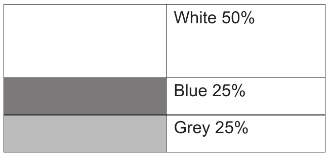

**Hình 1.1. Accord màu sắc của sự thật.**

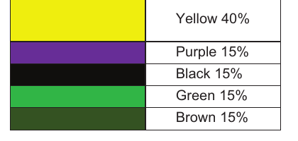

**Hình 1.2. Accord màu sắc của sự dối trá.**

**Bảng 1.9. Công thức dưỡng ẩm được sử dụng trong nghiên cứu của Jiménez và Sánchez (2014)**

| Thành phần | Tỷ lệ (%) |
|---|---:|
| Nước | qs |
| EDTA | 0.1 |
| Carbomer | 0.2 |
| Propylene glycol | 2.0 |
| Dimethicone | 2.0 |
| Chất làm mềm 1 | 2.0 |
| Chất làm mềm 2 | 2.5 |
| Cyclomethicone | 4 |
| Chất nhũ hóa | 2 |
| TEA | 0.2 |
| Chất bảo quản | 0.6 |
| Hoạt chất dưỡng ẩm | 4.0 |

Trong quá trình thử nghiệm, mỗi người tham gia được đưa các sản phẩm sau để đánh giá:

- Một mẫu lotion dưỡng ẩm trong hũ trắng, được đóng trong hộp có accord màu sắc của sự thật.
- Một mẫu lotion dưỡng ẩm trong hũ trắng, được đóng trong hộp có accord màu sắc của sự dối trá.

Người tham gia không biết rằng họ được đưa cùng một emulsion. Họ nghĩ mình đã nhận được hai sản phẩm khác nhau. Mỗi người tham gia được hỏi:

- Khi chưa mở hộp, sản phẩm nào sẽ đem lại nhiều lợi ích hơn cho da của bạn?
- Sau khi dùng sản phẩm, hãy chấm điểm từ 1 đến 5 (5 là tốt nhất) cho các hiệu ứng dưỡng ẩm, mềm mại, dính và cặn lưu lại.

Kết quả rất thú vị. Trước hết, 66,7% người tham gia cho biết họ thích sản phẩm được đóng trong hộp có accord màu sắc của sự thật hơn, trong khi 33,3% thích sản phẩm được đóng trong hộp có accord màu sắc của sự dối trá hơn. Điều này cho phép chúng tôi chứng minh rằng lý thuyết về các tổ hợp màu sắc có ảnh hưởng đến cảm nhận về sản phẩm. Sau trải nghiệm cảm quan, thuộc tính dính được đánh giá tốt hơn ở sản phẩm được đóng trong hộp có accord màu sắc của sự thật (p < 0.05), như trình bày trong Hình 1.3.

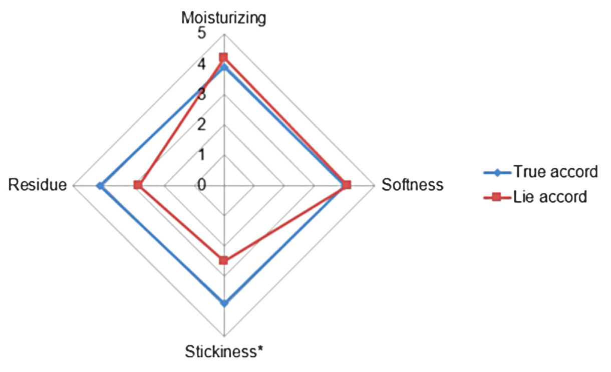

**Hình 1.3. Phân tích cảm quan cho nghiên cứu về accord màu sắc.**

---

## 1.4. Tính cộng hưởng cảm quan

Quá trình cảm quan có nhiều giai đoạn (Stein, 2012): kích thích, cảm giác, tri giác và đáp ứng. Tính cộng hưởng cảm quan là một công cụ rất thú vị để áp dụng khi thiết kế sản phẩm mỹ phẩm. Công cụ này tìm cách hiệp lực hóa cảm nhận cuối cùng về một sản phẩm dựa trên sự phối trộn đúng và mới mẻ của các kích thích. Quá trình này có thể xảy ra vì não bộ xử lý đồng thời nhiều kích thích cảm quan khác nhau.

Hình 1.4 trình bày trình tự của quá trình đa cảm quan trong sản phẩm mỹ phẩm. Sản phẩm tạo ra nhiều loại kích thích (mùi hương, xúc giác, màu sắc, v.v.). Người tiêu dùng chuyển đổi các kích thích này thành tín hiệu thần kinh, sau đó các tín hiệu được truyền lại theo cách tập trung. Một số tín hiệu này có thể hội tụ trong từng neuron riêng lẻ, tạo ra sự hội tụ đa cảm quan, vì các loại kích thích khác nhau được cùng một màng tiếp nhận (Stein, 2012). Tri giác đa cảm quan này có thể mang tính hiệp lực nếu tổ hợp các kích thích cảm quan phù hợp (1 + 1 = 4); ngược lại, nó sẽ bị suy giảm nếu tổ hợp không phù hợp (2 + 2 = 1).

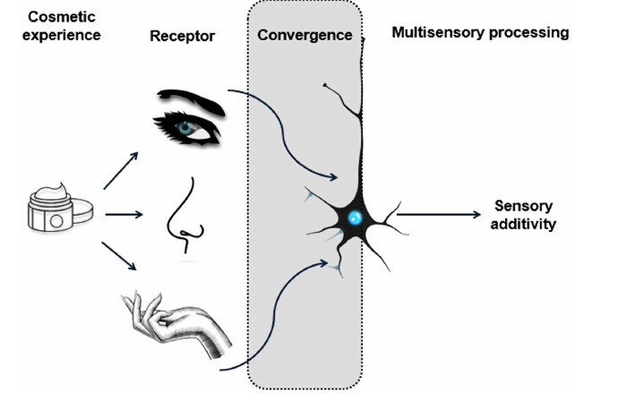

**Hình 1.4. Quá trình đa cảm quan của một sản phẩm mỹ phẩm.**

Cách tiếp cận này trong lĩnh vực khoa học thần kinh được các nhà khoa học áp dụng vào thiết kế sản phẩm và vào "neuromarketing" (Lindstrom, 2010; Pradeep, 2010; Lindstrom, 2011) trong nhiều ngành hàng khác nhau như thực phẩm, âm nhạc, bao bì và mỹ phẩm. Trong tất cả các nghiên cứu (Lindstrom, 2010; Pradeep, 2010; Lindstrom, 2011), các tác giả đã chứng minh rằng càng nhiều giác quan tham gia vào tương tác giữa sản phẩm/thương hiệu và người tiêu dùng, mức độ trung thành với thương hiệu cụ thể đó càng cao. Tận dụng quá trình đa cảm quan này cho phép phát triển các sản phẩm kích thích hơn và đem lại trải nghiệm người tiêu dùng tốt hơn. Một hướng có thể phát triển cùng bộ phận marketing là tạo ra một sản phẩm khiến người tiêu dùng bất ngờ bằng cách khai thác một insight đã được xác định.

Một số ví dụ về quá trình đa cảm quan trong các ngành khác nhau là:

- Khi ăn khoai tây chiên, âm thanh là yếu tố thiết yếu để cảm nhận chất lượng tốt. Nếu miếng khoai không tạo ra hiệu ứng giòn rụm này, người tiêu dùng kết luận rằng chúng không còn tươi hoặc chất lượng không tốt.
- Thay đổi màu sắc trong đồ uống trái cây. Người tiêu dùng kỳ vọng nước cam có màu vàng hoặc cam; bất kỳ màu nào khác sẽ tạo cảm giác lạ và khó chịu.
- Việc phát nhạc Pháp trong siêu thị đã được chứng minh là làm tăng doanh số rượu vang Pháp.
- Một số sân bay sử dụng ánh sáng xanh lam để giảm mệt mỏi cho hành khách sau chuyến bay dài, vì não bộ tỉnh táo dễ hơn dưới màu ánh sáng này.
- Khi hương liệu được thêm vào công thức xà phòng lỏng, mùi thức ăn chiên thay vì hương hoa sẽ làm giảm mạnh cảm nhận cảm quan về công thức. Đây là một ví dụ về sự ức chế cảm quan.
- Âm thanh động cơ của xe máy Harley Davidson rất dễ nhận biết. Nếu khách hàng mua một chiếc và âm thanh động cơ giảm đi đáng kể, cảm nhận tích cực về sản phẩm cũng sẽ giảm.
- Khi iPod được đưa ra thị trường, khách hàng xem đặc điểm thành công nhất của nó không phải là chất lượng âm thanh mà là trải nghiệm cảm quan về xúc giác khi tương tác với thiết bị.

---

### 1.4.1. Vai trò của màu sắc trong tính cộng hưởng cảm quan

Chúng tôi đã khảo sát lý thuyết về tính cộng hưởng và sự ức chế cảm quan liên quan đến cách màu sắc có thể ảnh hưởng đến cảm nhận về một nốt hương (Jiménez và Sánchez, 2014). Các mẫu sau được chuẩn bị:

- Mẫu 1: dung dịch vanilla 2%, trong ethanol, có màu be.
- Mẫu 2: dung dịch vanilla 2%, trong ethanol, có màu đỏ.
- Mẫu 3: dung dịch bạc hà 2%, trong ethanol, có màu xanh lam.
- Mẫu 4: dung dịch bạc hà 2%, có màu tím.

Hai nhóm gồm 12 phụ nữ (20 đến 40 tuổi) được đưa mẫu bạc hà 3 và mẫu vanilla 2 (Nhóm 1), hoặc mẫu bạc hà 4 và mẫu vanilla 1 (Nhóm 2). Mỗi mẫu được nhận diện bằng tên nốt hương tương ứng. Mỗi người tham gia được yêu cầu đánh dấu cảm nhận của mình trên thang điểm từ 1 đến 10, trong đó 1 là mức cảm nhận thấp nhất và 10 là cao nhất. Câu hỏi là: "Mẫu này làm bạn nhớ đến mùi bạc hà/vanilla (tùy từng mẫu) ở mức độ nào? Hãy đánh dấu mức độ bạn thích từng mẫu."

Kết quả cho thấy màu sắc của các nốt hương ảnh hưởng trực tiếp đến cách tình nguyện viên nhớ lại nốt hương và mức độ họ thích cảm giác đó (Hình 1.5). Một mẫu vanilla không được kỳ vọng là có màu đỏ; do đó mức độ yêu thích và ghi nhớ giảm xuống mặc dù hai mẫu có cùng nồng độ hương. Trải nghiệm tương tự cũng xảy ra với mẫu bạc hà. Mẫu bạc hà màu xanh lam hợp lý hơn mẫu bạc hà màu tím, và vì vậy mức độ ghi nhớ và yêu thích cũng giảm ở mẫu 4, dù nồng độ hương là như nhau ở cả hai mẫu.

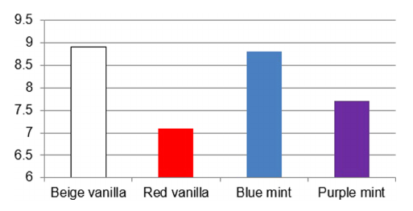

**Hình 1.5. Tính cộng hưởng/ức chế cảm quan trên các mẫu vanilla và bạc hà.**

Chúng tôi cũng khảo sát tác động của màu hộp bao bì lên cảm nhận dưỡng ẩm của một emulsion dưỡng ẩm (Jiménez và Sánchez, 2014). Một emulsion (công thức trình bày trong Bảng 1.9) được cho vào hai hũ trắng giống hệt nhau, rồi được đóng trong hai hộp có màu khác nhau: một hộp trắng và một hộp xanh lam. Mỗi mẫu được dán một mã số khác nhau. Mười hai phụ nữ (20 đến 40 tuổi) được yêu cầu đánh giá các thông số cảm quan gồm dưỡng ẩm, cặn lưu lại, mềm mại và dính, cũng như nhìn chung sản phẩm nào trong hai sản phẩm có hiệu năng tốt hơn. Người tham gia không biết rằng họ được đưa cùng một công thức. Điều thú vị là 83,4% người tham gia cho biết công thức được đựng trong hũ và đóng trong hộp xanh lam có hiệu năng tốt hơn (Hình 1.6), và các thông số cảm quan về dưỡng ẩm và mềm mại tốt hơn ở mẫu được đóng trong hộp xanh lam (p < 0.05: Hình 1.7).

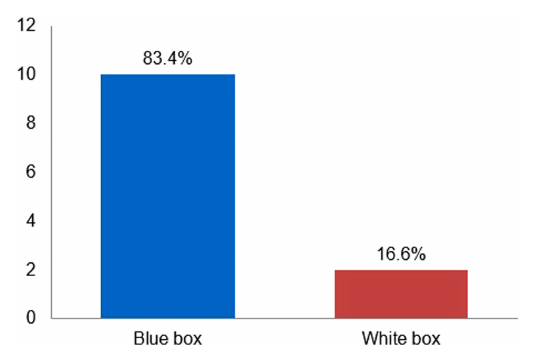

**Hình 1.6. Sự ưa thích sản phẩm theo màu hộp.**

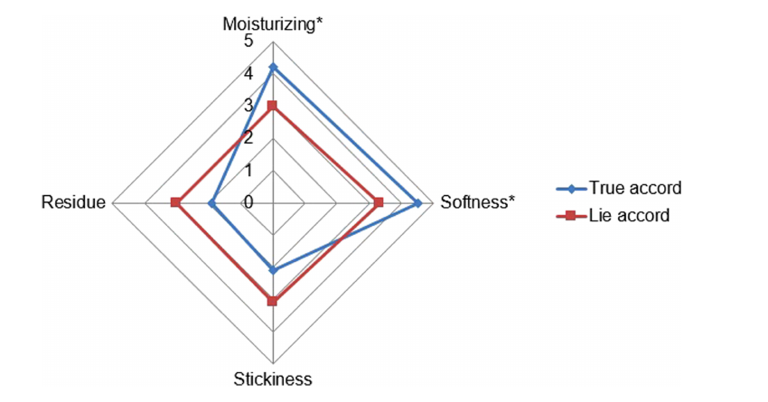

**Hình 1.7. Các thông số cảm quan được đánh giá.**

Một thử nghiệm cảm nhận cảm quan đối với hai mẫu của cùng một emulsion nuôi dưỡng nhưng có các nốt hương khác nhau cũng đã được thực hiện. Hương thứ nhất thuộc nhóm hương gỗ và hương thứ hai thuộc nhóm hương hoa. Mười hai phụ nữ tham gia được yêu cầu đánh giá các thông số cảm quan về dưỡng ẩm, mềm mại và cặn lưu lại sau khi thoa. Một lần nữa, người tham gia không biết rằng họ đang đánh giá cùng một sản phẩm. Cặn lưu lại được đánh giá là khác biệt có ý nghĩa giữa hai mẫu (p < 0.05), cho thấy cảm nhận cảm quan về emulsion thực sự có thể bị ảnh hưởng bởi nốt hương. Các nhóm hương khác nhau có thể tạo hiệu ứng làm dịu hoặc tiếp năng lượng, như đã được báo cáo trong nhiều tài liệu tham khảo về aromacology (trình bày trong Bảng 1.10). Bảng 1.11 trình bày một ma trận đánh giá hiệu ứng cộng hưởng/ức chế cảm quan có thể dùng cho đánh giá đa cảm quan đối với một số loại công thức mỹ phẩm.

**Bảng 1.10. Phân loại một số mùi hương theo hiệu ứng làm dịu hoặc tiếp năng lượng**

| Hiệu ứng | Mùi hương | Hiệu ứng | Mùi hương |
|---|---|---|---|
| Làm dịu | Bạc hà cay | Tiếp năng lượng | Vanilla |
|  | Lavender |  | Chocolate |
|  | Bạc hà |  | Cà phê |
|  | Eucalyptus |  | Cam |
|  | Quýt |  | Hoa cam |
|  | Jasmine |  |  |
|  | Hoa hồng |  |  |
|  | Chamomile |  |  |
|  | Geranium |  |  |

**Bảng 1.11. Ma trận đánh giá hiệu ứng cộng hưởng cảm quan đối với một số loại công thức**

| Sản phẩm | Thách thức/Lợi ích | Cảm nhận chính | Cảm nhận thứ cấp | Giác quan tham gia vào hoạt động cảm quan |
|---|---|---|---|---|
| Emulsion dưỡng ẩm da mặt | Tăng cảm nhận về độ ẩm | Cảm giác da đủ ẩm và mềm khi chạm | Xác định sắc độ xanh lam nào được người tiêu dùng liên hệ mạnh nhất với dưỡng ẩm. Xác định mùi từ nguồn nước tự nhiên nào tạo ra trải nghiệm mạnh nhất khi sử dụng một emulsion dưỡng ẩm. | Xúc giác; Thị giác; Khứu giác |
| Kem làm săn chắc da mặt | Tăng cảm giác săn chắc | Cảm giác da săn chắc hơn khi chạm | Kết cấu trông giống cao su cứng có hiệu ứng ghi nhớ. Việc nhìn và chạm gợi liên tưởng đến sự săn chắc. | Xúc giác; Thị giác |
| Sản phẩm blur cho da mặt | Cải thiện khuyết điểm da | Hiệu ứng làm mờ thị giác; nếp nhăn, soft-focus và hiệu ứng lì | Kết cấu sản phẩm trông giống cục tẩy. | Thị giác; Xúc giác |
| Sản phẩm filler cho da mặt | Hiệu ứng lấp đầy nếp nhăn | Giảm khả năng nhìn thấy nếp nhăn | Serum ở dạng bút và cho phép lấp đầy từng nếp nhăn. Loại hương nào có thể tăng cường hiệu ứng filler? | Thị giác; Xúc giác; Khứu giác |
| Sản phẩm lifting cho da mặt | Hiệu ứng làm căng da | Hiệu ứng nâng cơ nhìn thấy qua giảm nếp nhăn | Hiệu ứng cảm quan của cảm giác chạm cứng trên da | Thị giác; Xúc giác |
| Sản phẩm tẩy tế bào chết | Loại bỏ tế bào chết trên da | Các hạt cảm quan mài mòn nhẹ được cảm thấy khi thoa | Hiệu ứng thị giác về sự vỡ của các hạt và sự tích tụ hạt giúp loại bỏ tạp chất trên da. Bổ sung âm thanh làm tăng cảm nhận về tẩy tế bào chết. | Xúc giác; Thị giác; Thính giác |
| Dầu gội làm sạch | Làm sạch tóc | Cảm giác tóc mềm và không nhờn khi chạm | Mùi hương. Xác định hương giúp tăng cường cảm giác sạch ở mức độ lớn hơn. | Xúc giác; Khứu giác |
| Nước hoa tóc | Tạo hương cho tóc | Mùi còn lại trên tay khi tay lướt qua tóc | Thị giác. Pigment phát sáng trong bóng tối khi tóc được tạo hương. | Khứu giác; Xúc giác; Thị giác |
| Dầu dưỡng tóc | Dưỡng ẩm tóc | Cảm quan tóc mềm, linh hoạt và tươi mát | Dải giấy đổi màu khi tóc được dưỡng ẩm. | Xúc giác; Thị giác |
| Body lotion dưỡng ẩm | Dưỡng ẩm da | Hình ảnh kết cấu dạng xịt nước truyền tải khả năng dưỡng ẩm cao | Cảm quan với chất tạo màng để lại cảm giác ẩm trên da. | Thị giác; Xúc giác |
| Khử mùi | Kiểm soát mùi | Loại bỏ mùi khó chịu khi hoạt động thể chất | Giải phóng cảm giác lạnh khi hoạt chất phát huy tác dụng. | Khứu giác; Xúc giác |
| Kem tay | Dưỡng ẩm và làm mềm | Cảm quan bàn tay mịn và mềm | Giải phóng hương khi ma sát tay để tạo cảm giác da mượt hơn. | Xúc giác; Khứu giác |
| Điều trị cellulite | Giảm số đo, cải thiện biểu hiện cellulite | Giảm trực quan sự tích tụ mô mỡ | Thiết bị đi qua bề mặt da và chuyển sự giảm tích tụ mỡ thành âm nhạc dễ chịu. | Thị giác; Thính giác |
| Nước hoa fine fragrance | Tạo hương | Mùi hương kéo dài suốt ngày | Giải phóng các nốt hương khác nhau khi chạm vào nước hoa hoặc bất cứ khi nào có một cảm xúc. | Khứu giác; Xúc giác |
| Body splash | Tạo hương | Mùi hương kéo dài suốt ngày | Cảm nhận sự thay đổi của các nốt hương khi nếm thực phẩm ngọt hoặc chua. | Khứu giác; Vị giác |
| Kem cạo râu | Hỗ trợ trải nghiệm cạo râu | Cảm quan da mượt giúp lưỡi dao trượt dễ dàng | Kem có hiệu ứng tạo bọt tăng dần, phồng lên và tạo một lớp bọt dày trên da. | Xúc giác; Thị giác |
| Aftershave | Điều hòa da sau cạo râu | Cảm quan mát và mềm giúp giảm kích ứng da | Kết cấu dạng kem lướt trên da và đổi màu nhẹ sau khi tăng nhiệt độ, chỉ báo sự hiện diện của da nhạy cảm. | Xúc giác; Thị giác |
| Gel tạo kiểu | Duy trì kiểu tóc ở mức độ ẩm cao | Duy trì và kiểm soát kiểu tóc, cảm quan mượt và nhẹ | Kết cấu có pigment phát sáng trong bóng tối khi tóc hấp thụ độ ẩm cao, báo hiệu nhu cầu thoa lại. | Thị giác; Xúc giác |

---

## 1.5. Đổi mới trong đánh giá ngầm định

Thống kê cho thấy khoảng 80% sản phẩm mới thất bại sau một năm ra mắt, dù các sản phẩm này đã trải qua nhiều thử nghiệm bằng thiết bị và thử nghiệm cảm quan trong giai đoạn thiết kế và phát triển, các đánh giá mở rộng trên nhóm người tiêu dùng, thậm chí cả thử nghiệm lâm sàng để hỗ trợ claim. Vì sao một sản phẩm đã trải qua nhiều nghiên cứu và thử nghiệm như vậy vẫn thất bại trên thị trường sau khi ra mắt?

Trong một nghiên cứu liên quan đến quá trình ra quyết định mua hàng, nhà kinh tế học thần kinh Peter Kenning đã theo dõi các vùng não của người tiêu dùng được kích hoạt khi họ phản ứng với những hình ảnh thương hiệu khác nhau, bao gồm một số thương hiệu được panelist yêu thích và một số thương hiệu họ không thích (Barden, 2013). Dựa trên nghiên cứu này, Kenning kết luận rằng có sự khác biệt ở các vùng não có hoạt động mạnh hơn khi panelist được cho xem hình ảnh thương hiệu yêu thích của họ so với các thương hiệu khác. Trong trường hợp này, não cho thấy ít hoạt động tư duy phản tư hơn và nhiều hoạt động hơn ở các vùng ra quyết định trực giác. Các nghiên cứu khoa học thần kinh khác cũng cho thấy thương hiệu mạnh có tác động đến hoạt động não, dẫn đến việc ra quyết định nhanh (Lindstrom, 2010; Lindstrom, 2011).

Trước đây, chúng tôi đã cho thấy trải nghiệm thương hiệu ảnh hưởng đến cảm nhận yêu thích đối với một emulsion chống lão hóa (Jiménez và Sánchez, 2010). Chúng tôi mua một sản phẩm chăm sóc da mặt từ một thương hiệu xa xỉ nổi tiếng và có định vị tốt. Chúng tôi lấy sản phẩm ra khỏi hũ và dùng hũ rỗng đó để chứa một emulsion có profile cảm quan khó chịu, cụ thể là cảm giác sáp cao, cặn dầu nhiều, độ dễ tán thấp và độ dính cao (sản phẩm A). Sản phẩm vốn nằm trong hũ đắt tiền được chuyển sang một hũ khác bị hư hỏng, bẩn, trầy xước và có tình trạng nhãn kém (sản phẩm B). Cần lưu ý rằng profile cảm quan của sản phẩm xa xỉ tốt hơn profile cảm quan của emulsion được đóng trong hũ của thương hiệu uy tín.

Mười lăm phụ nữ (20 đến 55 tuổi), thuộc mức kinh tế xã hội trung bình và là người tiêu dùng thường xuyên các sản phẩm chăm sóc da mặt, đã tham gia nghiên cứu. Họ được đưa sản phẩm và được yêu cầu đánh giá các thông số sau:

- Trong khi thoa: độ dễ thoa, mức độ nhờn, độ dính và độ mượt, cùng các thông số khác.
- Sau khi thoa: cảm giác tươi mát, dưỡng ẩm, độ dính và lượng cặn lưu lại.

Điều thú vị là tại thời điểm thoa sản phẩm B, hai panelist đã dừng lại để quan sát hũ thật kỹ và hỏi về tình trạng của hũ. Các panelist đánh giá sản phẩm A chỉ liếc qua bao bì rồi ngay lập tức tiến hành thoa sản phẩm. Hành vi này cho thấy có sự tin tưởng vào thương hiệu, vì không phụ nữ nào dừng lại để đọc thông tin trên bao bì hoặc kiểm tra các chi tiết nhỏ. Hình 1.8 mô tả đánh giá cảm quan của hai sản phẩm sau khi thoa. Một số thông số được đánh giá tốt hơn đối với kem có profile cảm quan kém hơn nhưng được đóng trong hũ thương hiệu xa xỉ (sản phẩm A), qua đó cho thấy sức mạnh của thương hiệu có thể ảnh hưởng đến trải nghiệm sản phẩm.

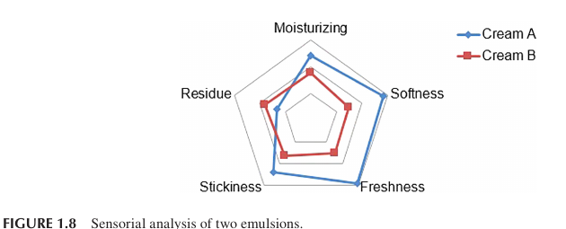

**Hình 1.8. Phân tích cảm quan của hai emulsion.**

Hình 1.9 trình bày quá trình mua hàng trực giác, trong đó người tiêu dùng có thể đưa ra quyết định chỉ trong vài mili giây. Knutson và cộng sự (2007) đã sử dụng chụp cộng hưởng từ chức năng (fMRI) để cho thấy vùng nhân accumbens septi của não được kích hoạt khi một người cảm nhận sự ưa thích đối với một giao dịch mua. Vùng não này liên quan đến khoái cảm, sự bù đắp, nghiện và hiệu ứng giả dược. Khi một giao dịch mua là tích cực, nó trở nên trực giác, nhanh và giàu cảm xúc. Có thể xem đây là một chiến lược do não của chúng ta thiết kế như một quá trình ra quyết định mang tính cơ học, giúp chúng ta ứng phó tốt hơn với một thế giới bão hòa thông tin.

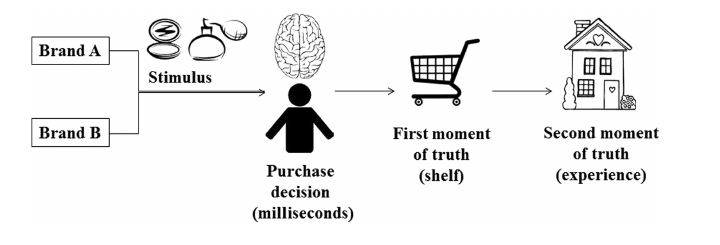

**Hình 1.9. Quá trình ra quyết định mua hàng.**

Trong lần mua đầu tiên, vốn có thể chỉ kéo dài vài mili giây, sức mạnh của thương hiệu là yếu tố then chốt để ảnh hưởng đến quyết định. Tuy nhiên, đối với việc mua lại và thành công tiếp theo của sản phẩm trên thị trường, trải nghiệm sử dụng công thức là điều thiết yếu để sản phẩm có hiệu quả bán hàng phù hợp. Do đó, một trong các mục tiêu của formulator là ảnh hưởng đến quá trình mua hàng bằng cách sử dụng một profile cảm quan làm tăng đáp ứng thần kinh. Khoa học thần kinh được áp dụng vào quá trình nghiên cứu và phát triển formulation là một cơ hội lớn để xây dựng thương hiệu và phát triển những sản phẩm chinh phục trái tim cũng như tâm trí người tiêu dùng. Có một lượng tài liệu đáng kể liên quan đến ứng dụng các nghiên cứu khoa học thần kinh trong quảng cáo, xây dựng thương hiệu và marketing, nhưng có rất ít tài liệu về ứng dụng của lĩnh vực này ở giai đoạn formulation, dù có nhiều cơ hội lớn.

---

### 1.5.1. Đánh giá hiển hiện so với đánh giá ngầm định

Có hai cách để đánh giá tác động mà một kích thích hoặc sản phẩm tạo ra trên người tiêu dùng: đánh giá hiển hiện và đánh giá ngầm định. Đánh giá hiển hiện liên quan đến mức độ cảm nhận được người tiêu dùng diễn đạt khi phản hồi với một kích thích cụ thể, và sử dụng các kỹ thuật như phiên focus group, thử nghiệm sử dụng tại nhà và phỏng vấn sâu. Đánh giá hiển hiện đóng góp rất lớn cho việc đánh giá sản phẩm và được sử dụng rộng rãi trong quá trình phát triển. Các đánh giá này cung cấp nhiều thông tin về hiệu năng của sản phẩm, mức độ hài lòng và tác động mà sản phẩm có thể đang tạo ra trên người tiêu dùng, như trình bày trong Bảng 1.12. Tuy nhiên, điều quan trọng là cần bổ sung các nghiên cứu này bằng đánh giá ngầm định, vốn tìm cách đánh giá những động cơ nội tại dẫn đến một quyết định, thông qua việc đánh giá quá trình cảm xúc, chú ý và ghi nhớ (Jiménez và cộng sự, 2016). Neuromarketing là việc áp dụng các nguyên lý khoa học thần kinh để thu thập thông tin về cách một người đưa ra quyết định dựa trên tiêu dùng thông qua ba tham số này. Một trong những cơ hội lớn là phát triển các nghiên cứu khoa học thần kinh ứng dụng trong giai đoạn formulation sản phẩm. Mục tiêu là để đánh giá ngầm định bổ sung cho đánh giá hiển hiện, chứ không thay thế chúng.

**Bảng 1.12. Các loại động cơ ở người tiêu dùng**

|  | Động cơ ngầm định |  | Động cơ hiển hiện |
|---|---|---|---|
| Cần đánh giá | Cách đo lường | Cần đánh giá | Cách đo lường |
| Thất vọng Thiền định Hào hứng/yêu thích Quan tâm | EEG fMRI (chụp cộng hưởng từ chức năng) Eye-tracking Biểu cảm khuôn mặt Hoạt động điện da | Màu sắc, mùi, vị, kết cấu và thính giác Hiệu quả và hiệu năng Ví dụ: "Xà phòng nên làm sạch và có mùi thơm" và "Xà phòng nên tạo đủ bọt" | Thử nghiệm định tính và định lượng Thử nghiệm sử dụng tại nhà Focus group Thử nghiệm hiệu quả bằng thiết bị bioengineering |

---

### 1.5.2. Các kỹ thuật khoa học thần kinh được áp dụng ở giai đoạn formulation

Khoa học thần kinh là ngành nghiên cứu hệ thần kinh của con người, bao gồm não, giải phẫu và các chức năng của não. Khoa học thần kinh là thiết yếu để hiểu các phản ứng sinh lý khác nhau xảy ra khi con người tiếp xúc với thương hiệu, sản phẩm và quảng cáo. Các kỹ thuật khoa học thần kinh bao gồm những phép đo sinh lý hoặc sinh trắc học được thu nhận từ tín hiệu cơ thể như:

**Biểu cảm khuôn mặt:** Khuôn mặt người ghi nhận rất nhiều trạng thái cảm xúc khác nhau (Hình 1.10), bao gồm những thay đổi dễ quan sát như mỉm cười, và những thay đổi nhỏ khó quan sát như chuyển động cơ.

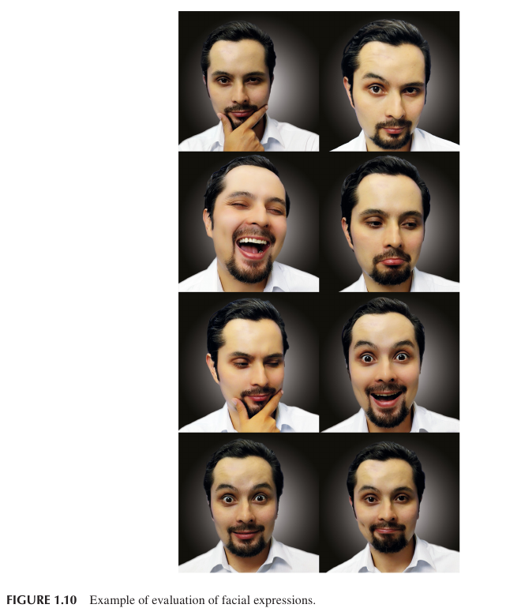

**Hình 1.10. Ví dụ về đánh giá biểu cảm khuôn mặt.**

**Eye-tracking:** Công cụ này đánh giá saccade (các chuyển động mắt dùng để chuyển nhanh điểm cố định thị giác từ đối tượng này sang đối tượng khác) và sự giãn đồng tử khi phản hồi với các kích thích khác nhau. Hình 1.11 mô tả một ví dụ về kết quả đọc eye-tracking trước hai hình ảnh.

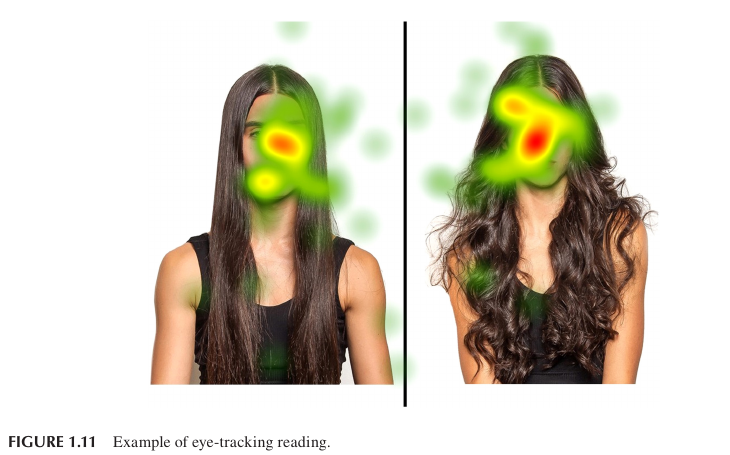

**Hình 1.11. Ví dụ về kết quả đọc eye-tracking.**

**Hoạt động điện da:** Sự thoát mồ hôi qua da là một thông số được đánh giá như phản hồi với một kích thích cụ thể. Thông số này có thể được đánh giá trên da ngón tay như trong Hình 1.12.

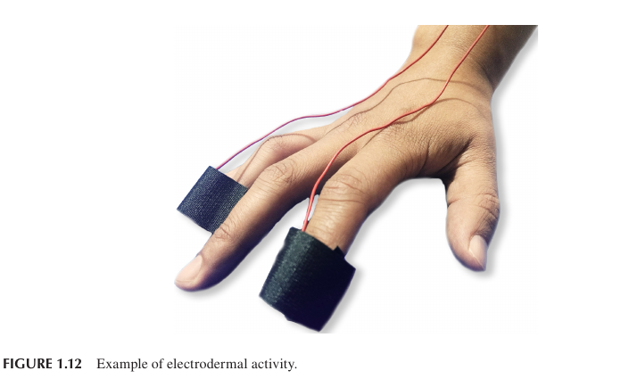

**Hình 1.12. Ví dụ về hoạt động điện da.**

**Chụp cộng hưởng từ chức năng (fMRI):** Đây là một công cụ rất chính xác, cung cấp hình ảnh chi tiết về các mức khác nhau của những vùng não hoạt động khi phản hồi với một kích thích (Hình 1.13). Tuy nhiên, công cụ này rất đắt và không dễ tiếp cận trong thực hành thường quy.

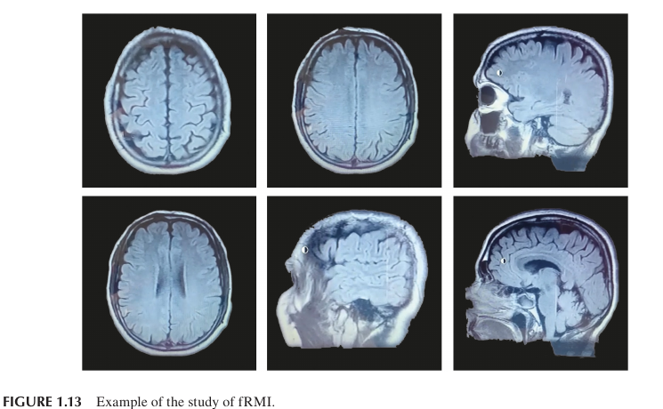

**Hình 1.13. Ví dụ về nghiên cứu fMRI.**

**Điện não đồ (EEG):** Kỹ thuật này đo hoạt động điện trong não và đang ngày càng được sử dụng để đánh giá các kích thích dựa trên formulation. Đây là một lựa chọn ít tốn kém hơn so với fMRI. Một ví dụ được trình bày trong Hình 1.14, nơi có thể quan sát hành vi của các sóng khác nhau theo thời gian.

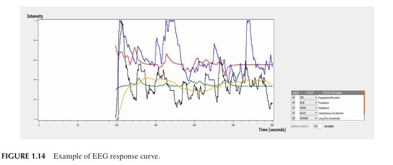

**Hình 1.14. Ví dụ về đường cong đáp ứng EEG.**

---

### 1.5.3. Ví dụ về ứng dụng eye-tracking

Phương pháp eye-tracking cung cấp thông tin về những vùng và trình tự mà panelist chú ý nhiều hơn. Kỹ thuật này có thể được sử dụng trong giai đoạn thiết kế formulation để cho phép phát triển các phương pháp luận mới, claim khác biệt và giảm thời gian ra quyết định. Hình 1.15 trình bày việc thoa sáu tông màu son môi khác nhau trên một tình nguyện viên, và Hình 1.16 trình bày một ví dụ về kết quả đọc được tạo ra. Có thể xác định màu môi nào có tác động lớn hơn và thu hút nhiều chú ý hơn từ người tiêu dùng (Jiménez, 2017).

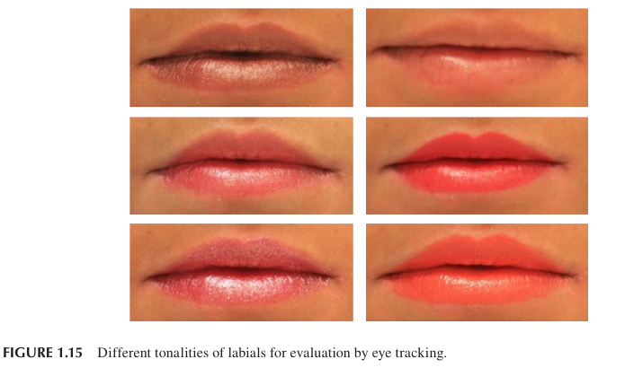

**Hình 1.15. Các tông màu son môi khác nhau để đánh giá bằng eye-tracking.**

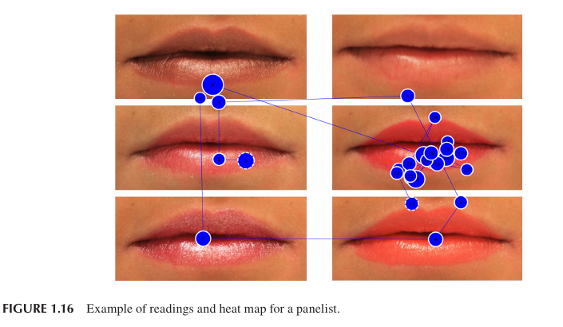

**Hình 1.16. Ví dụ về kết quả đọc và heat map của một panelist.**

Phương pháp luận này cũng cho phép chúng ta thu được các câu trả lời so sánh giữa nhiều nhóm panelist khác nhau. Hình 1.17 trình bày heat map của một nhóm 10 nam giới và Hình 1.18 trình bày heat map tổng hợp của 10 phụ nữ. Điều đáng chú ý là chúng ta có thể quan sát màu nào hấp dẫn hơn đối với các nhóm khác nhau, qua đó cho phép tăng tốc quá trình ra quyết định trong khu vực thiết kế và cũng đánh giá các thông số khác nhau trong concept và quảng cáo của sản phẩm.

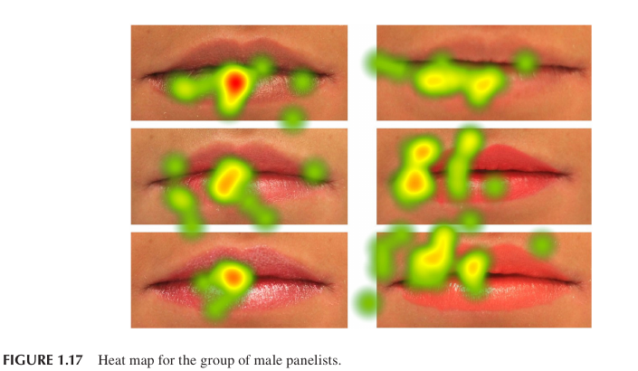

**Hình 1.17. Heat map của nhóm panelist nam.**

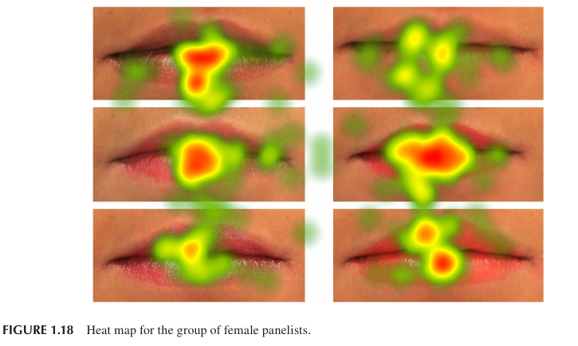

**Hình 1.18. Heat map của nhóm panelist nữ.**

Chúng tôi đã phát triển một phương pháp luận mới để đánh giá hiệu năng của hương liệu, dùng để đánh giá mối quan hệ giữa hương liệu, tên sản phẩm và hình ảnh (Jiménez, 2015). Với loại phương pháp luận này, điều quan trọng là phải thực hiện một quá trình hiệu chuẩn trước để biết hiệu năng của các chuyển động saccade trong một bối cảnh nhất định. Hình 1.19 trình bày một ví dụ về kết quả đọc khi có sự nhất quán giữa tên và hình ảnh. Từ "tree" (*árbol* trong tiếng Tây Ban Nha) tương ứng với hình ảnh. Hình 1.20 trình bày một ví dụ về kết quả đọc khi không có sự nhất quán, vì từ "carrot" (*zanahoria* trong tiếng Tây Ban Nha) không tương ứng với hình ảnh. Như thấy trong hai ví dụ, hiệu năng của các chuyển động saccade là khác nhau.

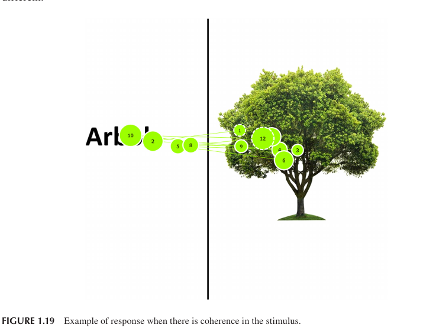

**Hình 1.19. Ví dụ về đáp ứng khi có sự nhất quán trong kích thích.**

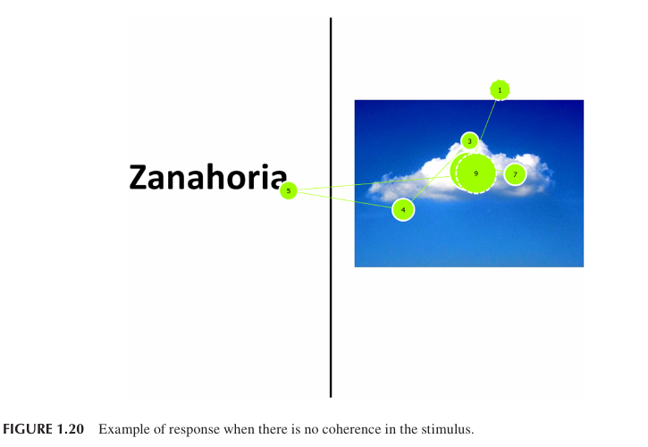

**Hình 1.20. Ví dụ về đáp ứng khi không có sự nhất quán trong kích thích.**

Giai đoạn hiệu chuẩn, bao gồm phân tích sự nhất quán, rất gợi mở vì nó mở ra cánh cửa cho việc thiết kế các phương pháp luận mới để nghiên cứu những kết cấu khác nhau của sản phẩm mỹ phẩm, bao gồm emulsion, sản phẩm khan nước, sản phẩm rinse-off và hương liệu. Quan trọng là phương pháp này cũng có thể được áp dụng trong đánh giá concept, tên thương hiệu và quảng cáo sản phẩm. Hình 1.21 cho thấy đáp ứng khi các yếu tố cấu thành kích thích là nhất quán, vì tên lavender tương ứng với hình ảnh và hương liệu được đưa cho panelist để ngửi. Hình 1.22 trình bày loại đáp ứng khi không có sự nhất quán trong các kích thích, vì tên lavender tương ứng với hình ảnh, nhưng trong trường hợp này panelist được đưa một nốt hương cà phê. Như thấy trong Hình 1.21 và 1.22, các đáp ứng là khác nhau.

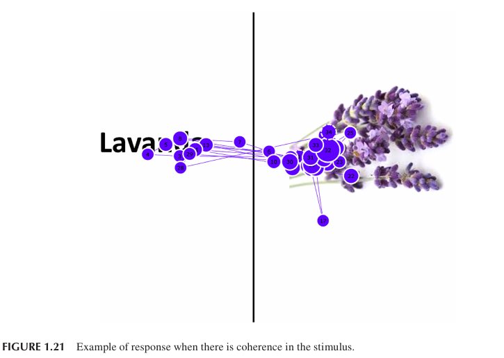

**Hình 1.21. Ví dụ về đáp ứng khi có sự nhất quán trong kích thích.**

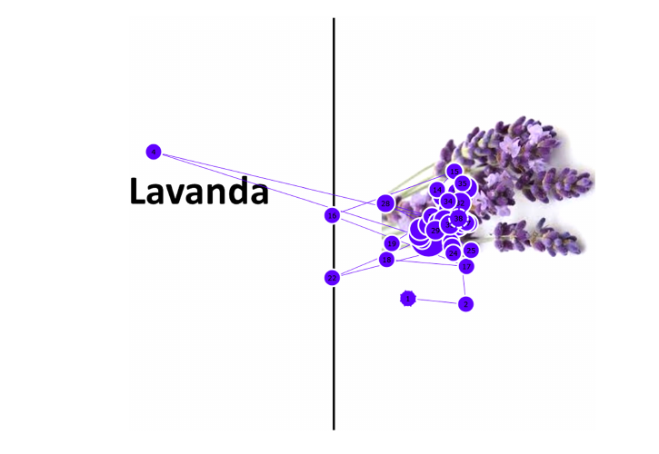

**Hình 1.22. Ví dụ về đáp ứng khi không có sự nhất quán trong kích thích.**

Phương pháp luận về sự nhất quán cũng có thể được áp dụng để đánh giá hiệu năng của sản phẩm. Gần đây, chúng tôi đã áp dụng phương pháp luận này để đánh giá hiệu ứng soft-focus trong các formulation chống lão hóa (Jiménez và Guzmán, 2017). Mục tiêu là phát triển một phương pháp đánh giá nhanh, từ đó cho phép chúng tôi xác nhận và loại bỏ formulation trong thời gian ngắn hơn. Trong trường hợp này, phân tích nhất quán ban đầu được thực hiện với các ảnh độ phân giải cao về hiệu ứng chống nhăn trước và sau. Các miếng da thuộc được sử dụng để đánh giá hiệu ứng soft-focus. Hình 1.23 trình bày một ví dụ về kết quả đọc ở một trong các mẫu được xem là mẫu trắng (không thoa sản phẩm), trong đó phần da thuộc được chia thành hai phần bằng nhau: sự phân bố các điểm nhìn là như nhau ở cả hai bên. Hình 1.24 trình bày một ví dụ về kết quả đọc của một formulation, trong đó phía bên phải của ma trận da thuộc được quan sát thấy có sự giảm nếp nhăn tức thì do hiệu ứng soft-focus. Hiệu ứng này làm thay đổi sự phân bố các điểm nhìn so với mẫu trắng.

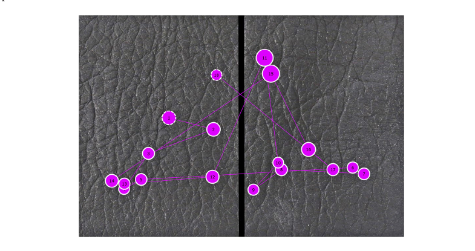

**Hình 1.23. Ví dụ về kết quả đọc eye-tracking cho panel hiệu chuẩn.** Ảnh do *Cosmetics & Toiletries* cung cấp.

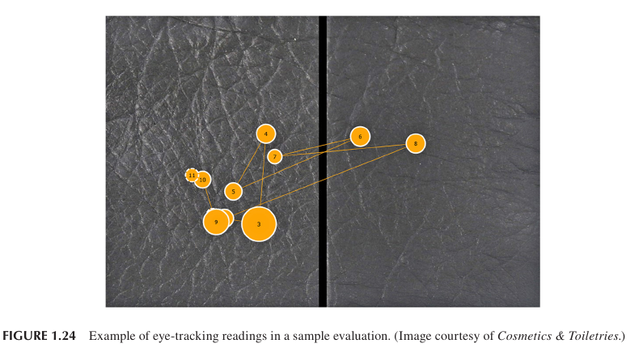

**Hình 1.24. Ví dụ về kết quả đọc eye-tracking trong đánh giá mẫu.** Ảnh do *Cosmetics & Toiletries* cung cấp.

---

### 1.5.4 Ví dụ ứng dụng eye-tracking và EEG trong sản phẩm chăm sóc tóc

Chăm sóc tóc là một ngành hàng mà việc ứng dụng các kỹ thuật thần kinh học cũng rất thú vị. Chúng tôi đã áp dụng phương pháp luận nhất quán/không nhất quán để đánh giá hiệu năng của các tác nhân dưỡng tóc (Guzmán và Jiménez, 2016). Trong trường hợp này, tính nhất quán liên quan đến những hình ảnh cho thấy tóc ở tình trạng rất tốt và những hình ảnh cho thấy tóc ở tình trạng kém (trước đó tóc đã được gội bằng dung dịch SLS 15%), như minh họa ở Hình 1.25. Hình 1.26 trình bày một ví dụ về kết quả đọc đối với hai tác nhân dưỡng tóc khác nhau. Trong trường hợp này, hiệu năng được thể hiện qua vùng bao phủ của ánh nhìn nhỏ hơn bởi các điểm nhìn.

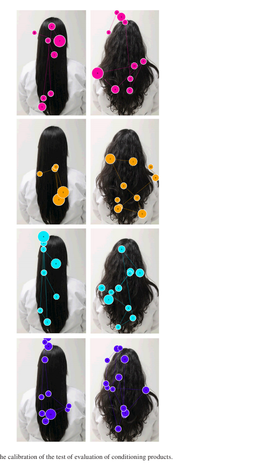

*Hình 1.25. Hình ảnh dùng để hiệu chuẩn phép thử đánh giá sản phẩm dưỡng tóc.*

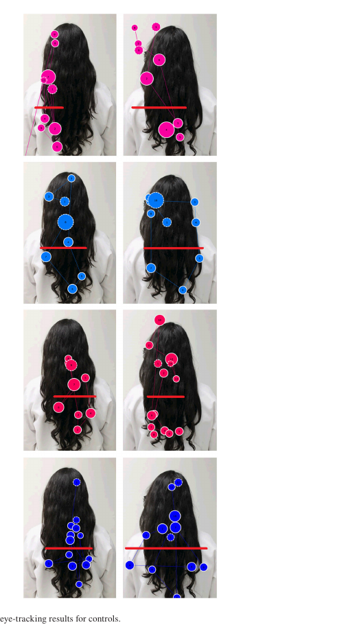

*Hình 1.26. Ví dụ về kết quả eye-tracking đối với mẫu đối chứng.*

Trong ví dụ này, kết quả đo điện não đồ cho phép chúng ta biết những động lực mà các panelist cảm nhận khi đối diện với các kích thích. Hình 1.27 cho thấy một ví dụ về đường cong đáp ứng tại thời điểm panelist chải các lọn tóc sau khi thoa sản phẩm. Có thể thấy công thức nào trong nghiên cứu tạo ra nhiều hứng thú và mức độ gắn kết hơn, cũng như công thức nào làm giảm mức độ thất vọng của người tiêu dùng khi đánh giá hiệu năng công thức. Trong phương pháp này, việc phân tích các điểm uốn (điểm 1 và 2 trong hình) rất quan trọng, vì đây là ví dụ rõ ràng về sự thay đổi tức thời trong nhận thức. Kiểu đánh giá này giúp chúng ta hiểu sâu hơn công thức nào có hiệu năng tốt hơn, từ đó phần nào bảo đảm công thức đó sẽ được đánh giá tốt hơn trong nghiên cứu hiệu quả lâm sàng hoặc da liễu tiếp theo, hay trong phép thử với người tiêu dùng.

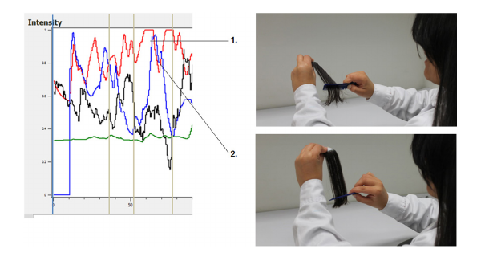

*Hình 1.27. Ví dụ về đường cong EEG tại thời điểm chải tóc.*

---

## 1.6 Cảm giác kèm trong thiết kế

Nguồn gốc thuật ngữ *synesthesia* là sự kết hợp của hai từ Hy Lạp có nghĩa là “cùng nhau” và “cảm giác”; vì vậy, thuật ngữ này được hiểu là sự cảm nhận cùng một kích thích bằng hai giác quan khác nhau. Cảm giác kèm tìm cách hòa trộn cảm giác của các giác quan khác nhau, đôi khi cả cảm xúc, và vì thế đã được sử dụng rộng rãi trong âm nhạc, hội họa, văn học và các ẩn dụ thi ca:

- Những cụm từ trong ngôn ngữ hằng ngày như “cái lạnh đắng”, “giấy dán tường ồn ào”, “nụ cười ấm áp”, “vuốt ve ngọt ngào”.
- “Không có màu sắc, anh không nghe thấy gì. Anh lấp đầy những cuốn sổ bằng âm thanh của màu vàng và đỏ” trong tiểu thuyết *The Sound of Blue* của Holly Payne.
- Trái tim người phụ nữ được tạo ra để “uống thứ thuốc nhợt nhạt của im lặng” trong tác phẩm *Modern Love* của George Meredith.
- “Tên em có vị như cỏ” trong bài hát “Tu nombre me sabe a yerba” của Joan Manuel Serrat.

Cảm giác kèm là một tình trạng trong đó những trải nghiệm liên quan đến nhận thức, chẳng hạn màu sắc hoặc vị giác, được gây ra bởi các kích thích vốn thường không gắn với trải nghiệm đó. Trải nghiệm cảm giác kèm có ba đặc điểm: được khơi gợi bởi một kích thích, là những nhận thức có ý thức và xảy ra tự động (Stein, 2012).

Nhiều nghiên cứu thú vị về cảm giác kèm đã được thực hiện trong lĩnh vực khoa học thực phẩm. Chẳng hạn, Spence đã xây dựng một khối lượng lớn tài liệu về nhận thức đa cảm quan, đặc biệt trong ứng dụng cho thực phẩm và đồ uống (Zampini và Spence, 2012; Velasco và cs., 2018). Ông đã đánh giá vai trò của tín hiệu thị giác và thính giác trong nhận thức đa cảm quan về hương vị; ví dụ, âm thanh tần số cao và hình dạng cong có thể làm tăng độ ngọt cảm nhận của thực phẩm, và rượu vang có thể được cảm nhận ngon hơn nếu trước đó người dùng nghe tiếng mở nút chai. Việc huy động nhiều giác quan cùng lúc có lợi vì hoạt động não tăng lên, khiến trải nghiệm trở nên thỏa mãn hơn.

Reinoso Carvalho và cs. (2017) nghiên cứu tác động của một số âm thanh trong việc cải thiện các thuộc tính của những hương vị cơ bản. Người tham gia (65 nữ và 51 nam) đánh giá độ béo mịn của hai mẫu sô-cô-la (không biết rằng hai mẫu giống hệt nhau) khi nghe các nhạc nền khác nhau. Họ cảm nhận sô-cô-la có độ béo mịn và độ ngọt cao hơn khi nghe nhạc nền “béo mịn” (các nốt flute dài, hòa âm thuận), được xác định là “béo mịn”, so với nhạc nền “thô ráp” (các câu violin pizzicato ngắn).

Có một số ví dụ khá lạ, liên quan đến sản phẩm mỹ phẩm, về việc áp dụng các khái niệm cảm giác kèm. Chẳng hạn, Hotel Café Royal nổi tiếng từng có một thực đơn cocktail lấy cảm hứng từ và có vị giống một số nốt hương thơm nhất của nước hoa cao cấp (LuxuryLaunches, 2016); còn tại Bart’s bar ở London, cocktail được pha cùng những nốt hương đặc trưng, đồng thời các nốt hương này có thể ăn được và giúp cải thiện tâm trạng (Eysenck, 2016).

Cảm giác kèm thúc đẩy chúng ta suy nghĩ khác đi. Bảng 1.13 trình bày một số ý tưởng thiết kế sản phẩm có thể khai thác theo khái niệm cảm giác kèm.

| Nhóm | Ví dụ về khái niệm cảm giác kèm |
|---|---|
| Emulsion | Có thể phát triển kết cấu của opera không? |
| Hương thơm | Có thể phát triển một hương thơm có mùi như nhạc rock không? |
| Dầu gội | Có thể phát triển công thức dầu gội dựa trên một bài hát không? |
| Hương thơm | Có thể phát triển một hương thơm ăn được, có vị như quế không? |
| Chống lão hóa | Có thể phát triển một sản phẩm chống lão hóa gợi nhớ đến ẩm thực Pháp không? |
| Hương thơm | Có thể chuyển nhịp điệu của một điệu nhảy Mỹ Latinh điển hình thành một nốt hương không? |
| Chăm sóc cơ thể | Có thể phát triển kết cấu cho phép người ta chạm vào những bản nhạc phương Đông không? |
| Chống nắng | Có thể phát triển công thức dựa trên tính cách không: công thức vui vẻ, lạc quan hay u sầu? |

*Bảng 1.13. Ý tưởng sản phẩm theo cách tiếp cận cảm giác kèm.*

Các phương pháp đánh giá ngầm định phù hợp nhất để thiết kế các phép thử cảm giác kèm. Trong một nghiên cứu gần đây (Guzmán và Jimenez, 2018), chúng tôi cho thấy âm nhạc, cụ thể là *Bốn mùa* của Vivaldi, có thể làm thay đổi nhận thức về một số nốt hương nhất định, vì mỗi mùa có nhịp độ khác nhau và gắn với những cảm giác, cảm xúc khác nhau. Chúng tôi cho thấy những nốt nhạc này có thể làm thay đổi nhận thức cảm quan về độ ẩm và độ mềm của các công thức kem giống hệt nhau. Khi bốn công thức khác nhau được đánh giá theo từng mùa, hệ phân tán silicone được xếp hạng tốt nhất ở mùa “Hạ” (nhịp nhanh gợi lên sự căng thẳng và sức mạnh); hệ phân tán petrolatum và một emulsion được đánh giá đồng hạng tốt nhất ở mùa “Thu” (nhịp vừa phải gợi lên sự bình thản); trong khi công thức hydrogel lỏng được đánh giá tốt nhất ở mùa “Đông” (nhịp chậm gợi sự chiêm nghiệm). Các tác giả cũng chứng minh cảm giác kèm ngửi–nghe với sáu hương thơm và âm nhạc, cùng cảm giác kèm nếm–chạm giữa sô-cô-la và các công thức dùng trên da.

Việc sử dụng thiết kế cảm giác kèm trong công thức mỹ phẩm mở ra một thế giới phát triển hoàn toàn mới. Việc áp dụng các phương pháp thần kinh học sẽ tiếp tục giữ vai trò quan trọng trong phát triển những phương pháp đánh giá mới cho sản phẩm mỹ phẩm, cho phép nhà khoa học mỹ phẩm thiết kế sản phẩm hướng đến trải nghiệm đa cảm quan và định lượng trải nghiệm đó. Sau cùng, điều này sẽ tối ưu hóa trải nghiệm người tiêu dùng và tiếp tục thúc đẩy đổi mới cũng như thành công trong phát triển sản phẩm mỹ phẩm.

---

# 2. Hình thái học, sự phát triển và sinh lý học của da

Kenneth A. Walters và Michael S. Roberts

## Nội dung

- Giới thiệu
- Cấu trúc da
  - Biểu bì
  - Trung bì
  - Mô dưới da
  - Các phần phụ của da
- Sự phát triển của lớp sừng
  - Biệt hóa biểu bì
  - Bao tế bào sừng hóa
  - Lipid gian bào của lớp sừng
  - Protein lớp sừng
  - Bong vảy
- Cơ chế sửa chữa biểu bì
  - Ảnh hưởng của sự hydrat hóa
  - Tổn thương hóa học
  - Bất thường sinh hóa
- Nhận xét kết luận
- Tài liệu tham khảo

---

## 2.1. Giới thiệu

Da là cơ quan lớn nhất của cơ thể, chiếm hơn 10% khối lượng cơ thể và cũng là cơ quan giúp cơ thể tương tác mật thiết nhất với môi trường. Hình 2.1 minh họa cấu trúc da dưới dạng sơ đồ.

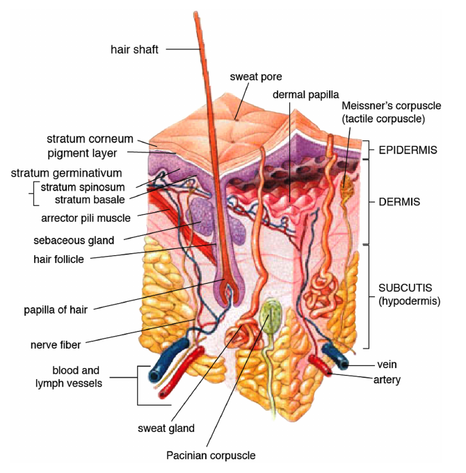

**Hình 2.1.** Sơ đồ da người toàn bộ chiều dày, thể hiện các lớp chính, mô dưới da và nhiều cấu trúc khác. Da có hai lớp chính là biểu bì và trung bì; trên phần lớn cơ thể, da dày hơn 1 mm. Biểu bì (dày khoảng 100 µm) được chia tiếp thành hai lớp: lớp sừng và lớp mầm (hay biểu bì sống). Hình cũng thể hiện một số phần phụ của da, bao gồm nang và thân tóc, các tuyến bã nhờn và cơ dựng lông liên quan, cùng các ống tuyến mồ hôi. Trung bì chứa một mạng lưới mạch máu dày đặc, liên tục nâng đỡ mô mầm và giữ vai trò quan trọng trong điều hòa thân nhiệt. Tại đây còn có các thụ thể cảm nhận đau và các đầu tận cùng thần kinh xúc giác (tiểu thể Meissner). (Nguồn: upload.wikimedia.org/Wikipedia/commons/2/27/skin.png.)

Về cơ bản, da gồm bốn lớp: lớp sừng (thường được gọi là biểu bì không sống), các lớp còn lại của biểu bì (biểu bì sống), trung bì và mô dưới da. Da còn có một số phần phụ đi kèm như nang tóc, ống tuyến mồ hôi, tuyến apocrine và móng. Nhiều chức năng của da có thể được xem là thiết yếu đối với sự sống còn của động vật có vú và con người trong một môi trường tương đối khắc nghiệt. Nhìn chung, các chức năng này có thể được phân thành ba nhóm: bảo vệ, duy trì cân bằng nội môi và cảm nhận.

Tầm quan trọng của vai trò bảo vệ và duy trì cân bằng nội môi của da được thể hiện, trước hết, qua đặc tính hàng rào. Đặc tính này cho phép con người tồn tại trong môi trường có nhiệt độ và lượng nước thay đổi (độ ẩm và việc tắm rửa), đồng thời hiện diện các mối nguy như hóa chất, vi khuẩn, dị nguyên, nấm và bức xạ. Thứ hai, da là một cơ quan chủ yếu giúp duy trì cân bằng nội môi của cơ thể, đặc biệt về thành phần cơ thể, điều hòa nhiệt, kiểm soát huyết áp và bài tiết. Thứ ba, da là cơ quan cảm giác quan trọng, tiếp nhận các tác động từ môi trường như nhiệt, áp lực, đau, cũng như sự xâm nhập của dị nguyên và vi sinh vật. Cuối cùng, da là một cơ quan liên tục tái tạo và sửa chữa. Để thực hiện được tất cả các chức năng này, da phải bền chắc, vững vàng và linh hoạt, đồng thời bảo đảm sự giao tiếp hiệu quả giữa các thành phần nội tại của nó.

---

## 2.2. Cấu trúc da

Trong khi Hình 2.1 cung cấp cái nhìn tổng quan về cấu trúc đại thể của da, Hình 2.2 trình bày các thành phần của da theo những chức năng mà chúng thực hiện.

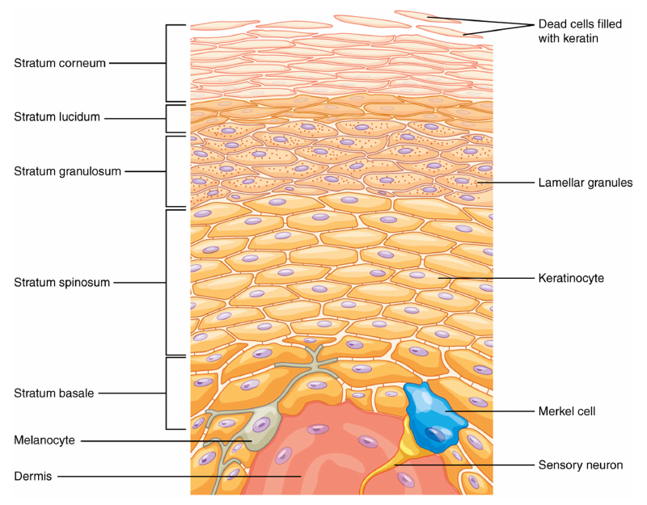

**Hình 2.2.** Các tầng tế bào của biểu bì được sắp xếp thành nhiều lớp, tất cả đều bắt nguồn từ các tế bào mầm ở lớp đáy (lớp đáy, hay *stratum basale*, tạo nên ranh giới giữa trung bì và biểu bì). Lớp này chứa các tế bào gốc của da; chúng tạo ra các tế bào con và các tế bào này được đẩy dần ra ngoài khỏi lớp đáy. Khi trưởng thành, các tế bào hình thành những cầu nối protein với nhau, qua đó tạo nên sự giao tiếp giữa tế bào với tế bào và làm cho tế bào có đường viền dạng gai (lớp gai, hay *stratum spinosum*). Chúng cũng bắt đầu tổng hợp keratin. Ở vị trí xa hơn về phía ngoài, các tế bào tạo ra những túi lipid làm cho tế bào có dạng hạt (lớp hạt, hay *stratum granulosum*). Cuối cùng, các hạt lipid được xuất bào; phần lipid bên trong tái sắp xếp để hình thành các phiến lipid gian bào. Sau đó, tế bào mất nhân và trở nên trong suốt (lớp trong, hay *stratum lucidum*); khi tạo thành lớp sừng, các tế bào này không còn được xem là tế bào sống. Những tế bào khác hiện diện trong biểu bì gồm tế bào hắc tố sản xuất sắc tố và tế bào Merkel đảm nhiệm chức năng cảm giác. (Nguồn: opentextbc.ca.)

Cần nhấn mạnh rằng các chức năng bảo vệ, duy trì cân bằng nội môi và cảm nhận của da vừa chồng lấp vừa tích hợp với nhau. Chẳng hạn, đặc tính hàng rào của da đối với một thực thể hóa học bao gồm: chống lại sự xâm nhập của thực thể đó (hàng rào do lớp sừng tạo nên); chuyển hóa phần thực thể vượt qua lớp sừng (tại biểu bì sống); nhận biết và đáp ứng với tổn thương do sự xâm nhập gây ra (giải phóng chất trung gian gây viêm ở biểu bì, với sự tham gia của trung bì); loại bỏ thực thể khỏi vị trí xâm nhập nhờ hệ mạch máu trung bì và phân bố thực thể đến các cơ quan chuyên trách của cơ thể để loại bỏ bằng chuyển hóa (gan) và bài tiết (thận). Quá trình điều hòa nhiệt có sự tham gia của lớp đệm mỡ dưới da và sự điều hòa sinh lý đối với lưu lượng máu, chẳng hạn giúp tỏa nhiệt thông qua giãn mạch và làm mát bằng tiết mồ hôi.

---

### 2.2.1. Biểu bì

Biểu bì thực hiện nhiều chức năng như trình bày trong Hình 2.2, trong đó một trong những chức năng quan trọng nhất là tạo ra lớp sừng, sẽ được mô tả ở phần sau. Lớp sừng là lớp ngoài cùng, không đồng nhất của biểu bì và dày khoảng 10–20 µm. Đây là phần biểu bì không sống, gồm 15–25 tế bào sừng hóa hình lục giác, dẹt và xếp chồng lên nhau, nằm trong một lớp “vữa” lipid gian bào. Mỗi tế bào có đường kính khoảng 40 µm và dày 0,5 µm. Tuy nhiên, độ dày này thay đổi và có thể lớn hơn một bậc độ lớn ở những vùng như lòng bàn tay và lòng bàn chân — các vùng cơ thể thường xuyên tương tác vật lý trực tiếp và mạnh với môi trường.

Đặc tính hàng rào của lớp sừng có thể một phần liên quan đến mật độ rất cao (1,4 g/cm³ ở trạng thái khô), mức hydrat hóa thấp 15–20% so với mức thông thường 70% của tổng khối lượng cơ thể, và diện tích bề mặt nhỏ dành cho sự vận chuyển chất tan. Hiện nay, người ta công nhận rằng phần lớn các hợp chất được thoa lên da đi vào cơ thể qua các vùng gian bào rộng dưới 0,1 µm của lớp sừng. Mỗi tế bào lớp sừng chủ yếu gồm các bó keratin không tan (~70%) và lipid (~20%), được bao bọc trong một vỏ tế bào (Matsui và Amagai, 2015). Vùng gian bào của lớp sừng chủ yếu gồm lipid và desmosome, giúp các tế bào sừng liên kết với nhau như sẽ được trình bày ngắn gọn ở phần sau. Lipid của lớp sừng được thảo luận chi tiết trong Chương 3.

Quá trình biệt hóa tận cùng liên tục của biểu bì, dẫn đến sự hình thành lớp sừng, cuối cùng gây bong lớp sừng này; toàn bộ lớp sừng được thay mới sau mỗi hai đến ba tuần. Các tác nhân rất ưa lipid như chất chống nắng và các chất liên kết với lớp sừng (ví dụ hexachlorophene) có thể được hấp thu vào cơ thể kém hơn so với mức dự đoán từ sự phân bố ban đầu của chúng từ chất dẫn được thoa vào lớp sừng. Lớp sừng còn đóng vai trò như một hàng rào ngăn các thành phần bên trong cơ thể, đặc biệt là nước, thất thoát ra môi trường ngoài. Hiệu quả của hàng rào này được ước tính có thể giới hạn lượng nước mất do “thoát hơi nước không nhận biết được” ở mức 0,5 µl/cm²/giờ, tương đương 250 ml nước mỗi ngày đối với một người trưởng thành bình thường. Các rối loạn biểu mô hóa như bệnh vảy nến làm tăng tốc độ thay mới da, đôi khi rút ngắn còn 2–4 ngày, đồng thời làm giảm sự hình thành chức năng hàng rào lớp sừng; đặc điểm sau có thể mở ra khả năng cải thiện kết quả điều trị (Namjoshi và Benson, 2010).

Các tế bào của lớp sừng bắt nguồn từ biểu bì sống và trải qua nhiều biến đổi hình thái trước khi bong vảy. Vì vậy, biểu bì gồm nhiều tầng tế bào ở các mức độ biệt hóa khác nhau (Hình 2.3).

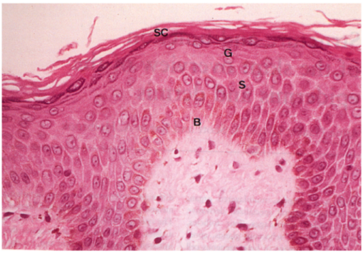

**Hình 2.3.** Mặt cắt ngang da người (nhuộm hematoxylin và eosin), cho thấy hình thái của các tầng biểu bì khác nhau. SC: lớp sừng; G: lớp hạt; S: lớp gai; B: lớp đáy.

Các tế bào biểu bì bắt nguồn từ lá đáy nằm giữa trung bì và biểu bì sống. Lớp này có tế bào hắc tố, tế bào Langerhans, tế bào Merkel và hai loại tế bào keratin chính: loại thứ nhất hoạt động như tế bào gốc, có khả năng phân chia và tạo tế bào mới; loại thứ hai neo biểu bì vào màng đáy (Lavker và Sun, 1982). Màng đáy dày 50–70 nm và gồm hai lớp là lá đặc và lá sáng, chủ yếu cấu tạo từ các protein như collagen type IV, laminin-5, nidogen (entactin) và fibronectin. Collagen type IV chịu trách nhiệm về độ ổn định cơ học của màng đáy, còn laminin-5 và fibronectin tham gia vào sự gắn kết giữa màng đáy và các tế bào sừng lớp đáy (Schneider và cs., 2007; El-Domyati và cs., 2015).

Các tế bào của lá đáy được gắn vào màng đáy bằng hemidesmosome, nằm trên bề mặt phía bụng của tế bào sừng lớp đáy (Borradori và Sonnenberg, 1999; Walko và cs., 2015). Hemidesmosome dường như gồm những nhóm protein riêng biệt, trong đó hai nhóm là các kháng nguyên pemphigoid bọng nước (BPAG1e và BPAG2), còn một nhóm khác gồm các integrin α6β4 và β1α đặc hiệu cho tế bào biểu mô. BPAG1e liên quan đến sự tổ chức cấu trúc bộ xương tế bào và tạo liên kết giữa cấu trúc hemidesmosome với các sợi trung gian keratin. BPAG2 là một protein xuyên màng. Integrin α6β4 liên kết với protein laminin-5 của chất nền ngoại bào, còn integrin β1α tạo cầu nối đến các sợi trung gian keratin trong bào tương. Vì vậy, integrin α6β4 và BPAG2 là các protein hemidesmosome chính góp phần gắn tế bào sừng với lá đáy, tạo liên kết kéo dài từ sợi trung gian keratin, xuyên qua lá sáng, đến lá đặc. Tại lá đặc, các protein xuyên màng này tương tác với laminin-5; đến lượt mình, laminin-5 liên kết với collagen VII, thành phần chính của các sợi neo trong chất nền trung bì.

Tầm quan trọng của việc duy trì liên kết chắc chắn giữa các tế bào lá đáy và màng đáy là rất rõ ràng; khi không có liên kết này, các bệnh da phồng rộp mạn tính như pemphigus và ly thượng bì bóng nước có thể xuất hiện.

Ngoài sự gắn kết tế bào–chất nền qua hemidesmosome, mối nối bám dính là một vị trí khác giúp các tế bào của lớp đáy biểu bì bám vào màng đáy (Kaiser và cs., 1993; Niessen, 2007); tại đây có hai đơn vị kết dính cơ bản. Nectin là các thụ thể kết dính giống IgG, có vùng xuyên màng và tạo thành một đơn vị kết dính với afadin, protein liên kết actin. Bên cạnh đơn vị này, cadherin là các protein xuyên màng liên kết với catenin α, β và p120. Mối nối bám dính xuất hiện thường xuyên hơn ở vùng biểu bì phía trên (Ishiko và cs., 2003).

Tính liên kết và sự giao tiếp giữa các tế bào biểu bì sống — tức tương tác tế bào–tế bào — được duy trì theo cách tương tự liên kết tế bào–chất nền, ngoại trừ việc desmosome thay thế hemidesmosome. Tại mối nối desmosome có hai cadherin glycoprotein xuyên màng là desmoglein và desmocollin. Chúng liên kết với các protein mảng bào tương gồm desmoplakin, plectin, periplakin, envoplakin và plakoglobin (Hình 2.4), qua đó tạo liên kết với các sợi trung gian keratin (Tariq và cs., 2015).

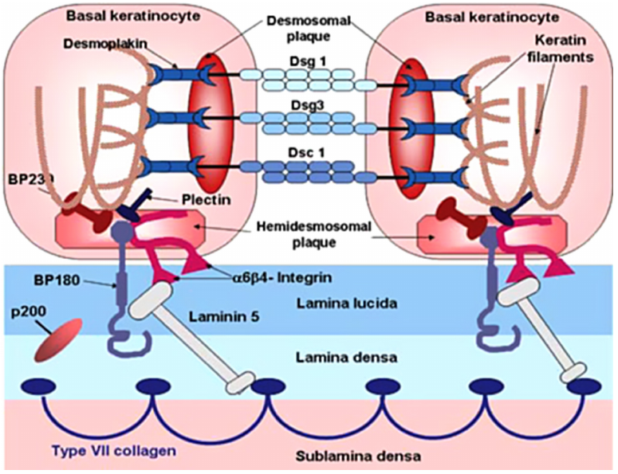

**Hình 2.4.** Sơ đồ desmosome và vùng nối trung bì–biểu bì. Hình chỉ thể hiện các protein cấu trúc đóng vai trò tự kháng nguyên trong các bệnh da bóng nước tự miễn. Các tế bào sừng lân cận liên kết với nhau qua phần ngoại bào của cadherin desmosome. Hình mô tả các tương tác đồng ái giữa desmoglein 1, desmoglein 3 và desmocollin 1. Phần nội bào của chúng liên kết với các protein mảng desmosome, làm trung gian cho tương tác giữa desmosome và sợi keratin. Sợi keratin còn liên kết với kháng nguyên pemphigoid bọng nước 230 (BP230) và plectin, là các thành phần nội bào chính của hemidesmosome. BP230 và plectin đóng vai trò phối tử cho các protein hemidesmosome xuyên màng gồm collagen type XVII (BP180) và integrin α6β4. Các protein này có thể nối hemidesmosome với laminin 5; cùng với collagen type IV, laminin 5 là một thành phần chính của lá đặc. Laminin 5 là phối tử đã biết của collagen type VII, thành phần chính của các sợi neo nối lá đặc với các bó collagen ở vùng trung bì phía trên. (Trích lại từ Mihai S, Sitaru C, 2007, *J Cell Mol Med* 11: 462–481, với sự cho phép của John Wiley & Sons.)

Như vậy, trong biểu bì, desmosome chịu trách nhiệm nối các cấu trúc bộ xương keratin của từng tế bào với nhau, qua đó tạo nên một mô có khả năng chống chịu lực cắt rất cao.

Một loại tế bào khác có ở lớp đáy biểu bì, cũng như xuyên suốt biểu bì và trung bì, là tế bào tua. Tế bào tua gồm một số phân nhóm riêng biệt, trong đó tế bào Langerhans nằm ở biểu bì. Đây là những tế bào trình diện kháng nguyên nổi bật của hệ miễn dịch da (Klechevsky và Banchereau, 2013; Banchereau và cs., 2012). Các tế bào này liên tục di chuyển đến những hạch lympho dẫn lưu; chức năng chính của chúng là thu nhận các dị nguyên tiếp xúc trong da và trình diện các tác nhân này cho tế bào lympho T, vì vậy chúng giữ vai trò quan trọng trong quá trình mẫn cảm tiếp xúc.

Khả năng di chuyển từ tủy xương, định vị tại một vùng biểu bì cụ thể rồi tiếp tục di chuyển khi được hoạt hóa của tế bào Langerhans cho thấy có những cơ chế giúp chúng tích tụ trong biểu bì, bám vào tế bào sừng và màng đáy, rồi phá vỡ liên kết bám dính. Sự di chuyển vào biểu bì có thể được điều hòa bởi yếu tố kích thích tạo cụm bạch cầu hạt–đại thực bào (GM-CSF), yếu tố hoại tử khối u α (TNF-α), interleukin 6, yếu tố tăng trưởng chuyển dạng β, các cytokine hóa hướng động như protein hóa hướng động bạch cầu đơn nhân, và kháng nguyên liên quan tế bào lympho ở da (Nakamura và cs., 1999). Các liên kết bám dính trong biểu bì dường như được hình thành nhờ tương tác của tế bào Langerhans với các protein chất nền ngoại bào như fibronectin và laminin thông qua integrin β1.

Sau khi da bị mẫn cảm, sự tách rời của tế bào Langerhans khỏi tế bào sừng và màng đáy có thể được điều hòa bởi các cytokine biểu bì, bao gồm GM-CSF và TNF-α; còn sự trưởng thành của tế bào, diễn ra trong quá trình di chuyển đến các hạch lympho tại chỗ, có thể do GM-CSF điều hòa. Người ta đã chứng minh IL-1β và TNF-α tác động trực tiếp lên tế bào Langerhans, làm giảm sự bám dính vào tế bào sừng và màng đáy bằng cách điều hòa giảm protein liên kết E-cadherin (Jakob và Udey, 1998). Boltjes và van Wijk (2014) đã cung cấp một bài tổng quan toàn diện về tế bào tua ở người.

Tế bào hắc tố là một loại tế bào chức năng khác của lớp đáy biểu bì và cũng hiện diện trong tóc và mắt. Chức năng chính của các tế bào này là sản xuất melanin — các polymer indole quinone có khối lượng phân tử cao, ảnh hưởng đến sắc tố của da, tóc và mắt (Jimbow và cs., 1986; Mort và cs., 2015). Melanin được tạo ra trong melanosome, các bào quan có màng bao bọc được chuyển sang tế bào sừng, có lẽ bằng quá trình thực bào, để tạo sự phân bố sắc tố đồng đều. Sự di chuyển của melanosome trong tế bào có thể được điều hòa thông qua actin và vi ống. Sắc tố quan sát được không chỉ phụ thuộc vào số lượng, hình dạng và kích thước của melanosome mà còn phụ thuộc vào bản chất hóa học của melanin.

Màu tóc được chi phối bởi các tế bào hắc tố nằm trong hành tóc ở trung bì (Slominski và cs., 2005; Tobin, 2008). Melanosome được chuyển vào thân tóc đang phát triển. Chức năng chính của sắc tố da là bảo vệ chống lại các tác động có hại từ môi trường như bức xạ tử ngoại, đặc biệt tại các lớp đáy đang tăng sinh, nơi tác động gây đột biến của dạng tổn thương này gây ra những hệ quả đặc biệt nghiêm trọng. Tế bào hắc tố vẫn gắn với lớp đáy và được cho là ở trạng thái không tăng sinh khi tiếp xúc với các tế bào sừng chưa biệt hóa.

Điều hòa quá trình sinh melanin là một quá trình phức tạp, liên quan đến khoảng 80 locus di truyền và có thể còn có sự tham gia của nhịp sinh học ngày–đêm (Hardman và cs., 2015). Đột biến ở một số gene liên quan dẫn đến các tình trạng bệnh lý như bạch tạng, bạch biến và hội chứng Waardenburg. Cơ chất ban đầu để tạo melanin là tyrosine; chất này được hydroxyl hóa thành dihydroxyphenylalanine (DOPA), sau đó có thể đi theo một số con đường để tạo ra eumelanin (melanin 5,6-dihydroxyindole và melanin acid 5,6-dihydroxyindole-2-carboxylic) hoặc pheomelanin (Hình 2.5).

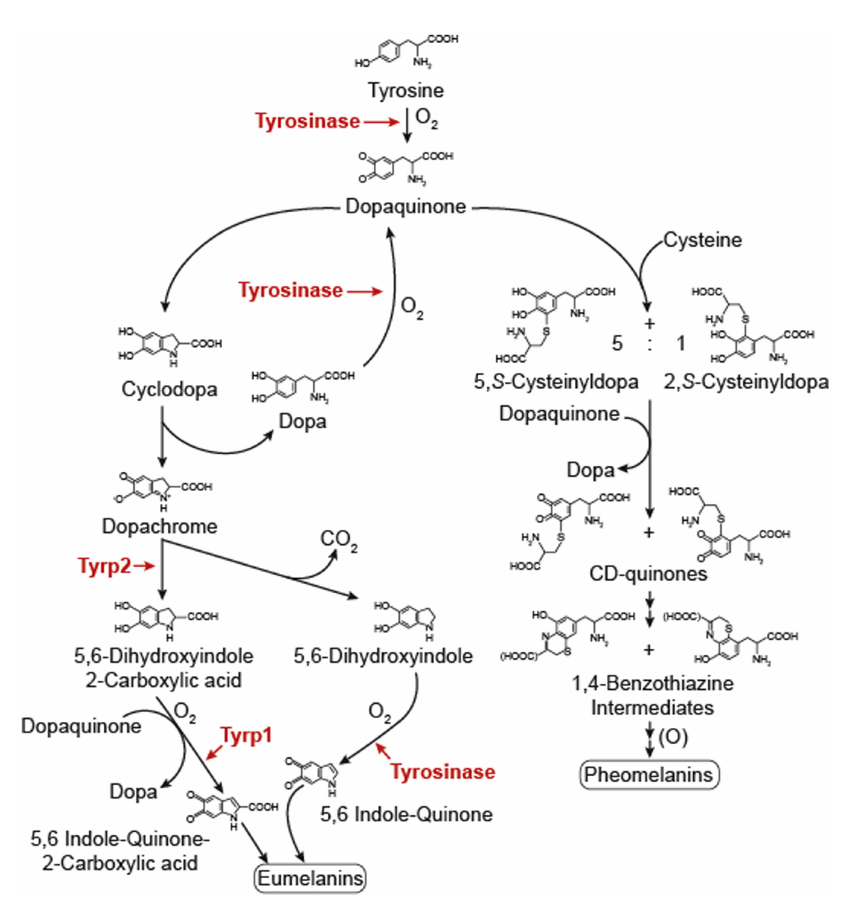

**Hình 2.5.** Con đường tổng hợp từ tyrosine thành các melanin gồm eumelanin và pheomelanin.

Eumelanin có màu nâu/đen, còn pheomelanin có màu vàng/đỏ. Người ta cho rằng tương tác giữa hormone kích thích tế bào hắc tố α (α-MSH), một tridecapeptide, và protein tín hiệu agouti quyết định con đường sinh melanin được sử dụng; trong điều kiện α-MSH chiếm ưu thế, eumelanin được tạo thành. Bức xạ UV dường như làm tăng sự sản xuất hormone tiền thân proopiomelanocortin, từ đó tăng sản xuất α-MSH và dẫn đến tăng hàm lượng eumelanin (Chakraborty và cs., 1995; Suzuki và cs., 1997; Nasti và Timares, 2015).

Loại tế bào cuối cùng được tìm thấy ở lớp đáy là tế bào Merkel. Các tế bào này dường như bắt nguồn từ biểu bì (Morrison và cs., 2009) và có thể được phân biệt với tế bào sừng nhờ bào tương trong và không có tơ trương lực. Tế bào Merkel mang các đặc điểm của tế bào thụ thể cảm giác và tạo những tiếp xúc “giống synapse” với các thụ thể cơ học ngưỡng thấp nằm ở phía bên kia màng đáy; cả hai đặc điểm này cho thấy chúng hoạt động như các tác nhân trung gian xúc giác (Maksimovic và cs., 2014; Zimmerman và cs., 2014; Walsh và cs., 2015). Việc các tế bào này biểu hiện kênh ion cảm giác và chất dẫn truyền thần kinh cung cấp thêm bằng chứng rằng một chức năng chính của tế bào Merkel là tham gia tiếp nhận xúc giác (Lumpkin và Caterina, 2007; Kwan và cs., 2009).

---

### 2.2.2. Trung bì

Trung bì là một thành phần thiết yếu của cơ thể. Thông qua một lớp nhú mỏng nằm sát biểu bì, trung bì không chỉ cung cấp dinh dưỡng, miễn dịch và các hệ thống hỗ trợ khác cho biểu bì mà còn tham gia điều hòa nhiệt độ, áp lực và cảm giác đau. Trung bì dày khoảng 0,1–0,5 cm, gồm các sợi collagen (70%) tạo nên khung nâng đỡ và lớp đệm, cùng mô liên kết đàn hồi tạo độ đàn hồi, tất cả nằm trong một chất nền mucopolysaccharide dạng gel bán rắn.

Nhìn chung, mật độ tế bào trong trung bì khá thưa. Các tế bào chính hiện diện tại đây gồm: nguyên bào sợi, sản xuất các thành phần mô liên kết như collagen, laminin, fibronectin và vitronectin; dưỡng bào, tham gia đáp ứng miễn dịch và viêm; telocyte, có thể tham gia tái tạo và sửa chữa da (Ceafalen và cs., 2012; Kang và cs., 2015); và tế bào hắc tố, tham gia sản xuất sắc tố melanin.

Các đầu tận cùng thần kinh cảm giác trong trung bì gồm thụ thể cảm nhận đau, tiểu thể Pacini và tiểu thể Meissner. Thụ thể cảm nhận đau là các neuron cảm giác đáp ứng với kích thích bằng cách truyền tín hiệu đến tủy sống và não, từ đó tạo ra cảm nhận đau. Chúng có thể đáp ứng với kích thích nhiệt, cơ học hoặc hóa học. Tiểu thể Pacini, đôi khi còn gọi là tiểu thể lá, nằm sâu trong trung bì và đảm nhiệm khả năng cảm nhận rung động và áp lực. Tiểu thể Meissner là một loại thụ thể cơ học khác, nằm gần vùng nối trung bì–biểu bì và đảm nhiệm khả năng cảm nhận tiếp xúc nhẹ.

Trong trung bì có một mạng lưới mạch máu rộng khắp, cung cấp dinh dưỡng, hỗ trợ sửa chữa và đáp ứng miễn dịch cho da; đối với phần còn lại của cơ thể, mạng lưới này tham gia trao đổi nhiệt, đáp ứng miễn dịch và điều hòa thân nhiệt. Tốc độ dòng máu đến da vào khoảng 0,05 ml/phút trên mỗi cm³ da, tạo ra diện tích trao đổi mạch máu tương đương diện tích bề mặt da. Các mạch máu da bắt nguồn từ mạch máu trong mô dưới da; mạng lưới động mạch cấp máu cho lớp nhú, nang tóc, tuyến mồ hôi, tuyến apocrine và vùng dưới da, cũng như cho chính trung bì. Các động mạch này dẫn vào tiểu động mạch, mao mạch, tiểu tĩnh mạch rồi đến tĩnh mạch.

Một đặc điểm đặc biệt quan trọng của mạng lưới mạch máu này là sự hiện diện của các cầu nối động–tĩnh mạch ở mọi tầng của da. Các cầu nối này cho phép tối đa 60% lưu lượng máu qua da đi tắt trực tiếp giữa động mạch và tĩnh mạch, bỏ qua mạng lưới mao mạch nhỏ; vì vậy, chúng có vai trò thiết yếu đối với chức năng điều hòa nhiệt và kiểm soát mạch máu của da. Những thay đổi lưu lượng máu dễ nhận thấy nhất ở da liên quan đến nhiều đáp ứng sinh lý khác nhau, bao gồm tác động tâm lý như sốc (“da tái nhợt”) và xấu hổ (“đỏ mặt”), tác động của nhiệt độ, cũng như đáp ứng sinh lý với vận động, xuất huyết và việc sử dụng đồ uống có cồn.

Hệ bạch huyết là một thành phần quan trọng của da, giúp điều hòa áp lực dịch kẽ, huy động các cơ chế phòng vệ và loại bỏ chất thải. Hệ này tồn tại dưới dạng một mạng lưới phẳng, dày đặc trong các lớp nhú của trung bì và kéo dài xuống những vùng sâu hơn của trung bì. Cross và Roberts (1993) đã chỉ ra rằng trong khi lưu lượng máu quyết định sự thanh thải các chất tan nhỏ đã thấm qua da, chẳng hạn nước và lidocaine, thì lưu lượng bạch huyết là một yếu tố quyết định quan trọng đối với việc loại bỏ các chất tan lớn hơn như interferon khỏi trung bì.

---

### 2.2.3. Mô dưới da

Lớp sâu nhất của da là mô dưới da, hay hạ bì. Hạ bì đóng vai trò cách nhiệt, hấp thu chấn động và dự trữ năng lượng. Lớp này là một mạng lưới tế bào mỡ (adipocyte), liên kết với trung bì bằng các sợi collagen và elastin đan nối. Các tế bào mỡ dự trữ những giọt chất béo chủ yếu gồm triglyceride và ester cholesteryl. Ngoài tế bào mỡ, các tế bào chính khác trong hạ bì là nguyên bào sợi và đại thực bào.

Một trong những vai trò chính của hạ bì là mang các hệ mạch máu và thần kinh của da. Lớp này còn neo da vào cơ nằm bên dưới. Nguyên bào sợi và tế bào mỡ có thể được kích thích bởi sự tích tụ dịch kẽ và dịch bạch huyết trong da và mô dưới da (Szuba và Rockson, 1997; xem thêm Breslin, 2014).

---

### 2.2.4. Các phần phụ của da

Da có bốn loại phần phụ: nang tóc cùng các tuyến bã nhờn đi kèm, tuyến mồ hôi eccrine, tuyến mồ hôi apocrine và móng. Mỗi phần phụ có một chức năng khác nhau. Nang tóc phân bố trên toàn bộ bề mặt da, ngoại trừ lòng bàn chân, lòng bàn tay và môi. Một cơ trơn gọi là cơ dựng lông gắn nang tóc với mô trung bì và làm cho lông dựng lên khi sợ hãi hoặc lạnh. Mỗi nang tóc có một tuyến bã nhờn đi kèm, với đường kính thay đổi từ 200 đến 2.000 µm. Bã nhờn do tuyến này tiết ra gồm triglyceride, acid béo tự do và sáp; chất này bảo vệ và bôi trơn da, đồng thời duy trì pH bề mặt ở khoảng 5. Phần diện tích bề mặt mà các cấu trúc này chiếm lớn hơn một chút so với 1/1.000 tổng diện tích bề mặt da.

Tuyến eccrine, hay tuyến mồ hôi, và tuyến apocrine lần lượt chiếm khoảng hai phần ba và một phần ba tổng số tuyến. Tuyến eccrine là cấu trúc biểu bì dạng ống đơn giản, cuộn xoắn, bắt nguồn từ một búi cuộn có đường kính khoảng 100 µm nằm ở phần dưới trung bì. Tuyến tiết ra dung dịch muối loãng có pH khoảng 5. Sự bài tiết này được kích thích bởi các yếu tố điều hòa nhiệt độ như vận động và nhiệt độ môi trường cao, cũng như bởi căng thẳng cảm xúc thông qua hệ thần kinh tự chủ (giao cảm). Tổng diện tích bề mặt của các tuyến này bằng khoảng 1/10.000 tổng diện tích bề mặt cơ thể.

Tuyến apocrine chỉ hiện diện ở một số vùng cơ thể nhất định và cũng có dạng ống cuộn. Các tuyến này có kích thước lớn gấp khoảng 10 lần ống tuyến eccrine, kéo dài xuống đến mô dưới da và gắn với nang tóc. Các bài tổng quan của Lu và Fuchs (2014), Rompolas và Greco (2014), và Vary (2015) trình bày phân tích chuyên sâu về tuyến mồ hôi và nang tóc, đồng thời thảo luận các rối loạn của phần phụ da.

Cấu trúc, tính chất và chức năng của bản móng được mô tả toàn diện trong Chương 5.

---

## 2.3. Sự phát triển của lớp sừng

Khả năng kiểm soát đồng thời sự mất nước và sự xâm nhập của các hóa chất cùng vi sinh vật có khả năng gây hại là kết quả của quá trình tiến hóa tạo nên một hỗn hợp độc đáo gồm vật liệu protein và lipid. Các vật liệu này kết hợp với nhau để hình thành lớp sừng — một màng liền mạch gồm những vùng có hình thái riêng biệt. Các vùng này chủ yếu có bản chất protein (các tế bào sừng) hoặc ưa lipid (các khoảng gian bào).

---

### 2.3.1. Biệt hóa biểu bì

Sự phát triển của lớp sừng từ các tế bào sừng ở lớp đáy bao gồm nhiều bước biệt hóa tế bào; từ đó, các lớp nằm phía trên lớp đáy (*stratum basale*) được phân loại dựa trên cấu trúc. Theo đó, tế bào tiến triển từ lớp đáy qua lớp gai, lớp hạt và lớp trong để đến lớp sừng (Hình 2.3). Thời gian thay mới tế bào từ lớp đáy đến lớp sừng được ước tính vào khoảng 21 ngày.

Cơ chế chính xác kích thích các tế bào sừng ở lớp đáy khởi đầu quá trình biệt hóa vẫn chưa được hiểu đầy đủ. Tế bào gốc biểu bì hiện diện ở vùng đáy của biểu bì, cũng như trong nang tóc và tuyến bã nhờn. Các tế bào gốc này chịu trách nhiệm tạo ra những loại tế bào khác nhau của biểu bì (Eckert và cs., 2013). Protein kinase C và một số cytokine có nguồn gốc từ tế bào sừng được biết là có thể giữ vai trò điều hòa quá trình biệt hóa (Jerome-Morais và cs., 2009; Chae và cs., 2016). Chẳng hạn, interleukin-1 (IL-1) kích thích sản xuất các cytokine khác theo cả cơ chế tự tiết và cận tiết; các cytokine này cảm ứng sự tăng sinh và hóa hướng động (Hình 2.6).

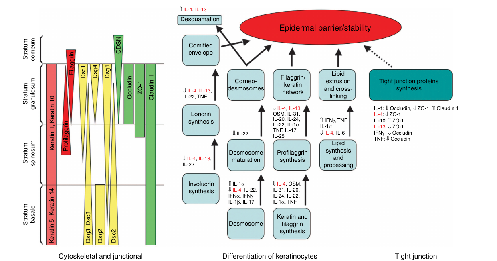

**Hình 2.6.** Sơ đồ bốn lớp của biểu bì, các kiểu biểu hiện của keratin, filaggrin, protein desmosome và protein mối nối chặt, năm quá trình biệt hóa tận cùng, cùng sự điều hòa bởi cytokine. Khung bên trái thể hiện bốn lớp biểu bì riêng biệt và kiểu biểu hiện của bốn keratin, filaggrin, bốn Dsg, ba Dsc, corneodesmosin và các protein mối nối chặt. Khung bên phải cung cấp thông tin chi tiết về năm quá trình biệt hóa biểu bì riêng biệt, cùng nhiều cytokine điều hòa tăng hoặc điều hòa giảm quá trình biệt hóa biểu bì. IL-4 và IL-13 được thể hiện bằng chữ in đậm. (Trích lại từ Tsuchisaka A, Furumura M, Hashimoto T, 2014, *J Invest Dermatol* 134: 1194–1196, với sự cho phép của Elsevier.)

Các cytokine cảm ứng này gồm yếu tố kích thích tạo cụm bạch cầu hạt–đại thực bào (GM-CSF), yếu tố tăng trưởng chuyển dạng α (TGF-α), yếu tố tăng trưởng thần kinh, amphiregulin, IL-6 và IL-8. Ngược lại, yếu tố tăng trưởng chuyển dạng β (TGF-β), cũng được IL-1 khởi phát sản xuất, ức chế sự tăng trưởng của tế bào sừng nhưng kích thích sự di chuyển của chúng; tác động sau có thể là kết quả của việc điều biến các integrin ở hemidesmosome và desmosome.

Người ta cũng cho rằng chất hoạt hóa plasminogen kiểu urokinase (uPA) có thể hoạt hóa các yếu tố tăng trưởng và kích thích tăng sinh biểu bì (Jensen và Lavker, 1999). uPA cảm ứng sự hình thành và hoạt hóa protease serine plasmin từ plasminogen; plasmin được hoạt hóa sẽ khởi phát quá trình phân giải protein ngoại bào cục bộ đối với các protein bám dính trên bề mặt tế bào và cuối cùng làm gián đoạn các hemidesmosome. Protein ức chế khối u TIG3 (gene 3 được cảm ứng bởi tazarotene) có thể điều hòa quá trình biệt hóa tận cùng bằng cách hoạt hóa transglutaminase type 1 (Scharadin và Eckert, 2014).

Lớp gai (lớp tế bào gai), nằm ngay phía trên lớp đáy, gồm nhiều lớp tế bào liên kết với nhau và với các tế bào lớp đáy bằng desmosome, đồng thời chứa các tơ trương lực keratin nổi bật. Tế bào lớp gai có bào tương lớn hơn tế bào lớp đáy. Trong bào tương có nhiều bào quan và sợi. Các α-keratin của lớp gai rõ ràng có phần khác với các α-keratin ở lớp đáy (Skerrow và Skerrow, 1983). Điều này cho thấy mặc dù nguyên phân đã dừng và giai đoạn biệt hóa tận cùng đã bắt đầu, tế bào vẫn duy trì khả năng thay đổi sự biểu hiện phiên mã của các gene. Trong các lớp tế bào ngoài của lớp gai, các hạt phủ màng nội bào có đường kính 100–300 nm xuất hiện trong bào tương, đánh dấu sự chuyển tiếp giữa lớp gai và lớp hạt.

Mặc dù keratin tiếp tục biệt hóa trong lớp hạt (Baden, 1979; Eckhart và cs., 2013), quá trình tổng hợp keratin mới dừng lại. Đặc điểm điển hình nhất của lớp này là sự hiện diện của nhiều hạt keratohyalin và hạt phủ màng bên trong tế bào; quá trình lắp ráp loại hạt thứ hai dường như diễn ra tại vùng lưới nội chất và bộ máy Golgi (Landmann, 1988; Manabe và O’Guin, 1992). Bên trong các hạt này có những tiểu đơn vị dạng phiến xếp thành các chồng song song. Chúng được cho là tiền chất của các phiến lipid gian bào trong lớp sừng.

Các hạt dạng phiến còn chứa enzyme thủy phân, trong đó quan trọng nhất là enzyme chymotrypsin của lớp sừng (SCCE). SCCE là một protease serine; do có khả năng định vị tại các vùng desmosome trong khoảng gian bào, enzyme này được cho là tham gia vào quá trình bong vảy (Egelrud và cs., 1993). Ở các lớp ngoài cùng của lớp hạt, các hạt dạng phiến di chuyển đến màng sinh chất phía đỉnh, hợp nhất với màng và cuối cùng đẩy thành phần bên trong vào khoảng gian bào (Manabe và O’Guin, 1992).

Tại giai đoạn này của quá trình biệt hóa, do sự giải phóng các enzyme ly giải chọn lọc, tế bào sừng mất nhân và các bào quan khác trong bào tương, trở nên dẹt và nén chặt để tạo thành lớp trong; lớp này cuối cùng hình thành lớp sừng. Việc đẩy thành phần của các hạt dạng phiến ra ngoài là yêu cầu nền tảng để hình thành hàng rào thấm của biểu bì; sự rối loạn quá trình này có liên quan đến nhiều bệnh da liễu.

Toàn bộ quá trình biệt hóa tận cùng của biểu bì hướng đến việc tạo ra hình thái hóa học đặc trưng của lớp sừng. Vì vậy, sản phẩm cuối của quá trình này là chất nền protein nội bào và các phiến lipid gian bào.

---

### 2.3.2. Bao tế bào sừng hóa

Bao tế bào sừng hóa (dày khoảng 15 nm và chiếm 10% khối lượng lớp sừng) là lớp ngoài cùng của tế bào sừng. Tế bào này chủ yếu gồm các sợi keratin bó chặt, sắp xếp song song với bề mặt chính của tế bào sừng. Bao tế bào thay thế màng sinh chất của các tế bào sừng đang biệt hóa và gồm cả thành phần protein lẫn lipid (Candi và cs., 2005). Bao protein (dày khoảng 10 nm) được tạo nên nhờ liên kết chéo cộng hóa trị giữa một số protein dưới tác động của sulfhydryl oxidase và transglutaminase, trong khi bao lipid (dày khoảng 5 nm) gồm lipid gắn cộng hóa trị với bao protein. Sulfhydryl oxidase và transglutaminase lần lượt dẫn đến sự hình thành liên kết disulfide và liên kết isopeptide (Nemes và Steinert, 1999). Bao tế bào nằm sát bề mặt trong của màng sinh chất.

Ngoài loricrin là protein chiếm ưu thế, một số protein tiền thân khác của bao tế bào đã được xác định, bao gồm periplakin và envoplakin (xem các bài tổng quan của Brown và McLean, 2012; Kypriotou và cs., 2012; Abhishek và Palamadal Krishnan, 2016; Boczonadi và Määttä, 2016). Các protein cấu trúc chiếm ưu thế trong bao sừng hóa gồm involucrin (2–5%), loricrin (80%), các protein nhỏ giàu proline (một họ gồm 11–14 protein có quan hệ gần, trong đó có cornifin và pancornulin; 3–5%), và cystatin A hay keratolinin (2–5%). Ngoài ra còn có nhiều protein với mức biểu hiện dưới 1%, gồm elafin, profilaggrin, sợi trung gian keratin, desmoplakin I và II, các protein S100 và annexin I (còn gọi là lipocortin I).

Bao tế bào được cho là hình thành qua hai giai đoạn (xem bài tổng quan ngắn về sự hình thành bao tế bào sừng hóa của Elias và cs., 2014). Ở giai đoạn đầu, các protein hòa tan như involucrin và cystatin-α tạo thành một khung, sau đó các tiền chất không tan khác, bao gồm loricrin, được bổ sung ở giai đoạn sau. Như vậy, bao sừng hóa được hình thành bằng sự lắng đọng tuần tự của các protein được biểu hiện nối tiếp nhau. Quá trình bắt đầu khi involucrin được cố định làm khung trên bề mặt nội bào của màng sinh chất theo cơ chế phụ thuộc calcium và phospholipid. Involucrin được liên kết chéo với desmoplakin và envoplakin, đồng thời liên kết cộng hóa trị với ω-hydroxyceramide. Sau đó, các protein khác gắn vào để gia cường bao tế bào (Nemes và Steinert, 1999).

Phức hợp protein liên kết chéo của bao tế bào sừng rất khó hòa tan và có khả năng kháng hóa chất cao. Bao tế bào sừng hóa cũng hiện diện trong nang tóc và mầm móng; tuy có hình thái tương tự, kiểu biểu hiện và loại tiền chất ở các vị trí này hơi khác so với biểu bì (Baden và Kvedor, 1993).

---

### 2.3.3. Lipid gian bào của lớp sừng

Hiện nay, người ta cho rằng bao protein của tế bào sừng giữ vai trò quan trọng trong quá trình lắp ráp cấu trúc các phiến lipid gian bào của lớp sừng. Lipid gian bào của lớp sừng được thảo luận đầy đủ trong chương của Mojumdar và Bouwstra (Chương 3), vì vậy sẽ không được trình bày tại đây.

---

### 2.3.4. Protein lớp sừng

Độ hòa tan kém của protein lớp sừng một phần là hệ quả của sự liên kết chéo rộng khắp ở cả bao tế bào lẫn protein nội bào. Phần lớn protein nội bào trong lớp sừng gồm các sợi keratin, được liên kết chéo bằng các cầu disulfide liên phân tử (Steinert và cs., 1994; Bragulla và Homberger, 2009), cùng các thành phần của bao tế bào sừng hóa. Ở giai đoạn cuối của quá trình biệt hóa, tế bào sừng chứa các sợi trung gian keratin (keratin 1 và 10, bắt nguồn từ keratin 5 và 14 có trong tế bào sừng lớp đáy), cùng một số protein khác, bao gồm involucrin, loricrin và profilaggrin (Robinson và cs., 1996; Candi và cs., 2005).

Như đã đề cập, loricrin và involucrin là các thành phần chính của bao tế bào sừng hóa, còn profilaggrin tham gia vào sự sắp xếp thẳng hàng của các sợi keratin. Profilaggrin là một protein lớn, được phosphoryl hóa ở mức độ cao, gồm nhiều đơn vị filaggrin (10–12 đơn vị) xuất hiện lần đầu trong các hạt keratohyalin ở lớp hạt. Phân tử profilaggrin được xử lý theo cơ chế phụ thuộc calcium bằng quá trình khử phosphoryl và phân giải protein để tạo thành các phân tử filaggrin riêng lẻ, có chức năng tập hợp các sợi keratin. Có bằng chứng cho thấy profilaggrin giữ vai trò trong cơ chế bệnh sinh của viêm da cơ địa (Thyssen và Kezic, 2014).

---

### 2.3.5. Bong vảy

Các cơ chế chi phối sự bong các tế bào lớp sừng rất phức tạp. Ban đầu, Suzuki và cs. (1984) cho rằng hoạt động của hai loại protease serine trong quá trình phân hủy desmosome dẫn đến bong vảy. Các protease serine (kallikrein), protease aspartic, glycosidase và protease cysteine (cathepsin) rõ ràng giữ vai trò then chốt trong quá trình này (Brocklehurst và Philpott, 2013). Người ta cho rằng sự bong vảy có thể được điều hòa bởi mức độ hoạt hóa các tiền chất protease và sự thay đổi pH trong khoảng gian bào của lớp sừng (Ekholm và cs., 2000).

Trong lớp hạt, desmosome được chuyển đổi thành corneodesmosome hay corneosome, là những cấu trúc kết dính gian bào chính trong lớp sừng (Ishida-Yamamoto và Igawa, 2015). Protein corneodesmosin được đặc biệt chú ý; protein này nằm ở phần ngoại bào của corneodesmosome và các vùng lân cận của bao tế bào sừng hóa. Người ta cho rằng protein này liên tục bị phân hủy, qua đó giải thích gradient tăng dần về độ liên kết của tế bào sừng từ bề mặt da xuống các lớp sâu hơn (Lundstrom và cs., 1994).

Các bệnh da có vảy và suy giảm chức năng hàng rào có thể là hậu quả của quá trình bong vảy bị rối loạn. Từ lâu, người ta đã biết sự bong vảy liên quan đến quá trình chuyển cholesterol sulfate thành cholesterol (Long và cs., 1985). Bệnh vảy cá liên kết nhiễm sắc thể X, một bệnh có vảy đặc trưng bởi quá trình bong vảy bị rối loạn, được xác định là có liên quan đến sự thiếu hụt enzyme cholesterol sulfatase (Koppe và cs., 1978). Nghiên cứu sau đó của Sato và cs. (1998) cho thấy chứng tăng sừng do desmosome có liên quan đến sự gia tăng hàm lượng cholesterol sulfate ở bệnh nhân vảy cá liên kết nhiễm sắc thể X. Rõ ràng, cholesterol sulfate làm chậm quá trình bong vảy bằng cách hoạt động như một chất ức chế protease serine.

Đột biến gene corneodesmosin có thể dẫn đến hội chứng bong da (Israeli và cs., 2011), còn đột biến gene mã hóa một chất ức chế protease serine có thể gây hội chứng Netherton, với biểu hiện cơ địa dị ứng và bong vảy sớm (Deraison và cs., 2007; Igawa và cs., 2013).

---

## 2.4. Cơ chế sửa chữa biểu bì

---

### 2.4.1. Ảnh hưởng của sự hydrat hóa

Từ lâu, người ta đã biết mức độ hydrat hóa của lớp sừng có thể ảnh hưởng sâu sắc đến các đặc tính hàng rào của lớp này (tổng quan trong Rawlings và Harding, 2004). Các cơ chế tham gia vào quá trình hydrat hóa da vẫn chưa được xác định đầy đủ, mặc dù nhiều khả năng đây là kết quả của sự kết hợp giữa sự hiện diện của các tác nhân hút ẩm — gọi chung là yếu tố giữ ẩm tự nhiên — và sự sắp xếp có trật tự của lipid gian bào (Verdier-Sévrain và Bonté, 2007). Yếu tố giữ ẩm tự nhiên được tạo thành từ quá trình phân giải monomer filaggrin và bao gồm một tập hợp amino acid cùng các dẫn xuất của chúng. Các hợp chất hút ẩm glycerol và urê cũng được tìm thấy trong lớp sừng và đóng vai trò là các chất hút ẩm tự nhiên (Björklund và cs., 2013a,b).

Ở trạng thái bình thường, lớp sừng chứa lượng nước bằng 15–20% khối lượng khô, phần lớn dường như liên kết với keratin nội bào. Sau khi ngâm quá mức, hàm lượng nước trong lớp sừng có thể tăng tới khoảng 400% khối lượng khô. Tế bào sừng trương lên có thể là do hấp thu nhiều nước hơn; lượng nước này sau đó tương tác với keratin và làm giãn rộng cấu trúc không gian của protein. Việc các tế bào sừng của bản móng và tóc không trương lên nhiều như tế bào sừng của lớp sừng sau khi hydrat hóa quá mức cho thấy mức độ tương tác giữa nước và keratin phụ thuộc vào vị trí và độ bền của các liên kết disulfide trong peptide. Vì vậy, khi các sợi keratin xoắn α được sắp xếp lỏng lẻo và linh hoạt hơn, như ở các keratinocyte của lớp sừng, chúng có khả năng thay đổi cấu dạng tốt hơn để dung nạp nước.

Trong lớp sừng được hydrat hóa hoàn toàn, các tế bào sừng trương lên, với các vùng nước chiếm chỗ và tách các sợi keratin khỏi nhau (van Hal và cs., 1996).

Như đã đề cập, các yếu tố giữ ẩm tự nhiên (NMF) có thể chiếm tới 10% khối lượng khô của tế bào sừng và có khả năng hấp thu một lượng lớn nước. Rawlings và cs. (1994) chỉ ra rằng các amino acid được tạo thành khi filaggrin bị phân giải protein cũng chính là tiền chất của yếu tố giữ ẩm tự nhiên. Glutamine được chuyển thành acid pyrrolidone carboxylic — một chất hút ẩm mạnh và là thành phần chính của NMF — trong khi histidine được chuyển thành acid urocanic. Điều thú vị là filaggrin chỉ được chuyển thành NMF khi hoạt độ nước nằm trong khoảng 0,70–0,95; filaggrin ổn định ở hoạt độ nước cao hơn, còn quá trình phân giải protein bị cản trở khi hoạt độ nước thấp. Do đó, trong điều kiện bít kín, mức NMF của lớp sừng giảm xuống gần bằng không và tất cả các tế bào sừng đều chứa filaggrin. Nhờ cơ chế cân bằng nội môi này, da có thể ngăn bản thân bị “hydrat hóa quá mức”.

NMF dường như không hiện diện trong tình trạng da bong vảy khô nghiêm trọng, cũng như trong cả bệnh vảy nến và bệnh vảy cá thông thường. Đột biến gene mã hóa filaggrin đã được chứng minh rõ ràng là nguyên nhân gây ra các bệnh da phổ biến như bệnh vảy cá thông thường (Smith và cs., 2006; Sandilands và cs., 2009). Mối liên hệ giữa các đột biến mất chức năng này — có thể hiện diện ở tới 10% dân số — với chàm cơ địa cũng đã được xác lập (McLean, 2016).

Tóm lại, các quan sát hiện nay cho thấy sự hydrat hóa lớp sừng không làm giảm tổng thể mức độ trật tự của lipid gian bào và chỉ có một lượng nhỏ nước hiện diện trong các vùng đầu phân cực gian bào. Vì vậy, có thể xem xét lại một cơ chế khả dĩ đã được nêu trong một bài tổng quan trước đây để giải thích cách hydrat hóa thúc đẩy hấp thu qua da (Roberts và Walker, 1993). Theo mô hình đó, sự trương nở của keratin tương tự như việc các “viên gạch” trương lên trong mô hình “gạch và vữa” của lớp sừng, làm lớp “vữa” lipid gian bào trở nên lỏng lẻo. Hiệu ứng tổng thể là làm tăng tính linh động của các chuỗi và tăng tính thấm mà không ảnh hưởng đến trật tự sắp xếp lipid.

---

### 2.4.2. Tổn thương hóa học

Khi lớp sừng bị xáo trộn, một số sự kiện sinh hóa khu trú xảy ra, giúp nhanh chóng tái lập chức năng hàng rào (Taljebini và cs., 1996). Do đó, trong những trường hợp lớp sừng bị tổn thương nghiêm trọng như khử lipid do acetone hoặc lột băng dính, quá trình phục hồi dường như diễn ra theo hai pha: một pha sửa chữa nhanh, tiếp theo là một pha bình thường hóa chậm hơn. Pha phục hồi hàng rào nhanh ban đầu bao gồm sự bài tiết tức thời các thể phiến đã hình thành sẵn từ tế bào lớp hạt vào khoảng gian bào, sự gia tăng tổng hợp cholesterol và acid béo ở biểu bì, cũng như sự tăng tốc tạo thành và bài tiết các thể phiến mới vào khoảng gian bào. Pha sửa chữa hàng rào chậm hơn sau đó bao gồm sự gia tăng tổng hợp ceramide và tổng hợp acid deoxyribonucleic, dẫn đến tăng sản biểu bì. Đáng chú ý là sự xáo trộn ban đầu xảy ra ở các lớp ngoài cùng của lớp sừng lại có thể nhanh chóng kích thích các sự kiện sinh hóa trong lớp hạt và các tầng thấp hơn của biểu bì.

Mặc dù chưa rõ cơ chế chính xác kích thích các sự kiện này, từ lâu người ta đã biết sự thay đổi tốc độ mất nước qua biểu bì (TEWL) do những biến đổi của hàng rào gây ra có vai trò nhất định (Grubauer và cs., 1989). Sự gia tăng TEWL này có thể làm thay đổi cục bộ nồng độ của một số ion, chủ yếu là Ca²⁺ ở vùng ngoài của biểu bì (Behne và cs., 2011; Celli và cs., 2016). Ở trạng thái bình thường, lượng Ca²⁺ dự trữ trong lưới nội chất của các tế bào thuộc lớp ngoài biểu bì nhiều hơn so với các lớp trong. Sau khi hàng rào bị phá vỡ, Ca²⁺ được giải phóng, tạo ra sự thay đổi lớn về gradient. Sự thay đổi gradient Ca²⁺ có thể làm tăng bài tiết các thể phiến. Vì vậy, mặc dù vẫn còn nhiều điểm chưa chắc chắn về quá trình sinh hóa của sự sửa chữa hàng rào, nhiều bằng chứng cho thấy nồng độ ion và sự cảm ứng các enzyme tạo lipid giữ vai trò quan trọng.

Sự xáo trộn chức năng hàng rào đôi khi — nhưng không phải luôn luôn — cũng gây ra đáp ứng viêm dẫn đến kích ứng. Cần hiểu rằng “kích ứng” được dùng để mô tả các phản ứng da có thể dao động từ ban đỏ nhẹ, thoáng qua và/hoặc ngứa cho đến hình thành mụn nước nghiêm trọng. Việc thoa chất hoạt động bề mặt natri dodecyl sulfate (SDS) gần như luôn gây ra đáp ứng kích ứng (Patil và cs., 1994; Angelova-Fischer và cs., 2016). SDS xen vào các phiến lipid và làm tăng tính lưu động ở vùng này, dẫn đến tăng TEWL. Hơn nữa, mặc dù các chất hoạt động bề mặt khác như natri laurat và polysorbate có thể làm tăng TEWL đến mức tương tự SDS, kích ứng do chúng gây ra lại nhẹ hơn nhiều và trong một số trường hợp không khác biệt đáng kể so với da không xử lý. Như vậy, kích ứng sau khi tiếp xúc với SDS hẳn phải bắt nguồn từ các yếu tố khác ngoài sự gia tăng vận chuyển nước và kích thích quá trình sinh lipid.

Khả năng gây kích ứng da của các chất hoạt động bề mặt đã được xác lập rõ ràng từ nhiều năm trước (tổng quan trong Prottey, 1978; Basketter và cs., 2008). Người ta cũng biết rõ rằng trong khi chất hoạt động bề mặt ion có thể gây kích ứng nghiêm trọng, chất hoạt động bề mặt không ion được xem là hầu như không gây kích ứng khi sử dụng thông thường. Vì vậy, phần lớn nghiên cứu về kích ứng da do chất hoạt động bề mặt đều khảo sát SDS. Tổng hợp các dữ liệu cho thấy SDS có thể tương tác với cả cấu trúc lipid và protein trong lớp sừng. Như đã đề cập, tương tác với lipid sẽ làm tăng tính lưu động của lipid, qua đó tăng tính thấm của da. Tuy nhiên, riêng tác động này — ngoài việc làm tăng độ thấm của chính SDS — không thể giải thích được kích ứng do SDS gây ra. SDS được biết là có thể thâm nhập vào tế bào sừng và tương tác với cấu trúc protein khiến α-keratin mất cấu trúc xoắn (Imokawa và cs., 1975), nhưng rất khó liên hệ khía cạnh này với đáp ứng kích ứng.

Một cách giải thích hợp lý hơn cho kích ứng do SDS gây ra là khả năng kích thích keratinocyte sản sinh các chất trung gian gây viêm như interleukin 1 và prostaglandin E2. Hiện vẫn chưa rõ sự cảm ứng này có phải là hệ quả thứ phát của một tương tác nào đó giữa SDS và màng tế bào sừng hay không.

---

### 2.4.3. Bất thường sinh hóa

Có rất nhiều bệnh có thể ảnh hưởng đến chức năng hàng rào biểu bì, nhưng việc xem xét chi tiết từng bệnh nằm ngoài phạm vi của chương này. Một số bệnh ảnh hưởng đến sự hình thành tế bào sừng (“hội chứng gạch vỡ”), trong khi những bệnh khác ảnh hưởng đến lipid gian bào (“hội chứng vữa yếu”). Chẳng hạn, Nemes và Steinert (1999) đề cập đến hơn 10 bệnh khác nhau liên quan đến các gene mã hóa sợi trung gian keratin, trong đó có bệnh Unna–Thost và tylosis. Những bệnh di truyền khác liên quan đến khiếm khuyết ở các gene gắn với protein cấu trúc của bao tế bào sừng hóa hoặc transglutaminase. Ví dụ, một khiếm khuyết di truyền ở *TGM1*, gene mã hóa enzyme transglutaminase I, dẫn đến bệnh vảy cá dạng phiến có thể đe dọa tính mạng.

Sự suy giảm hiệu quả của hàng rào lipid gian bào có thể dẫn đến các rối loạn từ khô da (cạn kiệt lipid do sử dụng chất tẩy rửa quá mức) đến tăng sinh quá mức và tạo vảy bất thường. Các nguyên nhân bao gồm thiếu acid béo thiết yếu, sự lắng đọng bất thường của nhiều loại lipid trong khoảng gian bào, sự tích tụ cholesterol sulfate trong bệnh vảy cá liên kết nhiễm sắc thể X và các khiếm khuyết di truyền về chuyển hóa lipid (ví dụ, bệnh Refsum và hội chứng Sjögren–Larsson lần lượt do thiếu hụt phytanoyl-CoA hydroxylase và aldehyde béo).

---

## 2.5. Nhận xét kết luận

Mục đích của chương này là giới thiệu cho người đọc hình thái học cơ bản của da, khái quát các giai đoạn phát triển của lớp hàng rào, xác định các protein chính của lớp sừng và minh họa các cơ chế sửa chữa sau khi hàng rào bị phá vỡ. Có thể thấy rõ rằng da không đơn thuần là một màng hàng rào sinh học mà trên đó các sản phẩm mỹ phẩm khác nhau được thoa trong thời gian dài hoặc ngắn, đồng thời các tác nhân điều trị có thể được đưa vào và vận chuyển xuyên qua màng này. Thay vào đó, da nên được xem là một màng bán thấm có tính chọn lọc rất cao, nằm phía trên một hệ miễn dịch mạnh mẽ luôn sẵn sàng đáp ứng với bất kỳ tác nhân gây tổn thương nào.

---

# 3. Thành phần và tổ chức lipid của lớp sừng

Enamul Haque Mojumdar và Joke A. Bouwstra

## Nội dung

- Cấu trúc và chức năng của lớp sừng
- Thành phần lipid trong lớp sừng người
- Tổ chức lipid trong lớp sừng người
- Thành phần và tổ chức lipid ở da bệnh lý và da khô
- Các hệ mô hình lipid như một công cụ để khảo sát chi tiết hơn mối quan hệ giữa thành phần và tổ chức lipid
  - Các hệ mô hình lipid nhằm làm sáng tỏ ứng xử pha lipid
  - Mô hình thay thế lớp sừng (SCS) như một công cụ để nghiên cứu chức năng hàng rào lipid
- Tài liệu tham khảo

---

## 3.1. Cấu trúc và chức năng của lớp sừng

Lớp sừng (SC) là một lớp không sống, gồm các tế bào sừng (tế bào chết chứa đầy keratin và nước) nằm trong một ma trận lipid có trật tự cao. Lớp này dày khoảng 10–15 µm và gồm 10–20 lớp tế bào sừng (Holbrook và Odland, 1974; Russell và cs., 2008). Các tế bào sừng có đường kính khoảng 20–30 µm, dày khoảng 0,5 µm và hấp thu nước khi da được hydrat hóa (Bouwstra và cs., 2003). Các tế bào sừng định hướng song song với bề mặt da. Về bản chất, tế bào sừng có tính thấm hạn chế đối với hầu hết các hợp chất do được bao quanh bởi bao tế bào sừng hóa — một lớp protein có mật độ liên kết chéo cao (Simonetti và cs., 1995). Khoảng gian bào giữa các tế bào sừng chứa đầy một ma trận lipid tinh thể. Do bao tế bào sừng hóa có tính thấm thấp, các phân tử được thoa tại chỗ ưu tiên khuếch tán dọc theo ma trận lipid gian bào (Boddé và cs., 1991; Talreja và cs., 2001).

Vì vậy, kiến trúc của SC thường được mô tả bằng cấu trúc “gạch và vữa” giản lược, trong đó tế bào sừng là gạch còn lipid là vữa (Michaels và cs., 1975). Mặc dù các tế bào sừng trong SC là những tế bào chết, dẹt và chứa đầy keratin cùng nước, SC vẫn là một mô động nhờ hoạt tính enzyme cao có khả năng điều hòa: (1) quá trình bong vảy của các tế bào sừng ngoài cùng, (2) sự hình thành bao tế bào sừng hóa trưởng thành và (3) mức độ hydrat hóa trong SC. Mức độ hydrat hóa chịu ảnh hưởng của yếu tố giữ ẩm tự nhiên (NMF), gồm các thành phần như amino acid (đã biến đổi hóa học), glycerol, urê và muối. Một phần các hợp chất NMF là sản phẩm chuyển hóa từ quá trình phân hủy filaggrin, một protein hàng rào quan trọng (O’Regan và cs., 2010). SC đóng vai trò là hàng rào chính chống lại sự xâm nhập của tác nhân gây bệnh và sự thấm xuyên da của các chất (Blank và Scheuplein, 1969; Scheuplein và Blank, 1971; Elias và Menon, 1991; Wertz và van den Bergh, 1998).

Một dược chất có thể thâm nhập qua da theo hai con đường khác nhau: đường qua phần phụ da (vận chuyển qua tuyến mồ hôi, nang tóc và tuyến bã nhờn) và đường xuyên biểu bì. Đường qua phần phụ da chiếm 0,1% tổng diện tích bề mặt da (Barry, 1983). Mặc dù tài liệu chuyên ngành vẫn còn nhiều tranh luận về mức đóng góp của nang tóc đối với sự thấm của các chất, con đường này được xem là ít quan trọng hơn đường xuyên biểu bì trong quá trình thấm qua da. Tùy theo bản chất của phân tử, đường xuyên biểu bì có thể đi theo con đường gian bào hoặc nội bào (xuyên tế bào). Như đã đề cập, bao tế bào sừng hóa hạn chế tối đa sự hấp thu của hầu hết các hợp chất vào tế bào sừng; do đó, con đường nội bào có thể ít nổi bật hơn. Vì lý do này, con đường gian bào quanh co dọc theo ma trận lipid gian bào được cho là một đường thâm nhập quan trọng của hợp chất qua da (Williams và Elias, 1987; Boddé và cs., 1991; Johnson và cs., 1997; Meuwissen và cs., 1998). Các nghiên cứu cho thấy sau khi lipid được chiết xuất, tính thấm của SC tăng lên nhiều lần (Rastogi và Singh, 2001), gợi ý rằng ma trận lipid gian bào thực sự giữ vai trò then chốt trong hàng rào da.

---

## 3.2. Thành phần lipid trong lớp sừng người

Ma trận lipid gian bào trong SC gồm ba nhóm lipid chính: ceramide (CER), cholesterol (CHOL) và acid béo tự do (FFA). Tỷ lệ giữa các lipid này trong SC người xấp xỉ đồng mol (Wertz và cs., 1985; Robson và cs., 1994; Stewart và Downing, 1999; Weerheim và Ponec, 2001; Ponec và cs., 2003; Masukawa và cs., 2008). Các CER trong SC có kiến trúc phân tử đặc biệt (Hình 3.1). Chúng gồm một chuỗi acyl hydrocarbon dài liên kết với một base sphingoid thông qua liên kết amide. Phần nhóm đầu của base sphingoid có thể khác nhau về cấu trúc; sphingosine (S), phytosphingosine (P), 6-hydroxysphingosine (H) và dihydrosphingosine (dS) là bốn base sphingoid khác nhau. Phần chuỗi acyl cũng biến đổi. Các chuỗi acyl có thể không hydroxyl hóa (N), α-hydroxyl hóa (A) hoặc ω-hydroxyl hóa (O). Loại sau cùng có thể liên kết với một chuỗi acid béo khác (ví dụ linoleate [C18:2]) thông qua một liên kết ester và được gọi là acid béo ω-hydroxy ester hóa (EO). Các phân nhóm EO, còn gọi là acyl-CER, có chuỗi acyl đặc biệt dài — một đặc điểm nổi bật trong lipid của SC. Sự kết hợp giữa các biến thể về kiến trúc chuỗi acyl và các biến thể của nhóm đầu sphingoid tạo ra 12 phân nhóm CER khác nhau. Ba O-CER — tức CER EO không có chuỗi linoleate — cũng được phát hiện ở hàm lượng thấp trong SC (t’Kindt và cs., 2012), nhưng không được thể hiện trong Hình 3.1. Gần đây, hai phân nhóm mới gọi là 1-*O*-acylceramide cũng đã được xác định (Rabionet và cs., 2014). Các CER này chứa chuỗi acyl dài, bão hòa ở cả vị trí N và O, vì vậy chúng lần lượt được đặt tên là CER 1-*O*-ENS và 1-*O*-EAS (chữ E trong tên viết tắt biểu thị FFA bổ sung được ester hóa với CER). Như vậy, cho đến nay đã xác định được 17 phân nhóm CER khác nhau trong SC người (Wertz và cs., 1985; Masukawa và cs., 2008; Ponec và cs., 2003; van Smeden và cs., 2011; Rabionet và cs., 2014; t’Kindt và cs., 2012) (Hình 3.1). Ngoài sự khác biệt về phân nhóm, các CER còn có phân bố rất rộng về tổng chiều dài chuỗi; cụ thể, tổng chiều dài của chuỗi acyl và sphingoid ở người khỏe mạnh được báo cáo là từ 34 đến 72 nguyên tử carbon (Farwanah và cs., 2005a; Masukawa và cs., 2008).

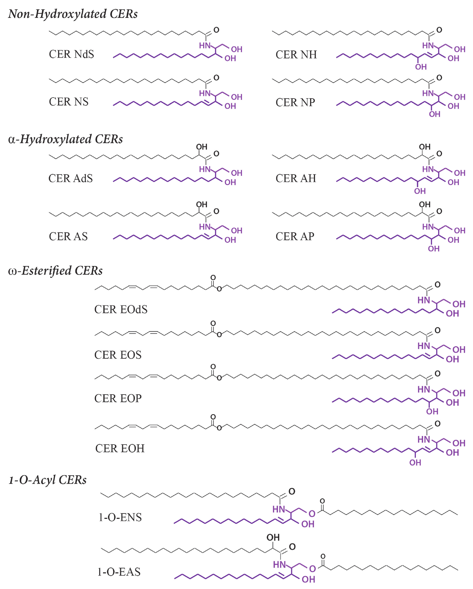

**Hình 3.1.** Cấu trúc phân tử của các CER hiện diện trong SC người. Có thể phân nhóm CER dựa trên mức độ hydroxyl hóa và ester hóa ở phần acid béo và phần sphingoid như trình bày trong hình.

Đối với FFA, người ta quan sát thấy chiều dài chuỗi biến thiên rất rộng. FFA được ghi nhận trong SC người chủ yếu ở dạng bão hòa, có chiều dài chuỗi từ C14 đến C34 và chiều dài chuỗi trung bình từ C20 đến C22 (Ansari và cs., 1970; Norlén và cs., 1998; Jennemann và cs., 2012; Park và cs., 2012; van Smeden và cs., 2014). Ngoài FFA bão hòa, SC còn chứa hàm lượng thấp FFA không bão hòa (ví dụ acid oleic, acid linoleic) và FFA hydroxy (Ansari và cs., 1970; Bouwstra và cs., 1996; Norlén và cs., 1998).

Bên cạnh CER và FFA, CHOL là một nhóm lipid khác hiện diện với hàm lượng cao. Một số dẫn xuất khác của CHOL, cholesterol sulfate và ester cholesterol cũng hiện diện trong SC, trong đó có những chất chỉ ở hàm lượng vết (Gray và Yardley, 1975; Gray và White, 1978; Yardley và Summerly, 1981).

---

## 3.3. Tổ chức lipid trong lớp sừng người

Ma trận lipid ngoại bào trong SC rất độc đáo và thể hiện trật tự sắp xếp ba chiều đặc biệt của lipid. Lipid được tổ chức thành các chồng phiến, gọi là tổ chức dạng phiến. Các phiến định hướng gần như song song với bề mặt da. Hai pha dạng phiến cùng tồn tại trong ma trận lipid của SC người. Khi khảo sát bằng nhiễu xạ tia X, chiều dài đơn vị lặp của các pha dạng phiến này lần lượt khoảng 13 nm và 6 nm, được gọi tương ứng là pha tuần hoàn dài (LPP) và pha tuần hoàn ngắn (SPP) (Madison và cs., 1987; White và cs., 1988; Bouwstra và cs., 1991; Hatta và cs., 2006) (Hình 3.2, phía trên bên phải). Khác với SPP được sắp xếp theo cấu trúc lớp kép (Mojumdar và cs., 2013), khoảng cách lặp của LPP rất khác thường so với các hệ lipid khác và pha này chỉ được phát hiện trong SC. Điều này gợi ý rằng LPP giữ vai trò then chốt đối với chức năng hàng rào da (Bouwstra, 2000).

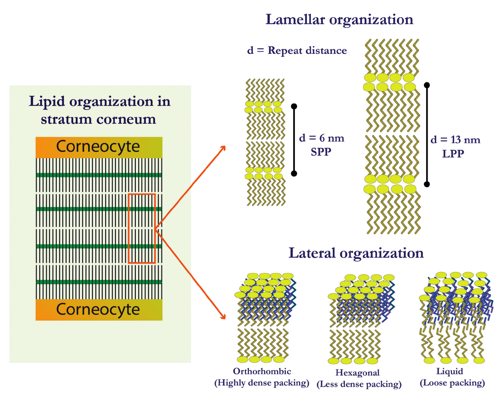

**Hình 3.2.** Tổ chức lipid của SC. Lipid có thể tập hợp thành hai pha dạng phiến (thể hiện ở phía trên bên phải của hình): LPP có đơn vị lặp (D) khoảng 13 nm và SPP có đơn vị lặp khoảng 6 nm. Tổ chức bên (phía dưới bên phải) mô tả cách lipid trong ma trận lipid được đóng gói trên mặt phẳng vuông góc với hướng của các phiến. Kiểu đóng gói bên có thể là trực thoi (mật độ rất cao), lục giác (mật độ thấp hơn) hoặc lỏng (đóng gói lỏng lẻo), như thể hiện trong hình.

Sự hiện diện của các pha dạng phiến trong SC lần đầu tiên được theo dõi bằng hiển vi điện tử bẻ gãy đông lạnh, nhưng phương pháp này khó khảo sát hướng và sự xếp chồng của lipid (Breathnach và cs., 1973). Sau đó, các dải thấu electron rộng–hẹp–rộng được ghi nhận bằng hiển vi điện tử với bước hậu cố định bằng RuO₄ (Madison và cs., 1987; Hou và cs., 1991). Những nghiên cứu này lần đầu tiên cho thấy các chồng phiến lipid đều đặn giữa các tế bào sừng (Hình 3.3). Nhiễu xạ tia X góc nhỏ (SAXD) đã phát hiện sự hiện diện của LPP với chu kỳ khoảng 13 nm trong SC người, lợn và chuột (White và cs., 1988; Bouwstra và cs., 1991, 1994, 1995). Tổ chức dạng phiến cũng đã được quan sát bằng hiển vi điện tử lạnh. Khoảng cách lặp quan sát được khác với giá trị thu từ nhiễu xạ tia X, nhưng cũng không thể giải thích bằng một cấu trúc lớp kép thông thường (Iwai và cs., 2012).

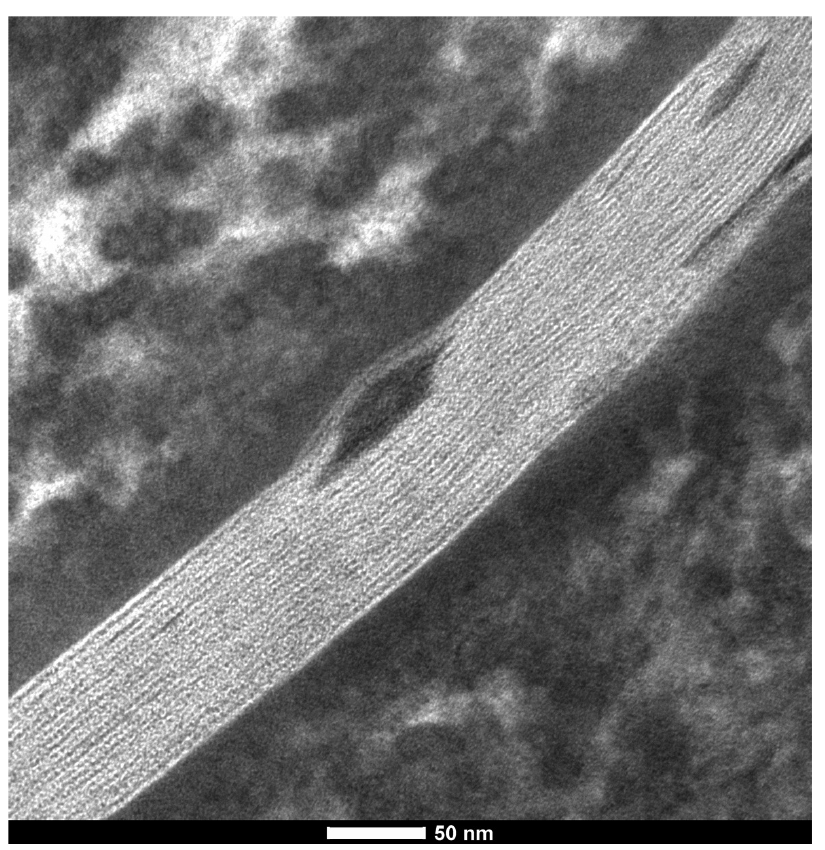

**Hình 3.3.** Tổ chức dạng phiến được quan sát bằng hiển vi điện tử bẻ gãy đông lạnh kết hợp nhuộm ruthenium tetroxide.

Tuy nhiên, sự sắp xếp của các pha dạng phiến mới chỉ là tổ chức theo một hướng trong không gian ba chiều. Ở hai chiều còn lại, tức trên mặt phẳng vuông góc với hướng sắp xếp của các pha dạng phiến, lipid tập hợp theo kiểu gọi là tổ chức bên. Không chỉ các pha dạng phiến mà cả tổ chức bên này trong ma trận lipid đều có tầm quan trọng thiết yếu đối với chức năng hàng rào da. Tùy theo thành phần lipid, lipid có thể tạo kiểu đóng gói trực thoi (dày đặc), lục giác (kém dày đặc hơn) hoặc lỏng (lỏng lẻo). Hình 3.2 trình bày sơ đồ ba cách sắp xếp khả dĩ này. Vào đầu thập niên 1990, kiểu đóng gói bên của da người được phát hiện bằng cả nhiễu xạ tia X góc rộng và quang phổ hồng ngoại biến đổi Fourier (FTIR). Lipid chủ yếu tồn tại ở kiểu đóng gói bên trực thoi, cùng một quần thể nhỏ lipid tạo kiểu đóng gói lục giác (Bommannan và cs., 1990; Ongpipattanakul và cs., 1994). Nhiễu xạ tia X khó xác định kiểu đóng gói bên dạng lỏng có cùng tồn tại với kiểu đóng gói tinh thể hay không, vì phản xạ rộng của kiểu đóng gói lỏng bị che khuất bởi các phản xạ từ keratin trong tế bào sừng (Bouwstra và cs., 2001). Điều thú vị là hiện tượng chuyển pha từ trực thoi sang lục giác đã được quan sát ở nhiệt độ chỉ cao hơn nhiệt độ da, trong khoảng 30–45°C và còn phụ thuộc vào hàm lượng nước trong SC. Do kiểu đóng gói lục giác đã được chứng minh là tạo ra giá trị mất nước qua biểu bì (TEWL) cao hơn kiểu đóng gói trực thoi, đây là một quan sát rất đáng chú ý (Damien và Boncheva, 2009). Nhiệt độ môi trường tăng có thể gây ra quá trình chuyển pha này, làm tăng mất nước và qua đó tiêu thụ một lượng đáng kể năng lượng tự do — chính xác hơn là enthalpy bay hơi — có thể góp phần duy trì thân nhiệt ngay cả trong môi trường nhiệt độ cao.

---

## 3.4. Thành phần và tổ chức lipid ở da bệnh lý và da khô

Trong một số bệnh da như viêm da cơ địa, bệnh vảy cá dạng phiến, hội chứng Netherton, bệnh vảy cá bẩm sinh di truyền lặn trên nhiễm sắc thể thường và vùng da tổn thương do vảy nến, chức năng hàng rào da suy giảm đáng kể (Imokawa và cs., 1991; Motta và cs., 1994; Paige và cs., 1994; Bonnart và cs., 2010; Ishikawa, 2010; Jungersted và cs., 2010; Park và cs., 2012; Radner và cs., 2013; Sassa, 2013; Tawada và cs., 2014). Bên cạnh những yếu tố khác góp phần làm suy giảm chức năng hàng rào, thành phần lipid trong SC của các bệnh nhân này có những sai lệch đáng kể so với da khỏe mạnh. Viêm da cơ địa là một bệnh viêm da phổ biến đi kèm suy giảm chức năng hàng rào da. Thành phần lipid trong SC của bệnh nhân viêm da cơ địa được đặc trưng bởi sự suy giảm đáng kể hàm lượng các phân nhóm EO CER (Imokawa và cs., 1991; Pilgram và cs., 2001). Sự suy giảm hàm lượng EO CER cùng với sự gia tăng hàm lượng CER chuỗi ngắn làm giảm chiều dài chuỗi CER trung bình trong SC của bệnh nhân viêm da cơ địa so với nhóm đối chứng. Hệ quả là tỷ lệ lipid tạo kiểu đóng gói bên lục giác tăng lên. Cả sự giảm chiều dài chuỗi lẫn sự gia tăng kiểu đóng gói bên lục giác đều tương quan rất chặt chẽ với tình trạng suy giảm chức năng hàng rào da trong viêm da cơ địa (Janssens và cs., 2012). Ngoài việc góp phần làm tăng sự hình thành kiểu đóng gói bên lục giác, hàm lượng các phân nhóm EO CER còn tham gia vào quá trình hình thành LPP. Do LPP đã được chứng minh là có vai trò quan trọng đối với hàng rào lipid của da, yếu tố này cũng có thể góp phần gây suy giảm hàng rào da ở bệnh nhân viêm da cơ địa (Janssens và cs., 2012; Jennemann và cs., 2012). Ngoài những thay đổi về thành phần CER, SC của các bệnh nhân này còn được ghi nhận có hàm lượng FFA chuỗi ngắn tăng, tỷ lệ CER/CHOL/FFA thay đổi và hàm lượng acid béo không bão hòa đơn (MUFA) tăng (Macheleidt và cs., 2002; Takigawa và cs., 2005; Janssens và cs., 2012, 2014; van Smeden và cs., 2014).

Hàm lượng MUFA tăng cao cũng được quan sát thấy ở một bệnh da khác là hội chứng Netherton. Ở một số bệnh nhân, hàm lượng MUFA có thể chiếm tới 80–90% tổng lượng FFA (van Smeden và cs., 2014). Ngoài ra, những bệnh nhân này còn có chiều dài chuỗi FFA giảm, hàm lượng CER chuỗi ngắn tăng, hàm lượng CER không bão hòa tăng và hàm lượng EO CER giảm (van Smeden và cs., 2014). Do đó, phần lớn bệnh nhân được ghi nhận có sự thay đổi về tổ chức lipid trong SC (van Smeden và cs., 2014), bao gồm thay đổi hoặc thậm chí mất các pha dạng phiến, đồng thời mức độ sắp xếp có trật tự của chuỗi lipid trong kiểu đóng gói bên cũng giảm.

Đối với bệnh vảy nến, một số nghiên cứu đã ghi nhận nhiều thay đổi. Vảy nến là một bệnh viêm da mạn tính. Do quá trình tăng sinh và biệt hóa biểu bì bất thường, vùng da tổn thương biểu hiện những bất thường về thành phần và tổ chức lipid. Motta và cs. (1993, 1995) ghi nhận thành phần các phân nhóm CER bị thay đổi, trong đó EO CER giảm. Bên cạnh đó, mức TEWL tăng cũng được ghi nhận tại các tổn thương vảy nến. Một công bố gần đây hơn cho thấy thành phần CER trong SC của vùng da không tổn thương ở bệnh nhân vảy nến không thay đổi (Farwanah và cs., 2005b). Hiện có rất ít dữ liệu về tổ chức lipid. Gần đây, vùng da tổn thương được chứng minh có sự khác biệt rõ rệt về tổ chức dạng phiến, trong khi tổ chức lipid ở vùng da không tổn thương không khác với da đối chứng (van Smeden và cs., 2014). Ngoài ra, các nghiên cứu bằng hiển vi điện tử truyền qua cho thấy cấu trúc lipid SC bất thường ở da vảy nến (Ghadially và cs., 1996). Những thay đổi trong tổ chức dạng phiến này có thể liên quan đến sự suy giảm hàm lượng EO CER ở da vảy nến mà Motta và cs. (1993, 1995) đã quan sát được.

Trong bệnh vảy cá dạng phiến, tổng hàm lượng FFA giảm đáng kể so với SC khỏe mạnh (Lavrijsen và cs., 1995). Điều này có thể làm tăng tỷ lệ lipid tạo kiểu đóng gói bên lục giác kém chặt chẽ hơn trong bệnh này (Pilgram và cs., 2001). Tuy nhiên, do chưa có thông tin về chiều dài chuỗi FFA nên chưa rõ sự thay đổi phân bố chiều dài chuỗi của FFA hoặc CER có góp phần hay không. Các nghiên cứu nhiễu xạ tia X cho thấy tổ chức dạng phiến thay đổi so với SC khỏe mạnh; thành phần CER bị thay đổi và chiều dài chuỗi giảm đều có thể giữ vai trò trong hiện tượng này (Lavrijsen và cs., 1995).

Một bệnh da thuộc nhóm vảy cá khác là bệnh vảy cá bẩm sinh di truyền lặn trên nhiễm sắc thể thường cũng cho thấy sự thay đổi thành phần lipid. Ở bệnh này, đột biến di truyền gây thiếu ceramide synthase 3, enzyme chịu trách nhiệm gắn chuỗi acid béo rất dài với base sphingoid. Hệ quả là hàm lượng của tất cả CER không hydroxyl hóa có chuỗi acyl dài hơn 22 nguyên tử carbon đều giảm, trong khi EO CER và CER liên kết giảm khi chiều dài chuỗi vượt quá 26 nguyên tử carbon (Eckl và cs., 2013). Những thay đổi mạnh mẽ về thành phần CER này được dự đoán sẽ dẫn đến những biến đổi sâu sắc trong tổ chức lipid.

Cuối cùng, bệnh vảy cá liên kết nhiễm sắc thể X di truyền lặn có hàm lượng cholesterol sulfate trong SC tăng cao do thiếu enzyme cholesterol sulfatase (Rehfeld và cs., 1988; Zettersten và cs., 1998). Sự gia tăng cholesterol sulfate làm hình thành pha lỏng trong các hỗn hợp mô hình lipid; vì vậy, hàm lượng cholesterol sulfate tăng có thể góp phần làm suy giảm hàng rào da trong bệnh này (Bouwstra và cs., 1999).

Hiện vẫn chưa rõ da khô xét về mặt mỹ phẩm có biểu hiện những thay đổi thành phần tương tự hay không. Chỉ có một vài nghiên cứu báo cáo về thành phần lipid ở da khô xét về mặt mỹ phẩm và chưa có thông tin về phân bố chiều dài chuỗi. Hai công bố cho thấy vào mùa đông, trong EO CER — chủ yếu là CER EOS — nhánh oleate tăng mạnh trong khi nhánh linoleate giảm tương ứng (Conti và cs., 1996; Rogers và cs., 1996). Mặc dù các công bố này cho rằng thay đổi thành phần lipid có thể được đưa về bình thường bằng cách bôi acid béo không bão hòa và triglyceride tại chỗ, nhưng theo hiểu biết tích lũy qua nhiều năm về ứng xử pha lipid của SC, điều này chỉ có thể xảy ra khi linoleate không bão hòa liên kết với chuỗi acyl rất dài của EO CER để thay thế oleate đang liên kết hóa học. Các tác giả của chương này hoài nghi liệu quá trình đó có thực sự xảy ra hay không. Một công bố khác (Schreiner và cs., 2000) cho thấy hàm lượng CER EOS có thể liên quan đến sự hiện diện của LPP. Tuy nhiên, số người trong mỗi nhóm của nghiên cứu này, bao gồm các nhóm da khô ở người trẻ và người cao tuổi, quá ít để phát hiện khác biệt có ý nghĩa thống kê giữa các nhóm. Dù vậy, một báo cáo gần đây cho thấy ở bệnh nhân chàm cơ địa, hàm lượng EO CER giảm tương quan với sự suy giảm tỷ lệ lipid hình thành LPP (van Smeden và cs., 2014).

---

## 3.5. Các hệ mô hình lipid như một công cụ để khảo sát chi tiết hơn mối quan hệ giữa thành phần và tổ chức lipid

---

### 3.5.1. Các hệ mô hình lipid nhằm làm sáng tỏ ứng xử pha lipid

Trong các nghiên cứu lâm sàng, thường rất khó khảo sát mối liên hệ giữa những thay đổi về thành phần và tổ chức lipid với chức năng hàng rào da. Trong trường hợp thuận lợi nhất, các mối tương quan sẽ được quan sát thấy. Tuy nhiên, những tương quan này không cho biết liệu sự thay đổi thành phần hoặc tổ chức lipid có phải là nguyên nhân gây suy giảm chức năng hàng rào da hay không. Để nghiên cứu vấn đề này, các mô hình lipid SC đã được phát triển. Các mô hình này cho phép khảo sát đặc tính của lipid mà không bị tế bào sừng gây nhiễu. Hơn nữa, thành phần lipid có thể được điều chỉnh theo yêu cầu. Vì vậy, những mô hình này giúp việc diễn giải trở nên thuận lợi hơn khi tập trung vào tổ chức lipid, đồng thời có thể cung cấp thông tin mới về vai trò của các lớp và phân lớp lipid đối với ứng xử pha lipid. Các mô hình đơn giản nhất trong nhóm này là hỗn hợp gồm một, hai, ba hoặc bốn thành phần lipid CER, CHOL và FFA (Rerek và cs., 2005; Chen và cs., 2007; Kessner và cs., 2008a,b; Ruettinger và cs., 2008; Brief và cs., 2009; Schröter và cs., 2009).

Các mô hình này đặc biệt hữu ích để nghiên cứu những tương tác cơ bản giữa các lipid khác nhau. Mặc dù cung cấp thông tin quan trọng về ứng xử pha lipid, chúng thường hình thành các pha khác với những pha trong SC. Hơn nữa, các nghiên cứu nhiễu xạ neutron và tia X cho thấy những hỗn hợp lipid mô hình này thường không có khả năng hình thành LPP và SPP. Điều đó khiến các hệ mô hình đơn giản hóa ít phù hợp hơn để xác định vai trò của các phân lớp lipid khác nhau đối với ứng xử pha lipid trong SC khi diễn giải dữ liệu về da khô và da bệnh lý, trong đó trọng tâm là mối liên hệ giữa sự suy giảm hàng rào da và những thay đổi về thành phần lipid (Kessner và cs., 2008; Schröter và cs., 2009).

Trái với các hỗn hợp lipid đơn giản, CER phân lập từ SC người hoặc lợn cũng đã được sử dụng cùng CHOL và FFA để khảo sát ứng xử pha lipid (Bouwstra và cs., 1996, 2001). Hỗn hợp CER phân lập từ người và CHOL cho thấy sự hiện diện của hai pha dạng phiến có khoảng cách lặp 5,4 và 12,8 nm, mô phỏng sát các pha dạng phiến hiện diện trong SC người và lợn (Bouwstra và cs., 2001). Tuy nhiên, có một khác biệt rõ rệt: những hỗn hợp lipid này biểu hiện kiểu đóng gói bên lục giác thay vì kiểu trực thoi vốn chiếm ưu thế trong SC (Bommannan và cs., 1990; Ongpipattanakul và cs., 1994). Việc bổ sung hỗn hợp FFA có chuỗi dài với chiều dài đa dạng không chỉ tạo ra hai pha dạng phiến nổi trội mà còn khiến lipid tập hợp theo kiểu đóng gói bên trực thoi (Bouwstra và cs., 1998a). Các nghiên cứu tiếp theo cho thấy sự vắng mặt của CER EOS trong hỗn hợp CER phân lập làm giảm mạnh sự hình thành LPP, qua đó chứng tỏ tầm quan trọng của CER EOS đối với tổ chức lipid thích hợp trong SC (McIntosh và cs., 1996; Bouwstra và cs., 1998b, 2001). Ảnh hưởng của mức độ không bão hòa của acid béo liên kết ester với chuỗi acyl 30 carbon của CER EOS cũng được khảo sát bằng cách sử dụng FFA, CHOL và CER phân lập từ người với tỷ lệ đồng mol. Trong các nghiên cứu này, CER EOS được thay thế bằng CER EOS linoleate tổng hợp (nhánh linoleate không bão hòa hai nối đôi), CER EOS oleate (không bão hòa một nối đôi) hoặc CER EOS stearate (bão hòa) (Bouwstra và cs., 2002). Kết quả cho thấy mức độ không bão hòa của chuỗi acid béo ảnh hưởng rất lớn đến tổ chức dạng phiến của lipid. So với CER EOS oleate, hỗn hợp lipid chứa CER EOS linoleate chủ yếu tạo các phiến LPP. Với CER EOS stearate, LPP thậm chí không hình thành (de Sousa và cs., 2011). Khi ngoại suy kết quả này cho hàm lượng CER EOS oleate cao hơn được ghi nhận ở da khô xét về mặt mỹ phẩm, có thể dự đoán tỷ lệ lipid tạo LPP sẽ giảm (Conti và cs., 1996).

Do da người không dễ thu nhận và quá trình phân lập CER từ SC tốn nhiều thời gian, CER tổng hợp có thể được sử dụng như một giải pháp thay thế (de Jager và cs., 2005). Ưu điểm của CER tổng hợp là có thể thay đổi thành phần theo yêu cầu, nhờ đó tạo thuận lợi cho việc nghiên cứu vai trò của các phân lớp lipid khác nhau trong tổ chức lipid. Hỗn hợp đồng mol gồm CER tổng hợp, CHOL và FFA tạo thành LPP và SPP tương tự các pha hiện diện trong SC, nhưng có chu kỳ hơi ngắn hơn, lần lượt là 12,2 và 5,4 nm, đồng thời hình thành kiểu đóng gói bên trực thoi (de Jager và cs., 2005). Ứng xử pha này rất giống với ứng xử thu được khi sử dụng CER phân lập. Trong các hỗn hợp lipid cũng quan sát thấy những miền CHOL tinh thể tách pha tương tự như trong SC. Cần lưu ý rằng với CER tổng hợp, LPP chỉ hình thành khi có FFA, trái với những quan sát từ hỗn hợp CER tự nhiên. Sự khác biệt về ứng xử pha giữa hỗn hợp CER tự nhiên và tổng hợp có thể bắt nguồn từ mức độ biến thiên chiều dài chuỗi acyl hạn chế hơn ở hỗn hợp tổng hợp.

---

### 3.5.2. Mô hình thay thế lớp sừng (SCS) như một công cụ để nghiên cứu chức năng hàng rào lipid

Như đã trình bày ở trên, các hỗn hợp lipid được điều chế từ CER tổng hợp, CHOL và FFA có thể được sử dụng để nghiên cứu ứng xử pha lipid, đồng thời là công cụ tuyệt vời để khảo sát vai trò của từng phân nhóm CER hoặc từng lớp lipid trong tổ chức lipid của SC. Cho đến nay, các hỗn hợp lipid này đã được dùng để khảo sát mối liên hệ giữa thành phần và tổ chức lipid. Tuy nhiên, để hiểu chức năng hàng rào da, cần xác định ảnh hưởng của thành phần và tổ chức lipid lên chức năng hàng rào lipid. Vì lý do đó, một thiết bị màng lipid đã được phát triển, gọi là mô hình thay thế lớp sừng (SCS) (de Jager và cs., 2006; Groen và cs., 2008). SCS được chế tạo bằng cách đúc lipid — gồm các hỗn hợp CER tổng hợp, CHOL và FFA — trên một giá đỡ xốp, chẳng hạn phun lipid lên màng lọc polycarbonate. Khi lựa chọn thành phần phù hợp, SCS được quan sát là mô phỏng rất sát thành phần và tổ chức lipid của SC (de Jager và cs., 2004, 2006).

Để khảo sát chức năng hàng rào và liên hệ hàng rào lipid với thành phần và tổ chức lipid, SCS có thể được kẹp trong một tế bào khuếch tán, cho phép nghiên cứu sự vận chuyển của các hợp chất mô hình bằng các phép thử thấm in vitro. Nhiều hợp chất thuốc mô hình đã được lựa chọn để thực hiện các phép thử thấm. Những hợp chất này có tính chất vật lý khác nhau, gồm acid benzoic, acid para-aminobenzoic (PABA), ethyl PABA, butyl PABA và hydrocortisone (de Jager và cs., 2006; Groen và cs., 2008, 2011a; Basse và cs., 2013). Trong số các hợp chất này, acid benzoic là thuốc có tính ưa lipid thấp nhất. Hồ sơ thấm của tất cả các hợp chất qua SCS cho thấy flux tương tự như quan sát được ở SC người, qua đó chứng minh tính phù hợp của mô hình SCS để nghiên cứu hàng rào lipid khi so sánh với SC.

Như đã đề cập, SC của da bệnh lý được ghi nhận có hàm lượng CER EO giảm và hàm lượng CER chuỗi ngắn cùng FFA tăng. Do đó, các phép thử thấm in vitro đã được thực hiện bằng màng mô hình SCS, trong đó thành phần lipid được thay đổi để mô phỏng nhiều đặc điểm của thành phần lipid trong SC của bệnh nhân viêm da cơ địa (Groen và cs., 2011; Basse và cs., 2013). Các nghiên cứu sử dụng hỗn hợp lipid không có CER EOS cho thấy hàng rào lipid suy giảm, qua đó chỉ ra tầm quan trọng của CER EOS không chỉ đối với ứng xử pha lipid mà còn đối với chức năng hàng rào lipid thích hợp của da (de Jager và cs., 2006). Trong các nghiên cứu khác, ảnh hưởng của việc giảm chiều dài chuỗi FFA cũng được khảo sát bằng acid benzoic làm thuốc mô hình. Chiều dài chuỗi FFA giảm làm suy yếu hàng rào lipid so với SC, chứng tỏ tầm quan trọng của chiều dài chuỗi FFA đối với hàng rào da (Groen và cs., 2011b).

Trong các nghiên cứu tiếp theo (Mojumdar và cs., 2014a), ảnh hưởng của phân bố chiều dài chuỗi CER cũng được khảo sát. Vì mục đích này, SCS được chế tạo từ CER tổng hợp có tổng chiều dài chuỗi [acid béo + base sphingoid] là 34, 48 hoặc 68 nguyên tử carbon, rồi so sánh với CER phân lập từ SC lợn. Ở CER lợn, tổng chiều dài chuỗi dao động từ 31 đến 74 nguyên tử carbon. Khi so sánh flux ở trạng thái ổn định của hydrocortisone, flux qua SCS được chế tạo từ CER lợn cao hơn khoảng 12 lần so với SCS được chế tạo từ CER tổng hợp có thành phần phân nhóm CER gần tương tự (Hình 3.4). Do đây là khác biệt rất lớn, các nghiên cứu này cho thấy phân bố chiều dài chuỗi ảnh hưởng mạnh đến hàng rào lipid của da. Một nghiên cứu rất gần đây đã xác nhận kết quả này: CER có chuỗi acyl gồm 24 nguyên tử carbon được thay thế bằng CER có chuỗi acyl gồm 16 nguyên tử carbon. Sự thay thế làm suy giảm hàng rào lipid và thay đổi tổ chức lipid, như được khảo sát bằng nhiễu xạ tia X và quang phổ hồng ngoại (Pullmannová và cs., 2017).

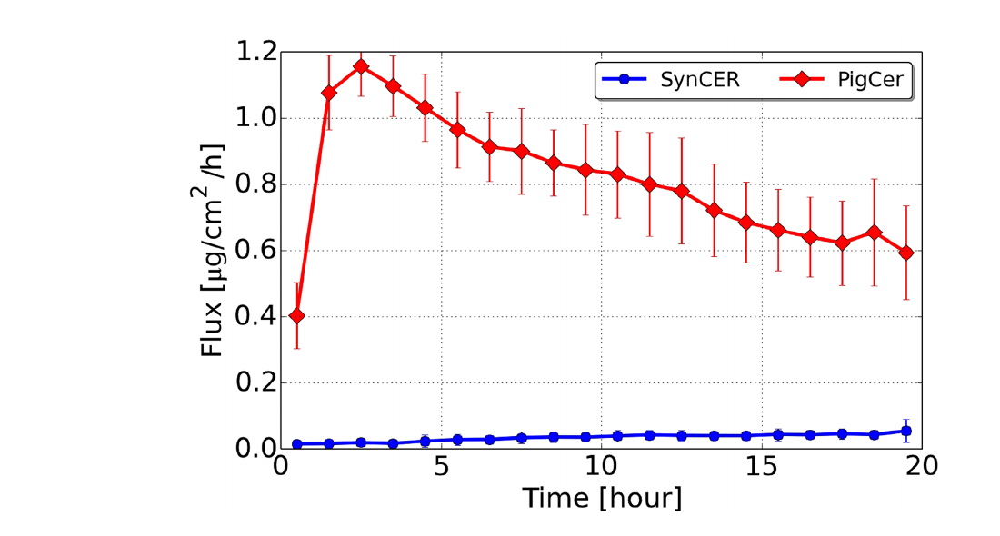

**Hình 3.4.** Flux hydrocortisone qua SCS được chế tạo từ CER lợn, CHOL và FFA theo tỷ lệ đồng mol hoặc từ CER tổng hợp, CHOL và FFA theo tỷ lệ đồng mol. Thành phần các phân nhóm CER rất tương tự thành phần quan sát được ở CER lợn.

Khi ngoại suy những phát hiện này cho da bệnh lý, nơi thường đồng thời quan sát thấy phân bố chiều dài chuỗi giảm và phân bố chiều dài chuỗi mở rộng hơn, có thể kỳ vọng những thay đổi về phân bố chiều dài chuỗi góp phần làm suy giảm chức năng hàng rào da. Trong một nghiên cứu khác của cùng nhóm tác giả, ảnh hưởng của FFA không bão hòa đơn (MUFA) lên tính thấm đã được khảo sát (Mojumdar và cs., 2014b). Trong các nghiên cứu này, một phần FFA bão hòa được thay thế bằng các FFA MUFA tương ứng. Kết quả cho thấy sự hiện diện của MUFA làm tăng flux hydrocortisone, đồng thời làm tăng TEWL. Điều này chứng minh rằng bên cạnh phân bố chiều dài chuỗi CER, sự gia tăng mức độ không bão hòa của FFA có thể giữ vai trò quan trọng trong tình trạng suy giảm hàng rào da ở các bệnh da.

Điều quan trọng cần lưu ý là trong các SCS này, đã phát hiện rõ sự gia tăng hàm lượng lipid tạo kiểu đóng gói lục giác, đi kèm sự giảm hàm lượng lipid tập hợp theo kiểu đóng gói trực thoi. Vì vậy, có thể thấy rất rõ rằng ngoài sự suy giảm hình thành LPP, sự gia tăng tỷ lệ lipid tạo kiểu đóng gói bên lục giác cũng giữ vai trò quan trọng trong tình trạng suy giảm hàng rào da ở da bệnh lý.

---

# 4. Miễn dịch học của da và tính phản ứng

Krishna Telaprolu, Heather A.E. Benson, Jeffrey E. Grice, Michael S. Roberts và Philip L. Tong

## Nội dung

- Mạng lưới miễn dịch của da
- Thành phần miễn dịch của biểu bì
  - Tế bào sừng
  - Tế bào sừng trong miễn dịch bẩm sinh
  - Tế bào sừng trong miễn dịch thích ứng
  - Tế bào hắc tố
  - Tế bào Langerhans (LC)
- Thành phần miễn dịch của trung bì
  - Tế bào tua ở trung bì (dDC)
  - Dưỡng bào (MC)
  - Tế bào T
  - Đại thực bào
  - Tế bào lympho bẩm sinh
- Ý nghĩa của hệ miễn dịch da trong khoa học mỹ phẩm
  - Viêm da tiếp xúc
  - Cơ chế bệnh sinh của viêm da
- Dược mỹ phẩm hướng đích các thành phần của hệ miễn dịch da
  - Tăng sắc tố
  - Bảo vệ quang học
- Kết luận
- Tài liệu tham khảo

---

## 4.1. Mạng lưới miễn dịch của da

Da là tuyến phòng thủ đầu tiên chống lại sự xâm nhập của các chất ngoại sinh và vi sinh vật từ môi trường; cơ chế phòng thủ này mang cả bản chất cấu trúc lẫn miễn dịch. Như đã trình bày chi tiết ở Chương 2, cấu trúc da gồm biểu bì và trung bì bên ngoài, gắn với màng đáy. Da có một hàng rào gồm bốn lớp bảo vệ khác nhau. Lớp phòng thủ thứ nhất bao gồm lớp sừng phân tầng cùng với các mối nối chặt trong lớp hạt. Tuyến phòng thủ thứ hai là hàng rào hóa học do các protein kháng khuẩn hiện diện trong biểu bì tạo nên. Hệ vi sinh vật trên da tạo thành lớp bảo vệ thứ ba bằng cách ức chế sự xâm nhập của các tác nhân gây bệnh trên da như *Staphylococcus aureus* và các vi sinh vật khác. Lớp bảo vệ thứ tư là hàng rào miễn dịch, gồm cả mạng lưới miễn dịch bẩm sinh và thích ứng, cung cấp khả năng miễn dịch tức thời cũng như lâu dài chống lại các tác nhân gây bệnh xâm nhập (Kuo và cs., 2013a; Heath và Carbone, 2013). Mạng lưới miễn dịch của da chứa các tế bào có nguồn gốc tạo máu và không tạo máu (Hình 4.1). Biểu bì chủ yếu chứa tế bào sừng, cùng các tế bào khác như tế bào hắc tố và tế bào miễn dịch là tế bào Langerhans. Ma trận collagen của trung bì tạo ra một vi môi trường, nơi các tế bào tua ở trung bì, tế bào T αβ, tế bào T γδ, dưỡng bào và đại thực bào cư trú.

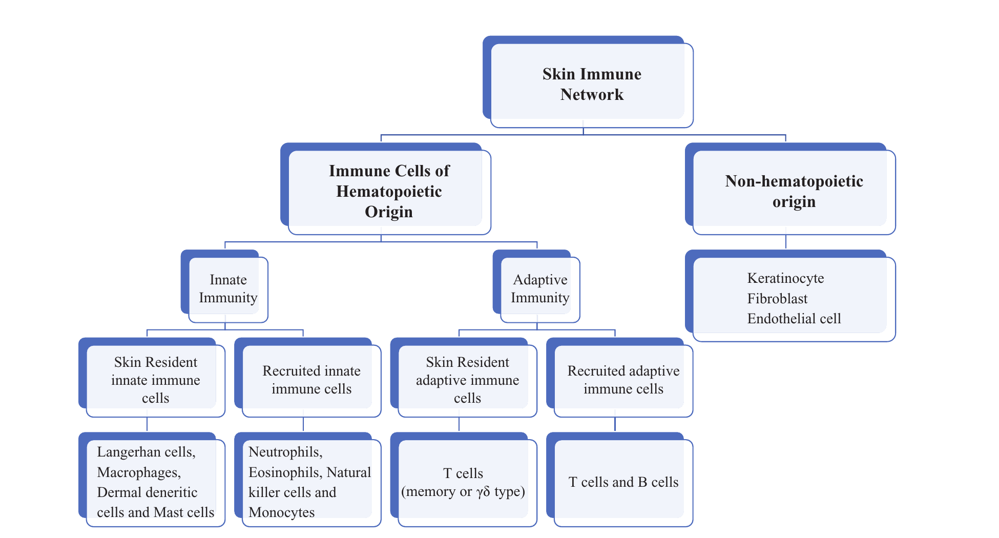

**Hình 4.1.** Mạng lưới miễn dịch của da.

(Di Meglio và cs., 2011). Những tế bào cũng được huy động trong một số trạng thái viêm bao gồm tế bào sát thủ tự nhiên, tế bào B, bạch cầu ái toan và tế bào T lưu hành.

---

## 4.2. Thành phần miễn dịch của biểu bì

---

### 4.2.1. Tế bào sừng

Tế bào sừng, loại tế bào chủ yếu phân bố trong biểu bì, đóng vai trò thiết yếu trong việc duy trì cân bằng nội môi miễn dịch ở da thông qua sự tham gia vào cả miễn dịch bẩm sinh và miễn dịch thích ứng. Ngoài chức năng miễn dịch, chúng còn là những chất trung gian quan trọng trong quá trình tăng trưởng, biệt hóa, điều hòa và lành vết thương của da (Steinhoff và cs., 2001).

---

### 4.2.2. Tế bào sừng trong miễn dịch bẩm sinh

Tế bào sừng chiếm 90% số tế bào biểu bì và giữ vai trò then chốt trong việc duy trì hàng rào vật lý của da. Chúng tích cực tham gia miễn dịch bẩm sinh bằng cách biểu hiện các peptide kháng khuẩn (AMP), chẳng hạn như β-defensin người (HBD-2 và HBD-3) và cathelicidin người (hCAP18/LL-37). Các AMP này cùng những peptide khác, bao gồm psoriasin, RNase 7 và dermicidin, thể hiện hoạt tính kháng khuẩn phổ rộng, trong đó có khả năng ức chế tác nhân gây bệnh xâm nhập và định cư (Brown và McLean, 2012; Mann, 2014). Các AMP liên kết với màng vi sinh vật nhờ bề mặt kỵ nước mang điện tích dương và tiêu diệt vi sinh vật bằng cách tạo lỗ trên màng của chúng (Bangert và cs., 2011). Ngoài đặc tính gây độc tế bào, AMP còn hoạt động như tác nhân hóa hướng động đối với các tế bào viêm thông qua việc giải phóng các tác nhân tiền viêm và thu hút các tế bào miễn dịch thích ứng. Trong viêm cấp tính, AMP cũng gây mất hạt ở dưỡng bào và kích thích tế bào sừng sản xuất cytokine cùng chemokine (Steinstraesser và cs., 2008).

Tế bào sừng nhận diện và bảo vệ cơ thể trước sự xâm nhập của tác nhân gây bệnh bằng cách sản xuất các thụ thể nhận diện mẫu (PRR). Các thụ thể này bao gồm thụ thể Toll-like (TLR), đáp ứng với các thành phần của tác nhân gây bệnh; và thụ thể NOD-like (NLR) Nod1 và Nod2, đáp ứng với peptidoglycan của vi khuẩn cũng như các thành phần của virus và nấm. Tế bào sừng biểu hiện thụ thể giống RIG (RLR) để đáp ứng với nhiễm virus và thụ thể lectin type C (CLR) để đáp ứng với nhiễm nấm. PRR có thể nhận diện các thành phần đặc hiệu của tác nhân gây bệnh như lipoprotein, tiên mao và các thành phần của thành tế bào. Trong trạng thái cân bằng nội môi, tế bào sừng biểu hiện một số peptide kháng khuẩn, cytokine và chemokine kể trên. Khi vi sinh vật xâm nhập vào da, PRR được hoạt hóa, làm tăng mạnh quá trình sản xuất AMP, đồng thời huy động và tạo tương tác chéo với các tế bào miễn dịch khác. Thông qua những hoạt động này, tế bào sừng tạo ra sự bảo vệ tức thời trước sự xâm nhập của tác nhân gây bệnh, đồng thời kích thích thêm đáp ứng miễn dịch dịch thể và miễn dịch thích ứng (Wang và cs., 2017; Kuo và cs., 2013b; Gallo và Nizet, 2008).

---

### 4.2.3. Tế bào sừng trong miễn dịch thích ứng

Tế bào sừng cũng tham gia đáp ứng miễn dịch thích ứng, tạo ra đáp ứng trí nhớ nhanh và đặc hiệu khi tiếp xúc lại sau đó. Chất lượng của đáp ứng miễn dịch thích ứng phụ thuộc rất nhiều vào đáp ứng miễn dịch bẩm sinh ban đầu. Tế bào sừng sản xuất cytokine, interleukin, yếu tố kích thích tạo cụm, yếu tố tăng trưởng và chemokine. Trong điều kiện bình thường, các chất truyền tin hóa học này được dự trữ trong tế bào và được giải phóng để đáp ứng với các kích thích bên ngoài như bức xạ tử ngoại (UV), nhiễm khuẩn và các chất hóa học. Tế bào sừng tham gia miễn dịch thích ứng bằng cách hoạt động như tế bào trình diện kháng nguyên; cuối cùng, kháng nguyên bị tiêu diệt bởi tế bào T và các kháng thể có nguồn gốc từ tế bào B. Tế bào sừng sản xuất rất nhiều protein truyền tín hiệu, bao gồm các chất trung gian tiền viêm IL-1, IL-6, IL-8 và TNF; các interleukin hỗ trợ tế bào T là IL-7 và IL-15; các interleukin điều hòa miễn dịch IL-10, IL-12 và IL-18; cùng những interleukin khác đóng vai trò phối tử cho một số thụ thể.

Mọi tác động vật lý hoặc hóa học đều có thể phá vỡ màng tế bào sừng, gây giải phóng tức thời chất trung gian tiền viêm IL-1α đã được tạo sẵn; sau khi được giải phóng, IL-1α kích thích sản xuất một chất trung gian tiền viêm khác là IL-1β. Hai interleukin IL-1 này tiếp tục kích hoạt việc sản xuất các chất trung gian tiền viêm khác, bao gồm yếu tố hoại tử khối u α (TNF-α), cytokine hóa hướng động IL-8, các yếu tố thúc đẩy tăng trưởng IL-6, IL-7 và IL-15, cùng các cytokine IL-10 và IL-12 có chức năng điều hòa miễn dịch dịch thể và miễn dịch qua trung gian tế bào (Coquette và cs., 2003; Lee và cs., 2013). IL-1α hoạt hóa nguyên bào sợi để giải phóng các chất trung gian khác như CXCL9, CXCL10, CXCL11 và CCL20. Tế bào sừng của nang tóc thể hiện sự phân khoang rõ rệt, với mức biểu hiện chemokine khác nhau tùy theo vị trí vi giải phẫu; đồng thời, chúng điều hòa sự xâm nhập của tế bào Langerhans — một loại bạch cầu cư trú chủ chốt trong biểu bì — trong quá trình tái lập quần thể biểu bì (Nagao và cs., 2012; Wang và cs., 2017; Grone, 2002; Steinhoff và cs., 2001).

---

### 4.2.4. Tế bào hắc tố

Tế bào hắc tố là các tế bào sản xuất melanin, có nguồn gốc phôi thai từ mào thần kinh và nằm trong nang tóc cũng như biểu bì. Trong biểu bì, chúng cư trú ở lớp đáy của da và được bao quanh bởi các tế bào sừng; cùng nhau, các tế bào này tạo thành đơn vị melanin biểu bì, khái niệm được Fitzpatrick và Breathnach đề xuất lần đầu vào năm 1963 (Nordlund, 2007; Fitzpatrick và Breathnach, 1963). Vị trí chiến lược và diện tích bề mặt lớn mà các tế bào này bao phủ giúp bảo vệ da thông qua việc sản xuất sắc tố melanin. Sắc tố này tạo màu cho da và nang tóc, đồng thời giữ vai trò nền tảng trong sinh lý da bằng cách bảo vệ tế bào khỏi những biến đổi cấu trúc DNA do bức xạ UV gây ra. Trong quá trình sản xuất melanin, một số chất trung gian có đặc tính kháng khuẩn được tạo thành; cùng với melanin, chúng có thể giữ lại và tiêu diệt các tác nhân gây bệnh xâm nhập. Melanin còn có vai trò điều hòa miễn dịch thông qua việc ức chế tế bào lympho T, bạch cầu đơn nhân, nguyên bào sợi và tế bào nội mô sản xuất cytokine tiền viêm (Wood và cs., 1999).

Các melanosome của tế bào hắc tố có tính acid và được chuyển sang những tế bào sừng xung quanh; khi biệt hóa, các tế bào sừng này tạo nên lớp sừng được acid hóa và tăng cường khả năng bảo vệ của hàng rào da (Wood và cs., 1999). Tế bào hắc tố tham gia đáp ứng bẩm sinh bằng cách sản xuất nitric oxide synthase cảm ứng (iNOS), đồng thời biểu hiện các thụ thể Toll-like TLR2–5, TLR7, TLR9 và TLR10. Những thụ thể này có thể nhận diện các mẫu phân tử của tác nhân gây bệnh và cảm ứng sản xuất cytokine cùng chemokine tiền viêm, qua đó tiếp tục điều biến sự huy động tế bào miễn dịch vào da. Tế bào hắc tố cũng sản xuất hormone kích thích tế bào hắc tố alpha (α-MSH), có hoạt tính chống viêm và điều hòa miễn dịch. Những hoạt động này cho thấy tế bào hắc tố là thành phần tham gia tích cực vào miễn dịch da, chứ không chỉ là một hàng rào vật lý ngăn vi sinh vật xâm nhập (Hong và cs., 2015).

---

### 4.2.5. Tế bào Langerhans (LC)

Tế bào Langerhans (LC) lần đầu được Paul Langerhans nhận diện và phân loại là các dây thần kinh ở da vào năm 1868 (Shamoto, 1983). Nguồn gốc phát sinh của LC từ lâu vẫn là chủ đề gây tranh luận, nhưng các thí nghiệm truy vết dòng tế bào *in vivo* gần đây trên chuột cho thấy LC trưởng thành có nguồn gốc kép: chủ yếu từ các tế bào có nguồn gốc từ bạch cầu đơn nhân gan thai, với một phần nhỏ từ các tế bào tiền thân dòng tủy nguyên thủy có nguồn gốc túi noãn hoàng (Hoeffel và cs., 2012). Các nghiên cứu trước đây luôn mô tả LC có nguồn gốc từ tế bào gốc tạo máu trong tủy xương (Katz và cs., 1979). LC là tế bào tạo máu dòng tủy và chỉ chiếm 3–8% số tế bào biểu bì ở động vật có vú. Steinman và cộng sự (Steinman và Cohn, 1973) đã phát hiện LC trong lách chuột và phân loại chúng là một thành viên của nhóm tế bào tua (DC).

Ban đầu, LC được nhận diện nhờ sự hiện diện của các hạt trong bào tương gọi là hạt Birbeck, được cảm ứng bởi lectin langerin (CD207); về sau, người ta cũng ghi nhận langerin được biểu hiện ở tế bào tua trung bì (dDC). LC được xếp vào nhóm tế bào miễn dịch tua kinh điển dựa trên việc phát hiện các thụ thể Fc và C3, CD45, E-cadherin, các phân tử bám dính tế bào biểu mô và kháng nguyên phức hợp hòa hợp mô chủ yếu (MHC) lớp II trên bề mặt của chúng (Birbeck và cs., 1961; Bangert và cs., 2011; Tamaki và cs., 1980; Stingl và cs., 1977). Các phân tử bổ sung gồm CD1a, các kháng nguyên MHC lớp II là kháng nguyên bạch cầu người (HLA)-DR, HLA-DQ và HLA-DP, cùng CD39, cho phép nhận diện LC trong biểu bì ở trạng thái bình thường. LC bám vào tế bào sừng thông qua liên kết do E-cadherin làm trung gian (Tang và cs., 1993).

LC hoạt động như tế bào trình diện kháng nguyên, kiểm soát sự cảm ứng đáp ứng miễn dịch thích ứng bằng cách di chuyển đến các hạch bạch huyết và trình diện kháng nguyên cho tế bào T. Nhờ sử dụng nhiều loại thụ thể trên bề mặt tế bào, LC nhận diện các tác nhân gây bệnh và sản phẩm vi sinh vật đã xâm nhập. Trong giai đoạn nhận diện kháng nguyên này, LC tổng hợp, nạp và tái sắp xếp các phân tử MHC lớp II lên bề mặt tế bào, đồng thời tăng biểu hiện các yếu tố đồng kích thích và dấu ấn trưởng thành khác. Sau khi di chuyển đến hạch bạch huyết, chúng tiết các chemokine thu hút tế bào T để lôi kéo tế bào T naïve, qua đó góp phần tạo miễn dịch thích ứng chống lại tác nhân gây bệnh xâm nhập (Elbe-Burger và Schuster, 2010). Trong điều kiện cân bằng nội môi, LC cũng di chuyển để trình diện các peptide bản thân nhằm duy trì dung nạp miễn dịch bằng cách cảm ứng tế bào T điều hòa (Loser và cs., 2006). Các cytokine được giải phóng từ cả LC và tế bào sừng xung quanh kiểm soát quá trình trưởng thành và sự di chuyển của LC đến hạch bạch huyết.

---

## 4.3 Thành phần miễn dịch của trung bì

Trung bì chứa nhiều tế bào miễn dịch phối hợp với nhau để giám sát và đáp ứng với tác nhân ngoại lai. Các tiểu mục dưới đây mô tả những quần thể chính.

---

### 4.3.1 Tế bào tua trung bì (dDC)

Khác với tế bào tua biểu bì (tế bào Langerhans) thường cư trú cố định, dDC có tính di động cao và liên tục di chuyển trong trung bì. Chúng bắt nguồn từ tế bào gốc tạo máu của tủy xương. Nhuộm Factor XIIIa là phương pháp đầu tiên nhận diện DC ở da. dDC phân biệt với tế bào Langerhans nhờ CD14 và CD1a; Langerhans biểu hiện langerin và có hạt Birbeck. Các dấu ấn khác của dDC gồm CD1b, CD1c (BDCA-1), CD11c, CD36, CD205 và MHC II. CD14 cũng có ở đại thực bào, vì vậy cần dựa thêm vào tính di động và hình thái.

Các dDC dòng tủy chính ở người là CD14+, CD1a+ và 6-sulfo LacNAc+ (slan). CD14+ kích thích tế bào T yếu nhưng hoạt hóa miễn dịch dịch thể; dưới tác động của TGF-β, chúng có thể biệt hóa thành tế bào Langerhans và đi vào biểu bì. Một phân nhóm CD14+ biểu hiện thrombomodulin (CD141+) và điều hòa miễn dịch bằng cách sản xuất IL-10. CD1a+ hoạt hóa mạnh tế bào T CD8+ và CD4+. dDC slan tạo nhiều IL-23 và IL-1β, liên quan đến bệnh sinh vảy nến. Trong da vảy nến, DC tạo TNF, nitric oxide synthase cảm ứng, IL-20 và IL-23; trong viêm da dị ứng, chúng tạo CCL3, IL-1, IL-12p70, IL-16 và IL-18.

Tế bào tua dạng tương bào (pDC) có chức năng trình diện kháng nguyên hạn chế, nhận diện RNA/DNA của tác nhân xâm nhập qua TLR7 và TLR9 rồi tiết interferon type I. Chúng biểu hiện CD123, BDCA-2 (CD303), BDCA-4 (neuropilin-1) và immunoglobulin-like transcript 7. Khi được huy động vào da, pDC tập trung quanh mạch cùng tế bào T, tăng MHC-II và tạo các đáp ứng T khác nhau. pDC hiếm khi có ở da bình thường nhưng xuất hiện trong lupus ban đỏ hệ thống và vảy nến; chúng còn có thể ly giải tế bào u nhờ granzyme B.

---

### 4.3.2 Dưỡng bào (MC)

Dưỡng bào phân bố khắp trung bì, đặc biệt quanh mạch máu, và nổi bật trong đáp ứng miễn dịch Th2. Dựa vào protease, MC được chia thành MCTC (tryptase, chymase, carboxypeptidase và protease giống cathepsin G), MCT (tryptase) và MCC (chymase, carboxypeptidase); da người chủ yếu chứa MCTC.

Tryptase thúc đẩy viêm và tạo mạch, hỗ trợ huy động bạch cầu trung tính, tế bào đơn nhân và lympho T. Chymase tác động lên IL-1β và IL-18 để gây viêm. Hai enzyme cũng phân giải chemokine và cytokine, qua đó điều chỉnh đáp ứng. MC tương tác trực tiếp với tế bào T (kể cả T điều hòa) qua OX-40L và TNF-α; IFN-γ liên quan vảy nến, IL-4 liên quan viêm da dị ứng.

MC thường được hoạt hóa khi dị nguyên gắn IgE bắt chéo thụ thể ái lực cao FcεRI, giải phóng histamine và các chất trung gian tạo giãn mạch, mày đay, phù mạch. Chúng còn tham gia quá mẫn tiếp xúc và lành vết thương, có thể gây viêm hoặc chống viêm. Chất vi sinh gắn TLR2–4, TLR6–7, TLR9 trên MC cũng kích thích tiết cytokine và thoát hạt. MC biểu hiện MHC-I/II, CD80/CD86, có chức năng trình diện kháng nguyên và di chuyển đến hạch. Trong viêm da, MC trao đổi phân tử, kể cả MHC-II, với DC; mức chuyển MHC-II tương quan hiệu quả hoạt hóa ban đầu tế bào T.

---

### 4.3.3 Tế bào T

Tế bào T tạo nên nhánh thích ứng của miễn dịch da, dù một số lớp mới có chức năng bẩm sinh. Tế bào T lưu hành và cư trú bảo vệ cơ thể khỏi nhiễm mới; tế bào cư trú nằm gần Langerhans để đáp ứng nhanh.

Trung bì chủ yếu có T nhớ CD4+ và một số CD8+ gần ranh giới trung bì–biểu bì. Biểu bì chứa T nhớ αβ CD8+ cư trú mô (TRM) lâu dài, biểu hiện CD69, VLA-1 và CD103. Khi viêm, chúng từ máu vào trung bì rồi được huy động lên biểu bì nhờ ligand CXCR3.

Khoảng 5% tế bào T da là T điều hòa (Treg), luân chuyển giữa hạch và da, điều hòa đáp ứng T, hoạt động của DC/đại thực bào và tích tụ bạch cầu trung tính giai đoạn sớm. Treg thúc đẩy kiểu hình chống viêm ở đại thực bào bằng cách ức chế TNF-α và có tính ức chế miễn dịch liên quan ung thư. Tế bào T γδ giám sát miễn dịch da, lành vết thương và quá mẫn tiếp xúc; chúng là nguồn IL-17 quan trọng và là đích mới trong điều trị vảy nến.

---

### 4.3.4 Đại thực bào

Đại thực bào M1 gây viêm, được hoạt hóa bởi IFN-γ hoặc sản phẩm vi sinh, góp phần vào viêm cấp và mạn. Đại thực bào gây viêm CD163+ gặp trong vảy nến, viêm da dị ứng và lymphoma tế bào T ở da. Đại thực bào M2 hỗ trợ lành thương, điều hòa viêm qua IL-10 và TGF-β; IL-4 và IL-13 cảm ứng M2, thúc đẩy miễn dịch type 2 bằng bắt giữ kháng nguyên và làm giảm kháng nguyên sẵn có cho lympho. Đại thực bào cư trú cùng đơn bào lưu hành hỗ trợ DC giám sát miễn dịch và vận chuyển kháng nguyên đến hạch dẫn lưu.

---

### 4.3.5 Tế bào lympho bẩm sinh

Tế bào lympho bẩm sinh (ILC) là nhóm tế bào đa dạng mới được mô tả, phối hợp viêm ở da và mô khác bằng sản xuất cytokine. Dựa trên cytokine và yếu tố phiên mã, ILC chia thành ILC1, ILC2 và ILC3. ILC1 gồm tế bào NK và các ILC1 khác, tham gia miễn dịch kháng virus, được kích hoạt bởi IL-12 và IL-18. NK là phân nhóm ILC1 duy nhất thấy ở da người khỏe mạnh và tăng ở da vảy nến. ILC2 tích tụ trong da viêm da dị ứng và góp phần gây viêm da kiểu Th2. ILC3 là loại chiếm ưu thế ở da; ILC3 dương tính với thụ thể kích hoạt độc tính tự nhiên được thấy trong tuần hoàn ở người khỏe mạnh và tăng ở vùng da không tổn thương của người vảy nến.

---

## 4.4 Ý nghĩa của hệ miễn dịch da trong khoa học mỹ phẩm

Mỹ phẩm và sản phẩm chăm sóc cá nhân tiếp xúc với da trong thời gian dài và lặp lại, nên có thể gây viêm da tiếp xúc kích ứng hoặc dị ứng. Ngành mỹ phẩm dùng sắc ký khí–khối phổ để sàng lọc dị nguyên, cùng các mô hình da in vitro như phương án không dùng động vật để đánh giá khả năng mẫn cảm (xem Chương 25 và 26).

Hệ miễn dịch cũng là đích tiềm năng của cosmeceutical—sản phẩm mỹ phẩm có lợi ích giống thuốc. Hoạt chất bôi ngoài da, nếu đạt nồng độ đủ tại đích tế bào, có thể tạo hiệu quả lâm sàng trong chống lão hóa và làm sáng da. Nghiên cứu cosmeceutical đang tiếp tục phát triển.

---

### 4.4.1 Viêm da tiếp xúc

Thiết kế và phát triển mỹ phẩm phải bảo đảm hiệu quả, an toàn và độc tính ở mức chấp nhận được trước khi cơ quan quản lý phê duyệt. Dị nguyên hoặc phân tử độc xâm nhập da có thể gây đáp ứng miễn dịch: viêm da tiếp xúc dị ứng (ACD), kích ứng (ICD) hoặc viêm da do tiếp xúc ánh sáng. ACD là đáp ứng thích ứng sau mẫn cảm với hóa chất, rồi bùng phát khi tái phơi nhiễm; dị nguyên gắn protein da thành hapten và được tế bào miễn dịch bẩm sinh thu nhận. Chất hoạt động bề mặt, dung dịch acid/kiềm mạnh gây ICD; hóa chất quang hoạt cùng UVA tạo chất quang độc gây viêm da do ánh sáng.

Dị ứng do thành phần mỹ phẩm chiếm 19,4% các ca viêm da được xét nghiệm (1990–2014). Dị nguyên thường gặp gồm toluene-2,5-diamine, oakmoss, methylisothiazolinone; ngoài ra ammonium persulfate, hydroperoxide linalool, keo ong, hỗn hợp hương, polyhexamethylene biguanide, thiomersal, paraben, acrylate methyl và paraphenylenediamine. Euxyl K400 đã bị cấm tại EU vì tăng mẫn cảm. Một số thuốc nhuộm gây quang độc/quang dị ứng; eosin từng bị loại khỏi thị trường. Avobenzone có thể phân hủy và gây quang độc phụ thuộc liều và thời gian UV; phối hợp nhiều màng lọc UV đôi khi tạo tác dụng hiệp đồng gây quang độc.

#### Bảng 4.1. Hóa chất gây các loại viêm da

| Viêm da tiếp xúc dị ứng | Viêm da tiếp xúc kích ứng | Viêm da do tiếp xúc ánh sáng |
|---|---|---|
| Tinh dầu/hương (amyl cinnamal, cinnamal, cinnamyl alcohol, hydroxycitronellal, eugenol, isoeugenol, geraniol, oakmoss); keo ong; glyceryl thioglycolate; methylisothiazolinone; ammonium persulfate; linalool; polyhexamethylene biguanide; methyldibromo glutaronitrile + phenoxyethanol; hydroperoxide; paraphenylenediamine | Sản phẩm nông nghiệp (chlorothalonil, chất xúc tác epoxy aliphatic amine); chất hoạt động bề mặt anion/cation; cây Dieffenbachia, philodendron, agave, thủy tiên giàu acid oxalic | Thuốc nhuộm (eosin); sulfonamide, doxycycline, voriconazole, amiodarone hydrochloride, norfloxacin; màng lọc avobenzone, methoxycinnamate + avobenzone + 4-methylbenzylidene camphor; 6-methylcoumarin, musk ambrette, dầu đàn hương |

---

### 4.4.2 Bệnh sinh của viêm da

ICD bắt đầu khi chất kích ứng phá vỡ hàng rào da, làm rối loạn lipid lớp sừng và tăng mất nước. Tổn thương keratinocyte giải phóng cytokine gây viêm, cytokine mới tổng hợp và phân tử kết dính MHC-II, từ đó tăng đáp ứng miễn dịch. Dưỡng bào hoạt hóa, giải phóng chất gây viêm và gây giãn mạch—dấu hiệu sớm của ICD cấp. Ai cũng có thể mắc ICD nếu phơi nhiễm đủ, trong khi ACD cần mẫn cảm trước.

ACD là quá mẫn type IV. Hapten gắn protein mang, gây giải phóng IL-1β và TNF-α làm DC trưởng thành. DC thu nhận hapten, nạp mảnh lên MHC; MHC-I được CD8+ nhận diện, MHC-II bởi CD4+, còn CD1d trình diện lipid cho tế bào NKT. Tế bào T hoạt hóa đi vào máu và bạch huyết, tồn tại đến lần phơi nhiễm sau (giai đoạn mẫn cảm 10–14 ngày). Khi tái tiếp xúc, CD8+ nhận diện hapten trên Langerhans và tiết IL-1, IL-2, IFN-γ, TNF-α. Cytokine tạo phân tử kết dính, làm chậm bạch cầu trong mạch và đưa chúng vào da, gây phù, nóng, ngứa và mụn nước. Treg giới hạn viêm qua tiếp xúc tế bào và IL-10/TGF-β; tế bào T sau đó chết theo chương trình qua tương tác Fas–FasL.

Trong viêm da quang dị ứng, chất nhạy sáng gặp UV tạo gốc tự do, gây độc tế bào; hóa chất gắn protein da thành hapten, được MHC-II của Langerhans trình diện và kích hoạt T đặc hiệu kháng nguyên.

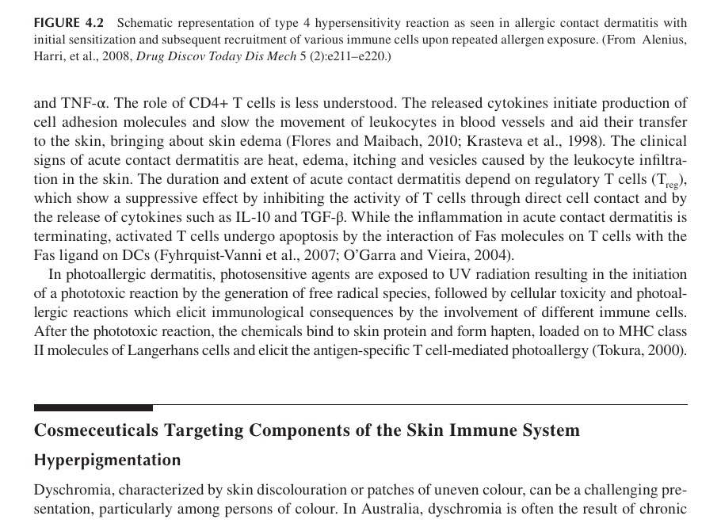

---

## 4.5 Cosmeceutical nhắm vào các thành phần của hệ miễn dịch da

Các hoạt chất cosmeceutical có thể điều chỉnh sắc tố, đáp ứng viêm và tổn thương do tia UV; hai ứng dụng tiêu biểu là tăng sắc tố và bảo vệ quang.

---

### 4.5.1 Tăng sắc tố

Dyschromia (đổi màu hoặc mảng màu không đều) khó xử lý, nhất là ở người da màu. Ở Australia, phơi nắng mạn gây poikiloderma Civatte, teo da và giãn mạch. Hydroquinone hoặc corticosteroid hiệu quả nhưng dùng dài ngày gây lo ngại an toàn.

Nhiều cosmeceutical tự nhiên ức chế tổng hợp melanin, giảm chuyển melanin vào keratinocyte hoặc loại melanin biểu bì. Bằng chứng in vivo mạnh nhất là đậu nành và niacinamide. Đậu nành ức chế PAR-2, ngăn tiếp xúc keratinocyte–melanocyte và giảm thực bào melanosome, đồng thời giảm sắc tố do UV. Niacinamide (dạng amide hoạt tính của niacin) ức chế chuyển melanosome và melanogenesis; hiệu quả được xác nhận trong thử nghiệm lâm sàng.

---

### 4.5.2 Bảo vệ quang

UV mạn gây phân hủy sợi đàn hồi và lắng đọng collagen bất thường. ROS dư thừa làm cạn enzyme chống oxy hóa (superoxide dismutase, catalase, glutathione peroxidase), tạo matrix metalloproteinase, ức chế gene collagen và dẫn đến thoái hóa chất nền—kiểu hình lão hóa do ánh sáng. Việc đưa đủ nồng độ chất chống oxy hóa vào da vẫn là thách thức.

Polyphenol trà xanh (GTP) làm giảm lão hóa sớm do UVB, ức chế ức chế miễn dịch tại chỗ/toàn thân, ban đỏ, stress oxy hóa và thâm nhiễm bạch cầu. Bôi GTP có hiệu quả lâm sàng dù SPF chỉ khoảng 1, nên cơ chế không chỉ là chống nắng. Vitamin C và E phối hợp tăng bảo vệ khỏi UVB (vitamin E đóng góp nhiều hơn); vitamin C bảo vệ UVA tốt hơn E. Thêm C hoặc C+E vào công thức có oxybenzone tạo đáp ứng hiệp đồng chống quang độc UVA. Dầu hoắc hương cũng ức chế nhăn và giảm đàn hồi do lão hóa quang trong mô hình in vivo.

---

## 4.6 Kết luận

Khoa học mỹ phẩm được thúc đẩy bởi khám phá sinh học, hợp chất mới, đổi mới formulation và tiến bộ công nghệ. Dữ liệu thị trường, phản hồi trực tuyến và diễn đàn giúp ngành hiểu yêu cầu người dùng; trước khi ra mắt cần thử nghiệm nghiêm ngặt để đạt khả năng dung nạp cao, nguy cơ kích ứng và mẫn cảm thấp.

Hiểu rõ miễn dịch da là điều thiết yếu khi thiết kế công thức. Miễn dịch bẩm sinh và thích ứng tạo hàng rào cấu trúc, hóa học và miễn dịch chống tác nhân ngoại lai, với các vai trò khác nhau của bạch cầu ở biểu bì và trung bì. Hệ vi sinh da góp phần duy trì cân bằng da–miễn dịch và có thể trở thành “áp kế vi sinh” theo dõi eczema, vảy nến, rosacea, mụn và lão hóa.

Mọi mỹ phẩm bôi da đều có thể gây viêm da kích ứng hoặc dị ứng; nhà formulation cần lưu ý dị nguyên mới nổi trong thuốc nhuộm, chất bảo quản và hương liệu (năm 2017, alkyl glucoside được bình chọn là Dị nguyên của năm). Miễn dịch da cũng mở ra đích đổi mới cho tăng sắc tố và bảo vệ quang; các nghiên cứu tương lai sẽ tiếp tục nhắm đến ban đỏ, dyschromia và lão hóa do ánh sáng.

---

# 5. Móng người: Cấu trúc, tính chất, điều trị và chăm sóc

Kenneth A. Walters và Majella E. Lane

## Nội dung

- Giới thiệu
- Cấu trúc và sinh lý móng
- Đặc trưng lý sinh của bản móng
  - Quang phổ Raman cận hồng ngoại
  - Quang phổ phản xạ khuếch tán cận hồng ngoại (NIR-DR)
  - Quang phổ hấp phụ hơi động và cận hồng ngoại (DVS-NIR)
  - Quang phổ hồng ngoại biến đổi Fourier với phản xạ toàn phần suy giảm (ATR FTIR)
  - Quang phổ Raman đồng tiêu (CRS)
  - Quang phổ hấp thụ nguyên tử (AAS)
  - Khối phổ plasma cảm ứng (ICP-MS)
  - Đo bức xạ phát xạ quá độ quang-nhiệt (OTTER)
  - Chụp cắt lớp quang học kết hợp (OCT)
  - Kính hiển vi quét laser đồng tiêu (CLSM)
  - Mất nước qua móng (TOWL)
- Khai thác đặc tính tính thấm của bản móng
  - Các phương pháp hiện tại và bằng chứng lâm sàng
  - Các phương pháp thực nghiệm
  - Tăng cường hóa học: phá vỡ hàng rào
  - Tăng cường hóa học: ảnh hưởng của chất dẫn
- Công thức mỹ phẩm cho móng
  - Sơn móng
  - Chế phẩm nhựa acrylate
  - Gel đóng rắn bằng ánh sáng
  - Nước tẩy sơn móng
- Triển vọng và tóm tắt
- Tài liệu tham khảo

---

## 5.1 Giới thiệu

Chương này trình bày hình thái và chức năng của móng người. Bản móng là đặc điểm nổi bật nhất của móng và từ lâu đã được các nhà khoa học mỹ phẩm quan tâm, chủ yếu vì mục đích trang trí. Một chương đi kèm sẽ trình bày nghệ thuật và khoa học về mỹ phẩm dành cho móng, còn chương này tập trung vào các tính chất và bệnh lý của móng. Bản móng là một mô được sừng hóa cao; các tính chất sinh lý và hình thái chịu trách nhiệm cho độ bền cơ học và tính chất hàng rào của nó sẽ được thảo luận.

Chương đặc biệt nhấn mạnh các phương pháp lý sinh và phân tích sinh học đã góp phần nâng cao hiểu biết của chúng ta về thành phần và chức năng của móng. Các phương pháp đã được khảo sát để làm công cụ chẩn đoán móng cũng sẽ được xem xét. Cuối cùng, do các bệnh về móng thường khó chữa và đòi hỏi thời gian điều trị kéo dài (Rich và Scher, 2005), những bệnh lý thường gặp cùng các phương thức điều trị tại chỗ sẽ được mô tả.

---

## 5.2 Cấu trúc và sinh lý móng

Bản móng người được cấu tạo từ các lớp tế bào sừng hóa dẹt, hợp nhất thành một khối đặc nhưng hơi đàn hồi. Bản móng được bao quanh ở ba phía bởi các rãnh quanh móng, thường được gọi là nếp móng; đây là phần kéo dài của biểu bì và được cấu tạo từ mô sừng hóa. Một phần kéo dài khác của biểu bì là mầm móng, một mô sinh mầm nằm ở đầu gần, bên dưới và phía sau bản móng của mỗi ngón. Mầm móng gồm phần lưng (phần đỉnh) và phần bụng; cả hai đều thể hiện kiểu kết hợp keratin biểu mô và keratin tóc. Phần bụng của mầm móng được xác định là vùng tiền sinh keratin (Perrin và cs., 2004), là nguồn chính tạo bản móng, trong khi mầm móng phần đỉnh được cho là tạo ra phần lưng mỏng của bản móng. Các tế bào đã cứng hóa của bản móng phát triển theo hướng ra xa từ mầm móng với tốc độ khoảng 2–3 mm mỗi tháng. Phần bụng của mầm móng chỉ hiện một phần dưới dạng một gờ lồi hơi đục bên dưới bản móng phía gần, được gọi là liềm móng. Các đặc điểm quan sát đại thể của móng người được thể hiện ở Hình 5.1. Trong quá trình sừng hóa, các tế bào trải qua những biến đổi về hình dạng và các biến đổi khác tương tự tế bào biểu bì tạo nên lớp sừng. Vì vậy, tế bào bản móng không chứa bào quan hoặc nhân, mà gồm các sợi keratin nằm trong một ma trận protein.

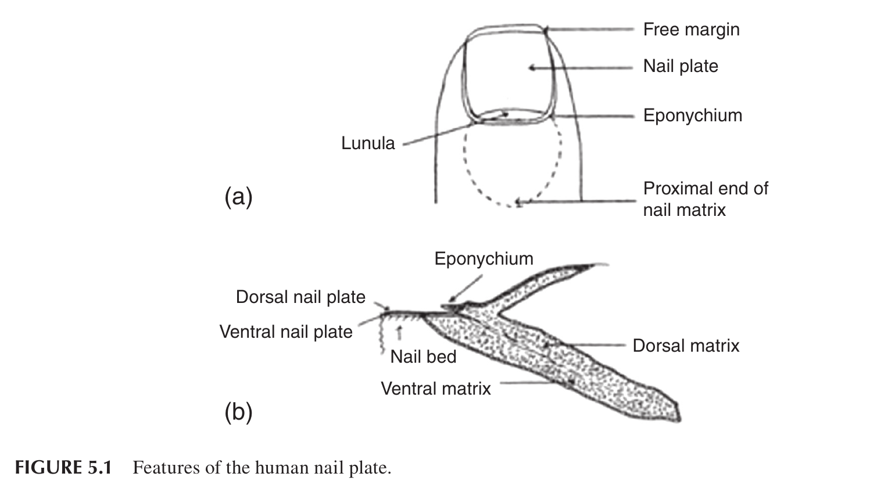

Bản móng có ba lớp sừng hóa liên kết rất chặt: một phiến lưng ngoài cùng cứng và mỏng, một phiến giữa mềm hơn nhưng dày hơn, và một lớp bụng trong cùng (Runne và Orfanos, 1981). Nhìn chung, có vẻ như sự biểu hiện của các loại keratin khác nhau ở những vùng khác nhau của mầm móng và giường móng có thể chịu trách nhiệm cho các đặc điểm vật lý biến đổi giữa các lớp bản móng (Bragulla và Homberger, 2009; Nogueiras-Nieto và cs., 2011). Chẳng hạn, eponychium (nếp móng phía gần), hyponychium (vùng dưới móng) và giường móng chỉ biểu hiện các keratin biểu bì (Perrin, 2004).

Biểu mô giường móng là một cấu trúc biểu mô chuyên biệt, có lớp đáy thực sự và hai hoặc ba lớp biểu mô nhưng không có lớp hạt. Giường móng có hoạt tính tăng sinh đáng kể. Sự đan cài giữa bờ dưới của bản móng và bề mặt giường móng giải thích sự gắn kết chắc giữa hai mô này (Perrin, 2007). Vùng chuyển tiếp giữa giường móng và vùng dưới móng thể hiện kiểu sừng hóa khác với chính vùng dưới móng. Tại đây, lớp sừng hóa của giường móng bám chắc vào bề mặt dưới gồ ghề của bản móng, tạo ra một lớp bịt kín hiệu quả và ngăn ngừa tình trạng tách móng.

Perrin (2008) tiếp tục nghiên cứu vùng xa của đơn vị móng và xác định vùng chuyển tiếp từ giường móng sang vùng dưới móng, trên lâm sàng được gọi là dải onychodermal. Perrin gọi vùng chuyển tiếp giữa giường móng và vùng dưới móng là eo móng. Về hình thái, eo móng có hai đặc điểm: “biểu mô của giường móng xa có hình dạng như bậc thang, với chỗ lõm rõ rệt của biểu mô bên dưới bề mặt dưới của bản móng” và “một phương thức gắn kết chuyên biệt của lớp sừng với bản móng thông qua kiểu biệt hóa theo chiều ngang” (Perrin, 2008). Ông nhận thấy bề mặt bụng của bản móng hơi có khía khi quan sát theo mặt phẳng dọc, và về chức năng eo móng thuộc về giường móng. Sự bám dính chắc giữa bản móng và giường móng ở vùng này được thay thế bằng một lớp bịt kín giữa phần kéo dài cận sừng hóa của eo móng và bản móng. Giường móng và bản móng cùng phát triển về phía trước. Bản móng được tạo ra trong các bầu biểu mô ở phần bụng của mầm móng; các bầu này được định hướng để bảo đảm bản móng mới phát triển theo hướng xiên, còn giường móng di chuyển chậm và song song với hướng phát triển của móng. Không giống biểu bì sống tạo ra lớp sừng, mầm móng không có lớp hạt (de Berker và cs., 2007), và điều này ảnh hưởng sâu sắc đến lượng lipid gian bào trong bản móng như sẽ bàn luận ở phần sau.

Eponychium và hyponychium (các nếp quanh bản móng) bịt kín bản móng ở các bờ gần và bên. Những cấu trúc này không chứa các đơn vị nang–tuyến bã, nhưng về các mặt khác có hình thái tương tự những vùng da khác.

Là một cấu trúc biểu mô sừng hóa, thành phần hóa học của bản móng có nhiều điểm tương đồng với tóc (Baden và cs., 1973). Mặc dù phần lớn protein trong tóc và móng được xếp vào nhóm keratin “cứng” của tế bào sợi tóc, cả keratin cứng và keratin mềm đều được phát hiện trong mầm móng, và cả hai dạng protein này đều hiện diện trong bản móng. Keratin 1 và 10 (keratin mềm) được tìm thấy trong mầm móng cùng với keratin cứng Ha-1 (de Berker và cs., 2000); một số keratin cứng khác cũng được chứng minh là có mặt trong mầm móng, giường móng và bản móng (Perrin và cs., 2004; Perrin, 2007). Các protein liên kết với sợi trung gian và trichohyalin cũng hiện diện trong móng (Cashman và Sloan, 2010). Hàm lượng lưu huỳnh trong móng khoảng 10%, chủ yếu nằm trong các liên kết disulfide của cystine; các liên kết này góp phần tạo độ bền kéo của móng bằng cách nối các sợi keratin.

Móng chứa một lượng đáng kể phospholipid, chủ yếu ở các lớp lưng và giữa, góp phần tạo độ linh hoạt. Acid glycolic và acid stearic cũng được tìm thấy trong móng. Tổng hàm lượng lipid của bản móng nằm trong khoảng 0,1–1%, khác biệt đáng kể so với lớp sừng (khoảng 10%). Chất hóa dẻo chính của móng là nước; hàm lượng nước thay đổi đáng kể tùy theo độ ẩm tương đối môi trường (Farran và cs., 2008), nhưng thường ở mức khoảng 18%. Khi hàm lượng nước dưới 16%, bản móng trở nên giòn; khi được hydrat hóa đến mức khoảng 25%, móng trở nên mềm. Khoáng chất cũng là những thành phần quan trọng của móng. Sự thiếu hụt selenium và magnesium có thể ảnh hưởng sâu sắc đến sức khỏe của bản móng (Bauer và Stevens, 1983; Kien và Ganther, 1983).

---

## 5.3 Đặc trưng lý sinh của bản móng

Nhiều kỹ thuật lý sinh và kỹ thuật sinh học vốn được phát triển để nghiên cứu da về sau đã được khảo sát về khả năng ứng dụng trong thăm dò móng và các thành phần của móng. Ở cấp độ phân tử, các đặc điểm thường được khảo sát gồm thành phần, cấu trúc và kiểu đóng gói keratin, hàm lượng nước và ảnh hưởng của quá trình hydrat hóa. Một số kỹ thuật cũng được dùng để khảo sát thành phần nguyên tố của móng, với các ứng dụng được đề xuất trong việc sử dụng mô này để chẩn đoán những tình trạng bệnh lý tiềm ẩn khác.

---

### 5.3.1 Quang phổ Raman cận hồng ngoại

Quang phổ Raman biến đổi Fourier cận hồng ngoại (NIR-FT Raman) khai thác hiện tượng trong đó một phần nhỏ ánh sáng đơn sắc bị một chất làm tán xạ có tần số khác với chùm tới một lượng bằng tần số dao động của liên kết hóa học. Độ dịch tần của ánh sáng tán xạ có thể được phân tích và biểu diễn dưới dạng phổ. Các dải phổ đại diện cho những dao động đặc trưng của liên kết hóa học trong các phân tử của mẫu được khảo sát. Quang phổ NIR-FT Raman đặc biệt phù hợp để phân tích vật liệu sinh học vì có thể sử dụng cho các mẫu phức tạp, không tinh khiết và chỉ cần một lượng mô rất nhỏ.

Các dao động Raman quan trọng, nhạy với cấu dạng protein, là dao động của liên kết peptide; trong số đó, hai dao động được gọi là amide I và amide III thể hiện rõ ở móng cũng như ở da, tóc và lớp sừng (Hình 5.2) (Gniadecka và cs., 1997).

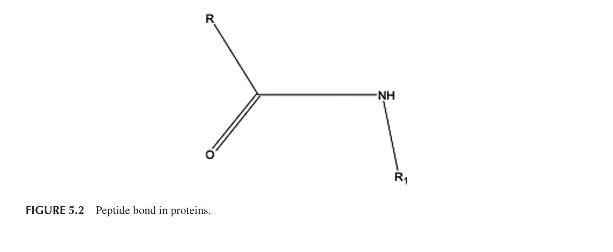

Gniadecka và cs. (1998) sử dụng quang phổ Raman biến đổi Fourier cận hồng ngoại để khảo sát các mẫu da, tóc và móng thu thập từ 10 người. Khoảng phổ từ 0 đến 3500 cm−1. Việc kết hợp tần số tại cực đại cường độ của amide I và amide III cho thấy phần lớn protein trong móng ở cấu dạng xoắn α, tương tự da toàn phần, tóc và lớp sừng. Một dải kéo giãn C–C mạnh ở khoảng 935 cm−1, đặc trưng cho cấu dạng xoắn α, cũng hiện diện trong các phổ này. Dải S–S của mô móng thể hiện rõ ở khoảng 510 cm−1, cho thấy các liên kết này chủ yếu ở cấu dạng gauche–gauche–gauche; tuy nhiên, một vai phổ tại 520 cm−1 cho thấy một số liên kết S–S ở cấu dạng gauche–gauche–trans. Số sóng trung bình của dải bất đối xứng CH3 ở móng so với da toàn phần cho thấy protein trong móng có mức độ gấp cuộn cao và chỉ tương tác rất ít với môi trường xung quanh. Dải ở 1447 cm−1, đại diện cho dao động biến dạng kiểu cắt kéo, cũng hiện diện trong phổ móng.

Các đỉnh lipid nổi bật quan sát được ở móng nằm tại 1130 cm−1 và 1030 cm−1, cho thấy cấu trúc lipid trong móng có mức độ trật tự cao. Tỷ số Slat của dao động nhóm CH trong vùng 2850–2890 cm−1 bằng 1, cho thấy phần lớn lipid ở trạng thái tinh thể; các tác giả cho rằng đây là dạng tinh thể lỏng kiểu phiến. Kết quả này cũng gợi ý mức độ tương tác liên phân tử thấp giữa lipid và protein trong móng. Ước tính tốt nhất về tổng lượng nước liên kết hydro được tính từ I2940/I3250 và được báo cáo ở mức hơi dưới 20%. Hàm lượng nước liên kết hydro trong móng tương đương với lớp sừng. Dải nước ở 180 cm−1 không xuất hiện, cho thấy phần lớn phân tử nước trong móng liên kết với các thành phần khác và không tạo cấu trúc tứ diện.

Trong một nghiên cứu sau đó của cùng nhóm (Wessel và cs., 1999), quang phổ NIR-FT Raman được dùng để khảo sát ảnh hưởng của hydrat hóa lên móng người. Phổ Raman được thu cả *in vitro* từ mẫu móng và *in vivo*, trước và sau khi ngâm nước. Không quan sát thấy khác biệt lớn giữa phổ đo ở phần xa của móng *in vivo* và *in vitro*. Mức hấp thu nước của móng tay *in vitro* thấp hơn (27%) so với móng chân *in vitro* (45%). Trong các nghiên cứu *in vivo*, phần bản móng còn bám dính có phổ Raman hơi khác so với phần xa không bám dính. Không bất ngờ khi hàm lượng nước tương đối của bản móng còn bám dính (bao gồm cả mô bên dưới) cao hơn nhiều so với phần tự do. Nhìn chung, kết quả cho thấy móng có khả năng giữ nước hạn chế và nước được hấp phụ làm thay đổi hình học của protein.

---

### 5.3.2 Quang phổ phản xạ khuếch tán cận hồng ngoại (NIR-DR)

Các nghiên cứu sơ bộ về phản xạ khuếch tán cận hồng ngoại (NIR-DR) trên móng lần đầu được Sowa và cộng sự báo cáo năm 1995. Egawa và cộng sự (2003) khảo sát tiềm năng của kỹ thuật này trong xác định hàm lượng nước của bản móng người. Khả năng giữ nước của các bản móng đã cắt được xác định bằng cách ngâm mẫu trong nước cất đến 60 phút và đo phổ NIR. Phổ NIR-DR được đo *in vivo* tại bờ tự do của móng tay, trước và ngay sau khi rửa, ở ba phụ nữ 26–32 tuổi (trung bình 29,7 tuổi). Hàm lượng nước của các bản móng đã cắt thay đổi từ 1,4% khối lượng đến 33,9% khối lượng trong khoảng độ ẩm tương đối 1–99%. Hàm lượng nước tăng rõ rệt khi độ ẩm tương đối của môi trường vượt quá 80%. Độ dày móng dường như ảnh hưởng rất ít đến lượng nước trong móng. Các tác giả quan sát thấy một đặc điểm phổ rộng trong vùng 1500–1530 nm và cho rằng đặc điểm này có thể bắt nguồn từ nước liên kết hydro và keratin. Khi hàm lượng nước cao hơn, cường độ của dải ở 1420 nm, liên quan đến nước tự do, tăng lên. Ở độ ẩm tương đối rất cao, một đỉnh mới tại 1488 nm được phát hiện và có thể phản ánh sự thay đổi trạng thái của các liên kết hydro trong bản móng đã cắt dưới những điều kiện này. Bản móng đã cắt có hàm lượng nước khoảng 7–9% khối lượng trước khi ngâm đạt tới 24–33% khối lượng ngay sau khi kết thúc thời gian ngâm. Hàm lượng nước *in vivo* dao động từ khoảng 15% đến 21%. Đối với hàm lượng nước *in vitro*, phương pháp NIR cho tương quan tốt với phân tích Karl Fischer và phép đo cộng hưởng từ hạt nhân.

Cũng nhóm tác giả này (Egawa và cs., 2005) đã khảo sát biến thiên hàm lượng nước của móng theo mùa. Phổ được thu *in vivo* vào cả mùa hè và mùa đông trong điều kiện nhiệt độ và độ ẩm được kiểm soát (23,8–25,0°C; RH 40–41%). Hàm lượng nước của bản móng khác nhau giữa các đối tượng nhưng không khác nhau giữa các móng của cùng một người. Hàm lượng nước trung bình vào mùa đông thấp hơn đáng kể (*p* < 0,05) so với mùa hè. Không quan sát thấy khác biệt phổ đáng kể giữa móng tay và móng chân.

---

### 5.3.3 Quang phổ hấp phụ hơi động và cận hồng ngoại (DVS-NIR)

Hấp phụ hơi động là một phương pháp trọng lượng dùng để nghiên cứu đặc tính hấp phụ của vật liệu trong điều kiện nhiệt độ và độ ẩm được kiểm soát. Gần đây, chúng tôi đánh giá đặc tính hấp phụ của móng người bằng một thiết bị DVS chuyên dụng có gắn thêm đầu dò NIR (Walters và cs., 2012). Mẫu móng cắt từ sáu tình nguyện viên được đặt ở nhiệt độ cố định 32°C và một dải độ ẩm tương đối từ 40% đến 90%, với bước tăng 10%. Sự tăng độ ẩm tương đối (40–90%) đi kèm với biến thiên tuyến tính của khối lượng. Phổ NIR cũng cho thấy độ hấp thụ của các dải (phổ đạo hàm bậc hai) tại 1422 nm và 1908 nm tăng lên. Tương quan tốt (Hình 5.3) được ghi nhận giữa biến thiên khối lượng theo phép đo trọng lượng và độ hấp thụ của các dải tại 1422 nm và 1908 nm.

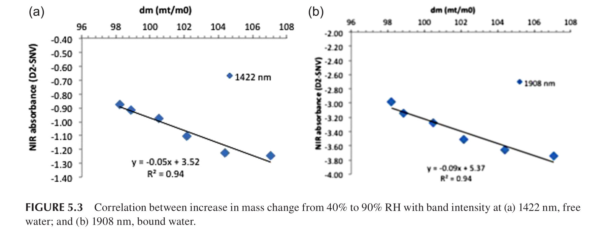

---

### 5.3.4 Quang phổ hồng ngoại biến đổi Fourier phản xạ toàn phần suy giảm (ATR FTIR)

Sowa và cs. (1995) khảo sát móng *in vivo* bằng ATR FTIR. Sự hiện diện của lipid trên bề mặt móng được xác nhận qua đỉnh carbonyl ester của lipid ở 1745 cm−1 và các dao động kéo giãn methylene của lipid ở 2924 và 2853 cm−1, vốn đặc trưng cho chuỗi acyl lipid không có trật tự. Các dải hấp thụ đặc trưng của protein cũng được xác định tại 1650, 1540 và 1250 cm−1. Trong một ứng dụng gần đây hơn, ATR FTIR được dùng để nghiên cứu cấu trúc bậc hai của protein ở 41 người hiến khỏe mạnh và 65 bệnh nhân mắc hội chứng mệt mỏi mạn tính (CFS) (Sakudo và cs., 2009). Phổ trong vùng 4000–6000 cm−1 được thu với độ phân giải 4 cm−1. Hàm lượng xoắn α, phiến β, đoạn ngoặt β và cuộn ngẫu nhiên của móng được ước tính từ vùng amide I của phổ ATR FTIR sau khi hiệu chỉnh chiết suất vật liệu, giải chập Fourier và khớp đường cong. Cấu trúc bậc hai của protein trong móng tay khỏe mạnh gồm 11,74% xoắn α, 37,58% phiến β, 25,01% đoạn ngoặt β và 25,67% cuộn ngẫu nhiên. Mẫu móng của bệnh nhân CFS chứa ít xoắn α hơn và hàm lượng phiến β cao hơn; điều này được quy cho sự suy giảm các thành phần bình thường của bản móng, tuy nhiên không có bằng chứng được cung cấp cho nhận định này.

---

### 5.3.5 Quang phổ Raman đồng tiêu (CRS)

CRS *in vivo* kết hợp quang phổ Raman với hiển vi quét laser đồng tiêu (CLSM) để xác định chính xác độ sâu trong da nơi tín hiệu Raman được thu nhận (Caspers và cs., 1998, 2001). Tuy nhiên, ứng dụng của kỹ thuật này trên móng chưa được khảo sát. Gần đây, chúng tôi báo cáo nghiên cứu đầu tiên về việc ứng dụng kỹ thuật này để đo độ hydrat hóa của móng (Walters và cs., 2012). Nghiên cứu được thực hiện trên người khỏe mạnh, không có tiền sử bệnh móng hoặc sử dụng mỹ phẩm trên móng. Móng tay được ngâm nước trong 0; 2,5; 5; 10 và 15 phút trước khi đo. Móng tay cũng được hydrat hóa bằng nước trong 2 giờ và phép đo được thực hiện tại thời điểm 0, 10, 30 và 60 phút. Phép đo *in vivo* được tiến hành bằng kính hiển vi CRS hoạt động ở hai bước sóng: 671 nm (vùng số sóng cao) và 785 nm (vùng dấu vân tay). Hàm lượng nước của móng được đo bằng laser 671 nm. Hàm lượng nước nền tại độ sâu 0 µm trong móng khoảng 8% khối lượng/khối lượng (Hình 5.4). Giá trị này tăng theo độ sâu đến khoảng 21% khối lượng/khối lượng ở độ sâu 30 µm trong móng, sau đó đạt pha bình nguyên. Hydrat hóa móng trong 2,5 phút làm hàm lượng nước trong móng tăng lên khoảng 15% khối lượng/khối lượng tại 0 µm và khoảng 24% khối lượng/khối lượng tại 30 µm. Thời gian hydrat hóa càng dài thì hàm lượng nước trong móng càng cao, cho đến 15 phút; sau đó không tăng thêm ngay cả khi hydrat hóa trong 2 giờ. Hàm lượng nước trong móng trở về mức nền sau 30 phút kể từ khi hoàn tất quá trình hydrat hóa 2 giờ. Các giá trị này tương đối phù hợp với kết quả đo bằng quang phổ vNIR-FT Raman (Gniadecka và cs., 1998) và NIR-DR (Egawa và cs., 2003) đã trình bày ở trên.

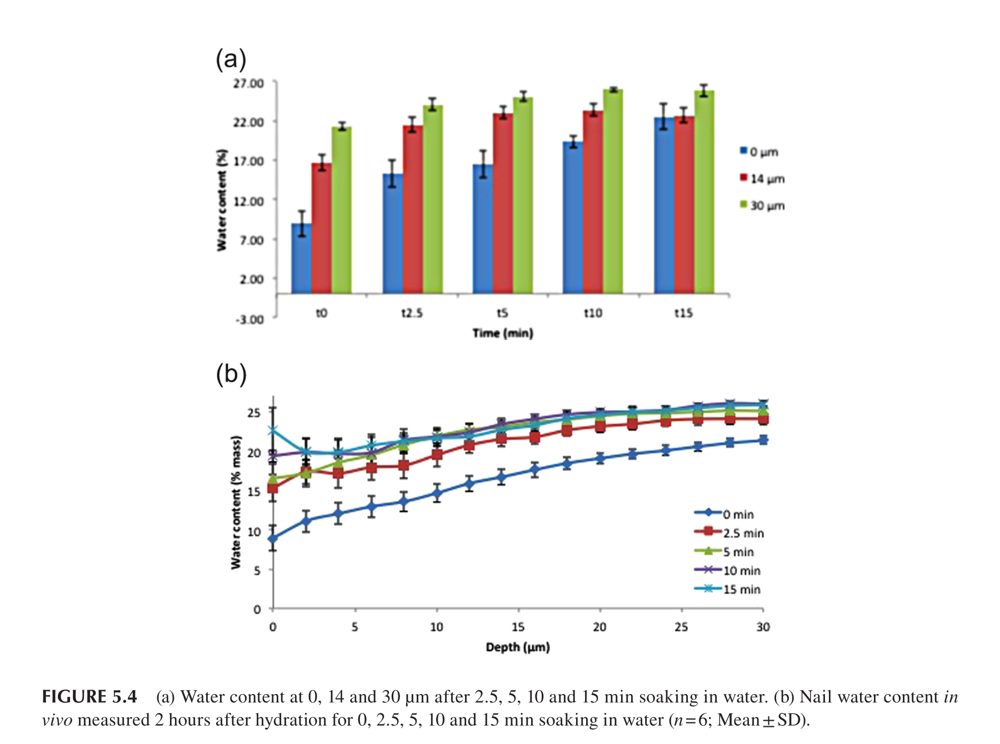

---

### 5.3.6 Phổ hấp thụ nguyên tử (AAS)

Do có giả thuyết về mối tương quan giữa nồng độ nguyên tố vi lượng toàn thân và nồng độ trong móng, nhiều báo cáo về ứng dụng AAS trên móng đã xuất hiện trong tài liệu. Harrison và Tyree (1971) là những người đầu tiên báo cáo việc ứng dụng hấp thụ nguyên tử ngọn lửa để xác định năm nguyên tố (Ca, Zn, Mg, Cu và Fe) trong mẫu móng tay cắt từ bảy nữ và mười nam. Barnett và Kahn (1972) cũng báo cáo một phương pháp xác định hàm lượng đồng trong mẫu móng tay cắt của trẻ sơ sinh. Tuy nhiên, bất chấp sự lạc quan ban đầu và nhiều công bố về ứng dụng này, lấy mẫu móng chưa trở thành phương pháp không xâm lấn thường quy để đánh giá tình trạng khoáng chất của cá nhân, có thể do mức nguyên tố vi lượng khác biệt rất lớn giữa các đối tượng.

---

### 5.3.7 Khối phổ plasma cảm ứng cao tần (ICP-MS)

ICP-MS sử dụng một chất khí chứa nồng độ ion và electron đủ cao để làm cho pha hơi dẫn điện. Plasma dùng trong ICP-MS được tạo ra bằng cách ion hóa một phần khí argon bằng dòng điện. Sau khi mẫu được đưa vào plasma, nhiệt độ cực cao làm mẫu phân tách thành các nguyên tử riêng lẻ. Để ghép nối với khối phổ, các ion từ plasma được chiết qua một chuỗi côn vào khối phổ kế. Goullé và cs. (2009) đã báo cáo việc sử dụng kỹ thuật này để phân tích đa nguyên tố trên mẫu móng tay và móng chân cắt từ những tình nguyện viên khỏe mạnh. Các nguyên tố Li, Be, B, Al, V, Cr, Mn, Co, Ni, Cu, Zn, Ga, Ge, As, Se, Rb, Sr, Mo, Pd, Ag, Cd, Sn, Sb, Te, Ba, La, Gd, W, Pt, Hg, Tl, Pb, Bi và U được phát hiện bằng các phép đo đã thẩm định. Các tác giả đề xuất ứng dụng ICP-MS như một kỹ thuật không xâm lấn để phát hiện phơi nhiễm kim loại trong công nghiệp, gia đình hoặc môi trường. Button và cs. (2009) sử dụng kỹ thuật này để đánh giá sự hấp thu arsenic trong mẫu móng chân cắt và đề xuất cách tiếp cận này như một chỉ dấu sinh học của phơi nhiễm với môi trường có nồng độ arsenic cao.

---

### 5.3.8 Đo bức xạ phát xạ quá độ quang nhiệt (OTTER)

OTTER sử dụng kích thích laser xung để tạo ra các bước nhảy nhiệt độ cỡ vài độ Celsius trong vài micromet trên cùng của vật liệu được khảo sát. Các bước nhảy nhiệt độ này suy giảm trong vòng vài microsecond và không làm tăng đáng kể nhiệt độ trung bình của nền hoặc tốc độ khuếch tán đang được nghiên cứu. Chúng được quan sát bằng đầu dò hồng ngoại tốc độ cao, nhạy với bức xạ nhiệt phát ra từ bề mặt (Bindra và cs., 1992). Đối với mô sinh học, bức xạ này mạnh nhất trong dải bước sóng hồng ngoại trung 6–13 µm. Phép đo ghi nhận động học suy giảm của thành phần quá độ trong bức xạ nhiệt và liên hệ thành phần này với các tính chất vật lý của những lớp gần bề mặt thông qua các mô hình toán học phù hợp. Trong các mô hình này, độ phân giải theo chiều sâu liên quan đến tham số thời gian của tín hiệu quá độ, còn tính đặc hiệu hóa học liên quan đến phổ hấp thụ của các phân tử cần khảo sát (Imhof và cs., 1994). OTTER đã được dùng để đo hàm lượng nước của móng, profile nồng độ nước theo chiều sâu trong móng và sự thấm qua móng của dung môi bôi tại chỗ (Hình 5.5) (Xiao và cs., 2010, 2011). Kết hợp kết quả hàm lượng nước với flux nước xuyên móng (TOWL) cũng cho phép tính hệ số khuếch tán nước của móng (xem phần “Mất nước xuyên móng (TOWL)”).

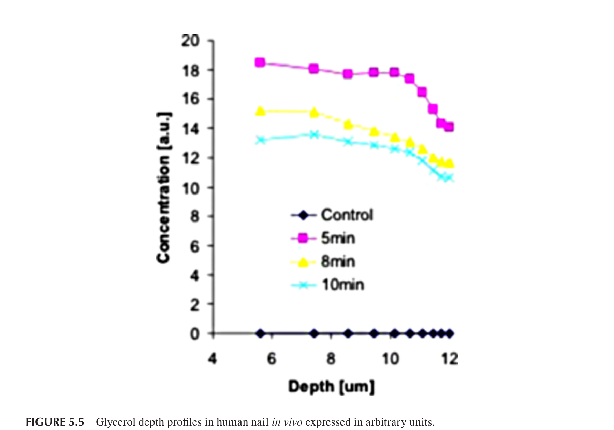

---

### 5.3.9 Chụp cắt lớp kết hợp quang học (OCT)

OCT là công nghệ tạo ảnh quang học không xâm lấn, cung cấp hình ảnh cắt ngang dạng chụp cắt lớp của mô *in situ* và theo thời gian thực (Fujimoto, 2003). Trong kỹ thuật này, độ phản xạ của ánh sáng hồng ngoại từ mô cần khảo sát được đo và cường độ được tạo ảnh theo vị trí. Có thể thu được hình ảnh mô *in situ* với độ phân giải trục cao. Hình ảnh đại diện của móng và mô phía gần được trình bày trong Hình 5.6. Mogensen và cs. (2007) khảo sát hình thái và độ dày móng ở người tình nguyện khỏe mạnh bằng ảnh OCT, rồi so sánh kết quả với ảnh siêu âm tần số cao (HFUS), phép đo bằng thước cặp và OCT nhạy phân cực (PS-OCT). Trong OCT tiêu chuẩn, bản móng hiện ra như một cấu trúc phân lớp chứa số lượng thay đổi các dải đồng nhất nằm ngang, có cường độ và độ dày khác nhau. Ảnh PS-OCT của bản móng cũng cho thấy cấu trúc phân lớp. Có thể đo độ dày móng bằng OCT và OCT phân biệt được những thay đổi tinh tế mà HFUS không phát hiện được.

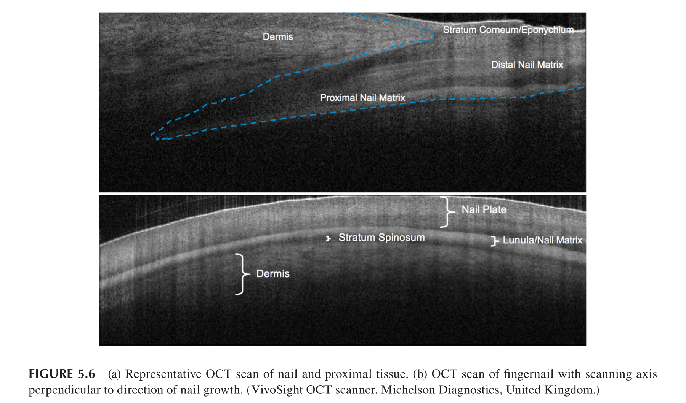

Gần đây hơn, Sattler và cộng sự (2011) so sánh OCT, CLSM và TOWL như các công cụ nghiên cứu móng. Móng khỏe mạnh được khảo sát bằng OCT và CLSM. Trong một nghiên cứu riêng, các tình nguyện viên khỏe mạnh rửa ngón giữa trong 30 phút ở 38°C trong 2 tuần. Các phép đo OCT, TOWL và CLSM được thực hiện trước và sau giai đoạn rửa. Độ sâu thâm nhập khoảng 2 mm với độ phân giải 10 µm. OCT xác nhận độ dày móng ở ngón giữa của tay thuận cao hơn đáng kể (giá trị trung bình 465,8 µm). Tương tự nghiên cứu OCT trước đó, cấu trúc dạng dải của bản móng khỏe mạnh được xác nhận. Thử nghiệm rửa không làm độ dày móng đo bằng OCT tăng đáng kể.

---

### 5.3.10 Hiển vi quét laser đồng tiêu (CLSM)

CLSM sử dụng laser và một cặp khẩu độ lỗ kim để tạo ảnh và phân lớp quang học mô ở độ phân giải cao. Một trong những ứng dụng đầu tiên của kỹ thuật này trong nghiên cứu móng được Hongcharu và cs. (2000) mô tả. Cả phân tích *in vivo* và *in vitro* đều được thực hiện trên móng của một bệnh nhân bị nấm móng. Các mẫu móng cắt toàn bộ chiều dày được thu thập và tạo ảnh. Các lát cắt ảo được thu *in vivo* bằng cách lấy nét kính hiển vi đồng tiêu vào bên trong bản móng. Ảnh đồng tiêu *in vivo* ngay bên dưới bề mặt bản móng cho thấy một mạng lưới sợi nấm phân nhánh. Các tác giả giả thuyết rằng CLSM có thể là phương pháp chẩn đoán nấm móng nhanh và chính xác hơn so với nuôi cấy nấm, kính hiển vi thông thường hoặc thủy phân hóa học.

Sattler và cộng sự (2011) sử dụng CLSM cùng các phương pháp khác để đánh giá móng khỏe mạnh. Ưu điểm chính của CLSM so với OCT là khả năng khảo sát cấu trúc vi mô của móng, vì có thể quan sát được ranh giới tế bào sừng và đánh giá tính toàn vẹn của chúng. Các tác giả đạt được độ sâu 400–500 µm. Khả năng chẩn đoán móng trắng và nhiễm nấm cũng được chứng minh qua các hình ảnh riêng lẻ của móng bệnh.

---

### 5.3.11 Mất nước xuyên móng (TOWL)

TOWL là phép đo flux nước qua móng và thường được sử dụng cùng các kỹ thuật lý sinh khác để đặc trưng hóa chức năng hàng rào hoặc tính thấm của móng. Jemec và cộng sự (1989) đo TOWL ở những tình nguyện viên khỏe mạnh bằng thiết bị đo bay hơi nhằm xác lập tính hữu ích của kỹ thuật này và nghiên cứu các thông số khác nhau như giới tính, tuổi và độ dày bản móng. Trung vị TOWL cao hơn mất nước qua biểu bì và giảm khi tuổi của đối tượng tăng. Không phát hiện mối tương quan đáng kể với độ dày bản móng đo bằng siêu âm. Krönauer và cs. (2001) khảo sát giá trị TOWL ở người khỏe mạnh và bệnh nhân bị chàm thể tạng, vảy nến và nấm móng. Giá trị TOWL ở người khỏe mạnh cao hơn đáng kể (*p* < 0,05) so với bệnh nhân chàm thể tạng và nấm móng; chỉ bệnh nhân vảy nến móng có TOWL thấp hơn đáng kể so với người khỏe mạnh.

---

## 5.4 Khai thác đặc tính thấm của bản móng

Hiểu biết ngày càng tăng về đặc tính thấm của bản móng đã củng cố niềm tin rằng các bệnh ở móng có thể được điều trị tại chỗ. Những hệ đưa thuốc qua móng mới và hiệu quả được trình bày trong phần này. Để tìm hiểu các mô hình thực tế dùng trong đánh giá những kỹ thuật thử nghiệm như vậy, độc giả có thể tham khảo bài tổng quan toàn diện của Nair và cs. (2012) cùng các công bố gần đây trong lĩnh vực này (Palliyil và cs., 2014; Baraldi và cs., 2015).

---

### 5.4.1 Các cách tiếp cận hiện nay và bằng chứng lâm sàng

Trong nhiều năm, các bác sĩ da liễu cho rằng điều trị tại chỗ là vô ích đối với mọi tình trạng ngoài những nhiễm trùng nông nhất của bản móng (Zaias và Serrano, 1989). Bản móng thường được xem là một hàng rào không thể thấm qua; cách duy nhất để điều trị bệnh ở đơn vị móng là đưa thuốc theo nguồn cấp máu đến mầm móng hoặc loại bỏ móng bệnh trước khi bôi liệu pháp tại chỗ. Cách thứ nhất đòi hỏi dùng đường uống kéo dài các thuốc kháng nấm mạnh và những thuốc khác (xem ví dụ Roberton và Hosking, 1983); cách thứ hai chỉ được cân nhắc khi chỉ có một vài móng bị bệnh hoặc khi chống chỉ định điều trị đường uống (Hettinger và Valinsky, 1991). Kho phương tiện điều trị của bác sĩ da liễu đã được bổ sung các loại sơn móng điều trị và những công thức khác, bao gồm các công thức chứa efinaconazole, tioconazole, tavaborole, amorolfine, ciclopirox, clobetasol 17-propionate, calcipotriol và tazarotene. Tuy nhiên, ai cũng biết rằng phép thử thực sự của bất kỳ phác đồ điều trị tiềm năng nào là khả năng chữa khỏi bệnh và ngăn bệnh tái phát.

Nakano và cs. (2006) thực hiện một nghiên cứu thăm dò để đánh giá tính an toàn và hiệu quả của liệu pháp terbinafine đường uống theo đợt ở 66 bệnh nhân nấm móng. Mỗi đợt gồm terbinafine đường uống (500 mg/ngày) trong 1 tuần, sau đó nghỉ 3 tuần. Kem terbinafine 1% được bôi hằng ngày. Hiệu quả được đánh giá 1 năm sau khi bắt đầu điều trị. Có 51 bệnh nhân khỏi hoàn toàn (khoảng 77%). Các tác giả kết luận rằng liệu pháp terbinafine theo đợt kết hợp với bôi kem terbinafine tại chỗ an toàn và hiệu quả, nhưng không thể xác định việc bôi tại chỗ có cải thiện kết quả hay không. Một nghiên cứu trước đó (Alpsov và cs., 1996) sử dụng phác đồ đường uống tương tự nhưng không bổ sung liệu pháp tại chỗ đã báo cáo tỷ lệ khỏi bệnh 74%, cho thấy bôi tại chỗ chỉ mang lại rất ít lợi ích bổ sung. Tuy nhiên, cần nhận thức rằng chất dẫn có vai trò rất quan trọng đối với việc đưa thuốc thành công vào bản móng, và có thể loại kem trong nghiên cứu của Nakano chưa được tối ưu hóa về mặt này. Hơn nữa, bản chất rất ưa lipid của terbinafine cho thấy thuốc khó thấm đáng kể vào móng. Có lẽ việc sử dụng một chất dẫn cải tiến hơn sẽ cho thấy rõ hơn hiệu quả của liệu pháp kép. Chẳng hạn, Ghannoum và cs. (2011) đã tích hợp terbinafine vào transfersome, được họ mô tả là “chất dẫn gồm các tập hợp lipid phức hợp có tính đáp ứng, biến dạng rất cao và có bề mặt rất ưa nước”, đồng thời chứng minh rằng ở nồng độ hoạt chất 1,5% khối lượng/thể tích, các chất dẫn này mạnh hơn đáng kể so với thuốc xịt terbinafine 1% *in vitro*; giá trị MIC50 đối với *Trichophyton rubrum* và *Trichophyton mentagrophytes* lần lượt thấp hơn 30 lần và 60 lần.

Tính hữu ích của việc bổ sung điều trị tại chỗ cho liệu pháp đường uống cũng được Rigopoulos và cs. (2003) khảo sát khi đánh giá sự kết hợp thuốc kháng nấm toàn thân và tại chỗ nhằm tăng tỷ lệ khỏi bệnh và rút ngắn thời gian điều trị toàn thân cho bệnh nấm móng. Liệu pháp itraconazole theo đợt được kết hợp với sơn móng amorolfine và so sánh với itraconazole đơn độc trong điều trị nhiễm *Candida* ở móng. Mặc dù phân tích thống kê không cho thấy khác biệt có ý nghĩa thống kê về hiệu quả điều trị (*P* > 0,1) giữa hai nhóm, sự kết hợp amorolfine tại chỗ và itraconazole đường uống cho thấy tác dụng hiệp đồng đáng kể.

Trong một nghiên cứu đa trung tâm, ngẫu nhiên, nhãn mở, nhóm song song, Baran và cs. (2007) đánh giá sơn móng amorolfine HCl 5% bôi mỗi tuần một lần trong 12 tháng kết hợp terbinafine 250 mg mỗi ngày một lần trong 3 tháng (nhóm AT), so với terbinafine đơn độc mỗi ngày một lần trong 3 tháng (nhóm T). Sau 18 tháng, tỷ lệ thành công ở nhóm AT cao hơn đáng kể so với nhóm T. Những kết quả này chứng minh sơn móng amorolfine kết hợp terbinafine đường uống hiệu quả hơn trong điều trị nấm móng chân có tổn thương mầm móng. Mặt khác, một nghiên cứu dùng quy trình tương tự Baran và cs. (2007) cho rằng liệu pháp terbinafine theo đợt có hiệu quả và an toàn trong điều trị nấm móng, còn việc bổ sung ciclopirox olamine (8%) hoặc amorolfine HCl (5%) tại chỗ không tạo ra khác biệt đáng kể về hiệu quả so với đơn trị liệu bằng terbinafine đường uống (Jaiswal và cs., 2007).

Đơn trị liệu tại chỗ cũng cho thấy một số thành công. Baran và Coquard (2005) điều trị bệnh nhân nấm móng bằng dung dịch fluconazole 1% và urea 20% trong hỗn hợp ethanol–nước, bôi mỗi ngày một lần. Bệnh khỏi hoàn toàn ở bốn trường hợp và bốn bệnh nhân khác cải thiện 90%. Gupta và cs. (2000) tổng quan hiệu quả và tính an toàn của sơn móng ciclopirox 8% trong điều trị nấm móng, và nhận thấy dữ liệu cho thấy sơn móng ciclopirox hiệu quả hơn đáng kể so với giả dược. Loại sơn này có phổ hoạt tính rộng, thể hiện hiệu quả đối với các loài *Candida* và một số loài nấm không thuộc nhóm dermatophyte. Hiệu quả của ciclopirox tại chỗ tiếp tục được xác nhận trong các nghiên cứu sau đó (Sardana và cs., 2006).

Như đã nêu, không phải mọi bệnh móng đều là nhiễm nấm hoặc nhiễm khuẩn. Vảy nến có thể ảnh hưởng đến toàn bộ bản móng và là một biểu hiện thường gặp ở bệnh nhân vảy nến. Hiệu quả và tính an toàn của công thức sơn móng chứa clobetasol 17-propionate 8% đã được đánh giá (Sanchez Regana và cs., 2005). Bệnh nhân bị vảy nến cả giường móng và mầm móng được bôi sơn móng mỗi ngày một lần trong 21 ngày, sau đó bôi hai lần mỗi tuần trong 9 tháng. Tất cả biến đổi ở móng, bao gồm đau móng, đều giảm trong vòng 4 tuần kể từ khi bắt đầu điều trị, và đáp ứng liên quan trực tiếp đến thời gian điều trị. Gel tazarotene cũng được đánh giá trong điều trị vảy nến móng (Scher và cs., 2001). Điều trị bằng tazarotene làm giảm tình trạng tách móng (mối liên kết giữa bản móng và giường móng bị lỏng) nhiều hơn đáng kể ở cả móng được băng kín và không băng kín, đồng thời làm giảm rỗ móng nhiều hơn đáng kể ở móng được băng kín. Vảy nến móng cũng được cải thiện sau khi bôi tại chỗ thuốc mỡ calcipotriol và betamethasone dipropionate mỗi ngày một lần trong 12 tuần (Rigopoulos và cs., 2009).

Hội chứng móng giòn là một vấn đề thường gặp, chỉ các móng có bề mặt thô ráp, bờ nham nhở và bong tách. Sherber và cs. (2011) đánh giá tính hữu ích của kem tazarotene (0,1%) trong điều trị móng giòn. Bệnh nhân bôi kem tazarotene lên móng hai lần mỗi ngày trong 24 tuần. Nghiên cứu cho thấy tazarotene làm giảm triệu chứng của hội chứng móng giòn với mức kích ứng rất ít hoặc không có. Tuy nhiên, khó lý giải vì sao tazarotene, một retinoid, lại có hiệu quả trong hội chứng móng giòn; có thể một thành phần khác trong công thức kem mới chịu trách nhiệm cho các tác dụng có lợi. Dù vậy, nghiên cứu không báo cáo dữ liệu giả dược.

---

### 5.4.2 Các cách tiếp cận thực nghiệm

Các cách tiếp cận thực nghiệm chính nhằm tăng cường khả năng thấm tập trung vào các hợp chất phá vỡ hàng rào móng hoặc các chất dẫn như sơn móng có thời gian lưu trên móng được cải thiện (Bảng 5.1).

**Bảng 5.1. Các tác nhân hóa học làm phá vỡ hoặc gây tổn thương hàng rào móng**

| Phân loại hóa học/sinh hóa | Hợp chất | Cơ chế tác dụng |
|---|---|---|
| Acid beta hydroxy | Acid salicylic, natri salicylate | Tiêu sừng |
| Carbamide | Urea | Làm biến tính protein |
| Imine | Guanidine hydrochloride | Làm biến tính protein |
| Mercaptan, thiol | *N*-acetyl cysteine; dithiothreitol; mercaptoethanol; 8-mercaptomenthone; *N*-[2-mercaptopropionyl] glycine; acid meso-2,3-dimercaptosuccinic; natri pyrithione, kẽm pyrithione; acid thioglycolic | Khử các liên kết disulfide trong ma trận keratin của móng |
| Enzyme | Papain | Protease |
| Sulfite, bisulfite | Natri metabisulfite, natri sulfite | Khử các liên kết disulfide trong ma trận keratin của móng |

---

### 5.4.3 Tăng cường bằng hóa chất: phá vỡ hàng rào

Palliyil và cs. (2013) đã trình bày một chiến lược tiền công thức để lựa chọn chất tăng cường thấm qua móng. Quy trình sàng lọc của họ bao gồm đánh giá khả năng của các chất tăng thấm tiềm năng trong việc cải thiện độ tan và sự thâm nhập *in vitro* của ciclopirox olamine vào bản móng. Sự thâm nhập và thấm qua da *in vitro* cũng được đánh giá. Trong số các chất tăng cường được khảo sát, thiourea là chất tăng cường thấm qua móng được ưu tiên.

Trong các nghiên cứu trước đó, Quintanar-Guerrero và cs. (1998) khảo sát ảnh hưởng của ba chất tiêu sừng (papain, urea, acid salicylic) lên tính thấm của ba thuốc kháng nấm nhóm imidazole (miconazole nitrate, ketoconazole, itraconazole) qua các mẫu móng người khỏe mạnh được gắn trong tế bào khuếch tán hai ngăn đối diện. Chỉ tác động kết hợp của papain (15% trong 1 ngày) và acid salicylic (20% trong 10 ngày) mới có khả năng làm tăng tính thấm của các thuốc kháng nấm.

Kobayashi và cs. (1998) đánh giá tác dụng tăng cường của urea và natri salicylate đối với việc đưa một thuốc mô hình ưa nước (5-fluorouracil) qua móng, sử dụng mẫu móng người trong các tế bào khuếch tán hai ngăn đối diện đã cải biến. Hỗn dịch nước chứa urea hoặc natri salicylate làm giảm flux thuốc so với hỗn dịch không chứa chất tiêu sừng. Các chất khử disulfide là acetyl cysteine và mercaptoethanol cũng được đánh giá về ảnh hưởng lên sự thấm của 5-FU và tolnaftate. Hỗn dịch thuốc được phối chế với acetyl cysteine hoặc mercaptoethanol trong chất dẫn ethanol:nước hoặc ethanol:isopropyl myristate. Chất dẫn ethanol:nước làm flux 5-FU tăng đến 16 lần so với hỗn dịch nước, còn chất dẫn ethanol:isopropyl myristate làm sự thấm của 5-FU tăng đến 8 lần. Sự thấm của tolnaftate cũng tăng trong các chất dẫn này nhưng ở mức thấp hơn nhiều.

Sử dụng mẫu móng người trong hệ tế bào Franz, Malhotra và Zatz (2002b) sàng lọc một loạt phân tử đã biết có khả năng tương tác với keratin. Các hợp chất được nghiên cứu gồm mercaptan (*N*-[2-mercaptopropionyl] glycine, kẽm pyrithione và natri pyrithione, 8-mercaptomenthone, acid meso-2,3-dimercaptosuccinic), natri metabisulfite và các chất tiêu sừng (acid salicylic, urea, guanidine hydrochloride). Gel được bào chế với các chất tăng cường dùng riêng lẻ hoặc phối hợp với nhau trong chất dẫn nước, hydroalcohol hoặc chất dẫn chứa dimethyl sulfoxide (DMSO). Kết quả cho thấy cấu trúc hóa học của chất biến đổi là yếu tố quan trọng nhất quyết định khả năng tăng cường thâm nhập. Hiệu quả tăng cường tốt nhất đạt được khi dùng *N*-(2-mercaptopropionyl) glycine kết hợp urea. Các hợp chất mercaptan chứa nhóm sulfhydryl (SH), vì vậy cơ chế chính làm tăng thâm nhập vào móng là khử các liên kết disulfide trong ma trận keratin của móng. Nhìn chung, tính toàn vẹn của hàng rào móng bị tổn hại không hồi phục sau khi xử lý bằng các chất biến đổi hóa học có hiệu quả.

Hui và cs. (2004) bào chế một công thức gel ethanol mới chứa ciclopirox, urea và propylene glycol, sau đó đánh giá sự thấm của thuốc qua mẫu móng cùng lượng thuốc khu trú trong mẫu móng khi kết thúc thí nghiệm. Một gel thương mại và một công thức sơn móng (không chứa chất tiêu sừng) cũng được khảo sát. Lượng ciclopirox được đưa vào và qua móng từ gel thương mại cao hơn đáng kể so với cả gel thử nghiệm và sơn móng.

---

### 5.4.4 Tăng cường bằng hóa chất: ảnh hưởng của chất dẫn

Mặc dù ethanol là chất tăng cường thâm nhập được sử dụng rộng rãi trong các hệ đưa thuốc tại chỗ và qua da, việc đưa 5-fluorouracil trong các chất dẫn menthol:ethanol:nước hoặc acid lactic:ethanol:isopropyl myristate không làm tăng sự thấm của thuốc so với đối chứng là nước (Kobayashi và cs., 1998).

Hui và cs. (2003) đánh giá khả năng thúc đẩy đưa econazole qua móng của 2-*n*-nonyl-1,3-dioxolane, một chất tăng cường thâm nhập qua da. Công thức sơn móng thử nghiệm dùng tại chỗ chứa 5% (khối lượng/khối lượng) econazole, Eudragit® RL/PO, ethanol và 2-*n*-nonyl-1,3-dioxolane (18% khối lượng/khối lượng). Công thức đối chứng thương mại có thành phần tương tự, ngoại trừ không chứa 2-*n*-nonyl-1,3-dioxolane. Sự thấm qua móng được đánh giá trên các mẫu móng người trong hệ tế bào khuếch tán cải biến. Việc bổ sung 2-*n*-nonyl-1,3-dioxolane vào sơn móng econazole làm lượng thuốc kháng nấm được đưa qua móng người cao gấp sáu lần so với công thức sơn móng–thuốc giống hệt nhưng không chứa chất tăng cường. Nồng độ econazole trong lớp sâu của móng và giường móng ở nhóm thử nghiệm cao hơn đáng kể so với nhóm đối chứng. Các tác giả cho rằng dioxolane có tác dụng hóa dẻo đối với công thức sơn móng và điều này có thể góp phần tạo nên hiệu quả của công thức.

Monti và cs. (2005) khảo sát sự thấm qua móng của ciclopirox từ một công thức tan trong nước trên nền hydroxypropyl chitosan, so với một loại sơn móng thương mại không tan trong nước (Penlac®). Các công thức được đánh giá bằng mẫu móng guốc bò gắn trong tế bào khuếch tán thẳng đứng. Giá trị flux ở trạng thái ổn định của hai chất dẫn có cùng bậc độ lớn. Tỷ lệ thuốc thấm qua cao hơn đáng kể đối với công thức trên nền polymer tan trong nước. Tỷ lệ thuốc được giữ lại trong màng khi kết thúc thí nghiệm cũng tương đương giữa hai chất dẫn. Các tác giả cho rằng công thức trên nền chitosan có thể bám dính vào màng tốt hơn sơn móng thương mại. Gần đây hơn, Monti và cs. (2010) so sánh sự thấm của ciclopirox qua màng móng guốc bò với sự thấm của amorolfine trong cùng loại sơn móng trên nền hydroxypropyl chitosan nêu trên và với một sản phẩm đối chiếu không tan trong nước (Loceryl®). Flux amorolfine từ công thức tan trong nước cao hơn đáng kể so với Loceryl. Ciclopirox có khả năng thấm qua màng móng guốc dễ hơn amorolfine; sự khác biệt này không thể giải thích bằng hàm lượng hoạt chất khác nhau trong các công thức tương ứng.

Hui và cs. (2007a) khảo sát nhiều loại sơn móng khác nhau và một chất dẫn đồng dung môi để đưa một thuốc kháng nấm oxaborole mới vào móng. Sơn móng được phối chế với một tác nhân tạo màng, dung môi và có thể thêm chất tăng cường thâm nhập. Ethanol là dung môi; poly(vinyl methyl ether-*alt*-maleic acid monobutyl ester), poly(2-hydroxyethyl methacrylate) và poly(vinyl acetate) là các chất tạo màng. Chất dẫn đồng dung môi gồm ethanol và propylene glycol. Lượng hợp chất thử nghiệm thâm nhập vào bản móng gần như tương đương nhau bất kể chất dẫn được sử dụng. Trong điều kiện *in vitro*, chất dẫn đồng dung môi cho khả năng thấm vào và qua bản móng người bình thường vượt trội so với công thức ciclopirox thương mại (Penlac®, ciclopirox 8%).

Cũng nhóm nghiên cứu này (Hui và cs., 2007b) đã so sánh sự thâm nhập qua móng của panthenol trong một công thức tạo màng không phải sơn móng (ethanol, copolymer acrylate, phytantriol) với công thức dung dịch nước. Công thức xử lý móng cho hiệu quả tăng cường đưa panthenol vào/qua các lớp sâu hơn của bản móng người tốt hơn dung dịch panthenol trong nước.

---

## 5.5 Các công thức mỹ phẩm dành cho móng

Hiện có nhiều sản phẩm mỹ phẩm dùng để duy trì sức khỏe của móng, tạo màu và loại bỏ màu trên móng. Các sản phẩm này bao gồm nhiều chế phẩm sơn móng khác nhau (enamel, lacquer, varnish), hỗn hợp trên nền nhựa acrylate, gel đóng rắn bằng ánh sáng, sản phẩm dạng xịt và các dung môi đơn giản.

---

### 5.5.1 Sơn móng

Nhìn chung, các công thức sơn móng bao gồm sơn móng cổ điển để tạo màu cho móng, lớp sơn nền, lớp sơn phủ, chất làm cứng móng, sơn dành cho móng giòn, sơn dành cho móng có đường gờ và sơn móng ít gây dị ứng. Trong các công thức móng chứa chất màu (vô cơ và hữu cơ), thành phần chính còn lại trên móng sau khi khô là nitrocellulose, đóng vai trò polymer tạo màng (Wimmer và Schlossmann, 1992). Cần có các chất điều chỉnh màng (ví dụ nhựa toluene sulfonamide/formaldehyde) để cải thiện độ bám dính và độ bóng của công thức. Công thức còn chứa các thành phần khác, bao gồm chất hóa dẻo (ví dụ dầu thầu dầu, glyceryl tribenzoate), dung môi (ví dụ ethyl acetate, butyl acetate), chất pha loãng (ví dụ ethanol, isopropanol, butanol, toluene) và tác nhân thixotropic (ví dụ stearalkonium hectorite).

Do lớp sơn nền có chức năng làm tăng độ bám dính của lớp sơn lên móng, nó chứa nhiều nhựa hơn các công thức có chất màu. Lớp sơn nền cũng hoạt động như một hàng rào bảo vệ, giúp bản móng không bị nhuộm màu, vì vậy không chứa chất màu. Lớp sơn phủ chứa nhiều nitrocellulose và chất hóa dẻo hơn lớp sơn móng có chất màu bên dưới để bảo đảm độ bền cho lớp này. Ngoài ra, lớp sơn phủ có thể chứa các chất hấp thụ tia UV, chẳng hạn benzophenone 1 và 3, nhằm giúp bảo vệ các lớp sơn màu bên dưới. Lớp sơn nền và lớp sơn phủ được phối chế với tỷ lệ chất pha loãng và dung môi khác với chế phẩm chứa màu để thuận tiện cho việc sơn và làm khô. Cuối cùng, chất làm cứng móng, sơn dành cho móng giòn và sơn dành cho móng có đường gờ về cơ bản là các lớp sơn nền có thể chứa thêm sợi nylon, nhựa acrylic hoặc formaldehyde (Schoon, 2005).

---

### 5.5.2 Các chế phẩm nhựa acrylate

Các công thức này được dùng để “tạo hình” móng nhân tạo và gồm một loại nhựa acrylic thu được bằng cách phối trộn monomer methyl methacrylate, ethyl methacrylate hoặc isobutyl methacrylate với polymer poly(methyl methacrylate) hoặc poly(ethyl methacrylate). Monomer chứa một chất ổn định như hydroquinone và chất xúc tiến *N,N*-dimethyl-*p*-toluidine; polymer cũng chứa benzoyl peroxide làm chất khơi mào trùng hợp. Công thức còn có thể chứa các thành phần khác như chất hóa dẻo, dung môi, chất xúc tiến và chất màu (Kanerva và cs., 1996).

---

### 5.5.3 Gel đóng rắn bằng ánh sáng

Các chế phẩm này được cung cấp dưới dạng hỗn hợp monomer và polymer acrylic đã pha sẵn. Có hai loại gel đóng rắn bằng ánh sáng chính dùng để tạo màu cho móng: acrylic và cyanoacrylate. Đối với gel acrylic đóng rắn bằng ánh sáng, quá trình làm cứng đạt được nhờ chiếu sáng để gây trùng hợp. Các gel này có thể chứa urethane (meth)acrylate hóa, triethylene glycol dimethacrylate, nhựa epoxy methacrylate hóa hoặc methacrylate có nhóm chức hydroxyl cùng một chất khơi mào quang (Hemmer và cs., 1996). Với gel cyanoacrylate, quá trình trùng hợp được thực hiện bằng cách phun hoặc quét một chất hoạt hóa lên gel.

---

### 5.5.4 Nước tẩy sơn móng

Khi được thoa lên móng, nước tẩy sơn móng sẽ hòa tan nitrocellulose còn sót lại và đồng thời loại bỏ lipid. Các sản phẩm này thường chứa một lượng lớn dung môi hữu cơ và một lượng nhỏ dầu. Các dung môi thường dùng là acetone, butyl acetate, ethyl acetate hoặc ethoxyethanol; các loại dầu điển hình gồm dầu thầu dầu hoặc dầu lanolin. Công thức cũng có thể chứa chất màu, hương liệu, chất bảo quản, vitamin và chất hấp thụ tia UV (de Groot và cs., 1994).

---

## 5.6 Triển vọng và tổng kết

Cho đến nay, các nhà khoa học và bác sĩ lâm sàng đã sử dụng nhiều kỹ thuật lý sinh và kỹ thuật sinh học khác nhau để nghiên cứu móng và hiểu rõ hơn về cách các đặc tính của móng có thể bị ảnh hưởng. Tiềm năng của nhiều cách tiếp cận này trong điều trị bệnh móng vẫn chưa được khai thác đầy đủ. Thành công còn khiêm tốn của các liệu pháp lâm sàng hiện nay cần trở thành động lực thúc đẩy đổi mới trong lĩnh vực này. Các công thức thông thường chủ yếu dựa trên sơn móng, cho thấy rằng, tương tự như đối với da, thời gian lưu của cả hoạt chất và tá dược trong hoặc trên móng có ý nghĩa quyết định đối với hiệu quả. Cần thận trọng khi xem xét những cách tiếp cận thực nghiệm rõ ràng gây tổn thương móng, và các phương pháp này có khả năng sẽ gặp phải những rào cản pháp lý đáng kể.

---

# 6. Hình thái học, quá trình sinh tóc, tính không đồng nhất, sinh lý bệnh và sự thấm vào nang tóc

Alexa Patzelt và Jürgen Lademann

## Nội dung

- Giới thiệu
- Hình thái học của tóc và nang tóc
- Chu kỳ tóc
- Tính không đồng nhất chủng tộc trong hình thái học của tóc và nang tóc
- Sinh lý bệnh của nang tóc
  - Rụng tóc có hồi phục
    - Telogen effluvium và ngừng sớm pha anagen
    - Các rối loạn liên quan androgen
    - Rụng tóc do cơ chế tự miễn
    - Rụng tóc do viêm
  - Rụng tóc không hồi phục
  - Nang tóc và các khối u da
- Sự thấm vào nang tóc
  - Phương pháp khảo sát sự thấm vào nang tóc
  - Cơ chế thấm vào nang tóc
  - Nanocarrier làm chất vận chuyển để đưa hoạt chất vào da
- Tài liệu tham khảo

---

## 6.1 Giới thiệu

Mặc dù thoạt nhìn không dễ nhận thấy, tóc và nang tóc đảm nhiệm nhiều chức năng ở người. Trước hết, tóc là một cơ quan cảm giác. Hệ thần kinh tự chủ có thể khiến lông dựng lên; cơ dựng lông kiểm soát hiện tượng này và tạo ra tình trạng được gọi là “nổi da gà”, chủ yếu do lạnh, lo âu hoặc cảm xúc khởi phát (Benedek và Kaernbach, 2011). Động vật sử dụng hiệu ứng này để trông to lớn hơn và đe dọa kẻ thù; ở người, chức năng này dường như chỉ đóng vai trò thứ yếu và đôi khi gây khó chịu (Benedek và Kaernbach, 2011). Ngoài ra, tóc còn thực hiện một số chức năng bảo vệ. Chẳng hạn, lông mi và lông mày có thể ngăn mồ hôi và các dị vật chạm tới mắt. Tóc da đầu bảo vệ hiệu quả trước ánh nắng (Parisi và cs., 2009), thể hiện qua tỷ lệ ung thư da đầu cao ở nam giới bị hói. Ngày nay, tóc da đầu là một phương tiện rất quan trọng trong giao tiếp tâm lý–xã hội. Rụng tóc da đầu thường gây ra gánh nặng tâm lý nghiêm trọng (Katoulis và cs., 2015).

Là một phần của đơn vị nang–tuyến bã, nang tóc là cơ quan quan trọng tham gia bài tiết bã nhờn (Matsui và cs., 2016). Bã nhờn được giải phóng từ tuyến bã, đi vào nang tóc rồi tới bề mặt da, tại đó được phân bố đồng đều và góp phần đáng kể vào hiệu quả của hàng rào da.

Vì nang tóc tạo ra một chỗ gián đoạn trong hàng rào da, nang tóc cũng đóng vai trò quan trọng như một con đường thấm cho sự hấp thu qua da và như một kho dự trữ dài hạn đối với các chất dạng hạt bôi tại chỗ (Lademann và cs., 2006).

Ngoài ra, một số rối loạn da có liên quan đến nang tóc; do đó, nang tóc có thể là đích của nhiều chiến lược điều trị.

Tổng hợp các chức năng này cho thấy rõ tóc và nang tóc là những cấu trúc quan trọng của da. Chương này sẽ thảo luận các khía cạnh khác nhau của tóc và nang tóc.

---

## 6.2 Hình thái học của tóc và nang tóc

Nang tóc là phần phụ của da và hiện diện với mật độ cao ở hầu hết động vật có vú. Ở người có khoảng 5 triệu nang tóc (Krause và Foitzik, 2006), với mật độ và kích thước khác nhau tùy từng vùng da (Otberg và cs., 2004). Ngoài da đầu, vùng trán có mật độ nang tóc rất cao; tại đây, các nang tóc tương đối nhỏ. Vùng bắp chân có mật độ nang tóc thấp hơn, nhưng kích thước nang tóc lớn hơn đáng kể (Otberg và cs., 2004).

Đơn vị nang–tuyến bã, là cấu trúc bậc trên gồm nang tóc, thân tóc, cơ dựng lông và tuyến bã, là một cấu trúc ba chiều rất phức tạp, trong đó hơn 20 quần thể tế bào khác nhau tương tác với nhau (Meidan và cs., 2005; Rogers, 2004). Nang tóc được minh họa sơ đồ ở Hình 6.1.

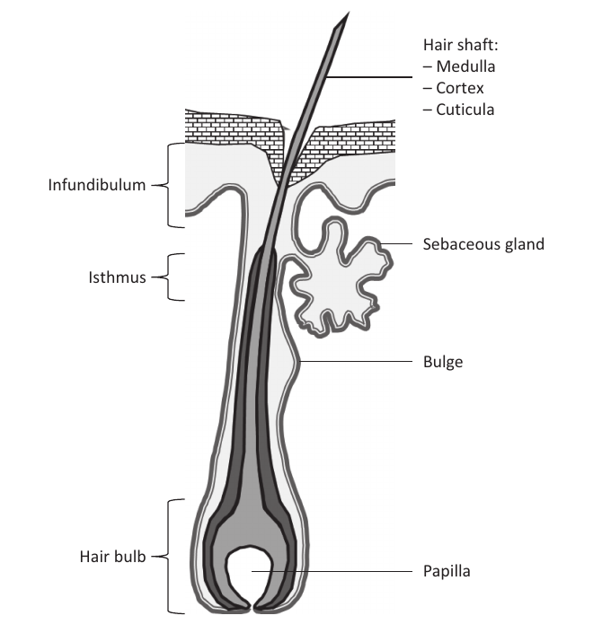

*Hình 6.1. Sơ đồ nang tóc.*

Thân tóc gồm nhiều lớp khác nhau. Lớp trong cùng là tủy tóc, được bao quanh bởi vỏ tóc - thành phần chịu trách nhiệm về độ đàn hồi của tóc. Lớp ngoài là lớp biểu bì tóc (cuticle), gồm các tế bào sừng hóa phẳng xếp chồng lên nhau, tạo cho tóc cấu trúc đặc trưng giống mái ngói (Buffoli và cs., 2014). Ở người chủ yếu có hai loại tóc: tóc terminal (tóc tận cùng) lớn và lông tơ nhỏ. Tóc terminal dài và dày (>50 µm), mọc từ nang tóc ăn sâu vào mô mỡ dưới da (>3000 µm). Lông tơ không có sắc tố, ngắn hơn 2 cm và mảnh hơn 30 µm. Các nang tương ứng chỉ kéo dài vào trung bì (<1000 µm) (Meidan và cs., 2005; Vogt và cs., 2007).

Nang tóc gồm một phần thường trực và một phần nhất thời. Phần nhất thời tham gia vào chu kỳ tóc, trong khi phần thường trực ít nhiều không bị ảnh hưởng.

Phần thường trực của nang tóc gồm phễu nang, eo nang và vùng phình. Phễu nang được định nghĩa là phần nang tóc nằm giữa bề mặt da và tuyến bã; ít nhất ở phần trên, phễu nang có biểu bì sừng hóa nguyên vẹn. Ở phễu nang phía dưới, kiểu biệt hóa chuyển từ kiểu biểu bì sang kiểu trichilemmal, với chức năng hàng rào giảm ở vùng bao rễ ngoài (Blume-Peytavi và Vogt, 2011). Ở phần dưới của nang tóc, chức năng hàng rào chủ yếu do các mối nối chặt đảm nhiệm. Không phát hiện được hàng rào ở vùng hành tóc (Mathes và cs., 2016). Eo nang là vùng nằm giữa tuyến bã và vùng phình. Vùng phình là nơi cư trú của tế bào gốc (Vogt và Blume-Peytavi, 2003) và các tiền thân dưỡng bào của da (Kumamoto và cs., 2003).

Phần nhất thời của nang tóc là vùng nằm giữa vùng phình và hành tóc. Hành tóc nằm quanh nhú tóc, chứa các tế bào ma trận tóc và tế bào sinh mầm. Nhú tóc chịu trách nhiệm nuôi dưỡng nang tóc vì đây là phần duy nhất của nang được cung cấp mạch máu (Krause và Foitzik, 2004). Hành tóc ở pha anagen biểu hiện giảm các phân tử MHC-I và có số lượng tế bào T, tế bào Langerhans thấp hơn (Christoph và cs., 2000); vì vậy, đây được xác định là vùng có đặc quyền miễn dịch tương đối và phụ thuộc chu kỳ (Paus và cs., 2005). Ngược lại, có lẽ vì nang tóc tạo ra chỗ gián đoạn trong hàng rào da, một số lượng lớn tế bào trình diện kháng nguyên tập trung ở vùng quanh phễu nang.

---

## 6.3 Chu kỳ tóc

Nhiều con đường truyền tín hiệu, yếu tố tăng trưởng và cytokine tham gia điều hòa chu kỳ mọc tóc, gồm ba giai đoạn khác nhau (Vogt và Blume-Peytavi, 2003). Trong pha anagen, các keratinocyte của ma trận tăng sinh ở vùng hành tóc rồi di chuyển để tạo thành thân tóc (Cotsarelis, 2006). Sang pha catagen tiếp theo, phần dưới của nang tóc thoái triển; nang tóc bước vào pha telogen, khi tóc bị rụng (Meidan và cs., 2005). Sau đó, một pha anagen khác bắt đầu với sự phân chia của các tế bào ma trận tóc và sự tái phát triển phần dưới của nang tóc.

Thời lượng của từng giai đoạn mang tính đặc hiệu theo pha và khác nhau đáng kể giữa các cá thể. Pha anagen kéo dài 2–6 năm, trong khi pha catagen rất ngắn, chỉ khoảng 2 tuần. Pha telogen kéo dài 2–4 tháng. Tùy thời lượng pha anagen ở mỗi người, độ dài tối đa của tóc có thể rất khác nhau.

---

## 6.4 Tính không đồng nhất sắc tộc trong hình thái học của tóc và nang tóc

Rõ ràng hình thái học của tóc khác nhau giữa các nhóm sắc tộc. Ở người châu Á, sợi tóc tương đối rộng và tròn, còn tóc của người da trắng có dạng elip hơn. Sợi tóc của người Mỹ gốc Phi còn elip hơn nữa, với mặt cắt ngang gần như phẳng trong cấu trúc xoăn và rất dễ gãy, rối (McMichael, 2003).

Mật độ tóc da đầu cũng khác nhau, cao nhất ở người da trắng và thấp nhất ở người châu Á. Người ta cũng phát hiện những khác biệt sắc tộc về mật độ và hình thái nang tóc ở các vùng cơ thể khác. So với người da trắng, mật độ nang tóc ở vùng trán thấp hơn đáng kể ở người châu Á và người Mỹ gốc Phi. Ở các nhóm sắc tộc này, thể tích nang, diện tích nang, kích thước lỗ nang và đường kính thân tóc tại vùng đùi và bắp chân cũng nhỏ hơn. Nhìn chung, kho dự trữ nang tóc được chứng minh là lớn hơn ở người da trắng (Mangelsdorf và cs., 2006).

---

## 6.5 Sinh lý bệnh của nang tóc

Trong số nhiều bệnh da, có một số bệnh liên quan đến nang tóc và đi kèm rụng tóc. Rụng tóc có thể hồi phục hoặc đi kèm sự phá hủy không hồi phục các quần thể tế bào có khả năng tái tạo, gây ảnh hưởng đáng kể đến chất lượng cuộc sống của người bệnh.

---

### 6.5.1 Rụng tóc có hồi phục

Rụng tóc có hồi phục có thể gặp trong một số bệnh về tóc, chẳng hạn telogen effluvium, ngừng sớm pha anagen, rụng tóc do androgen và rụng tóc từng vùng.

---

#### 6.5.1.1 Telogen effluvium và ngừng sớm pha anagen

Triệu chứng rụng tóc có hồi phục tương đối phổ biến trong cộng đồng và có thể do nhiều yếu tố làm gián đoạn chu kỳ tóc gây ra. Sự gián đoạn này khiến số lượng nang tóc bước vào pha telogen sớm tăng lên, kéo theo tình trạng rụng tóc nhiều hơn (Sperling, 2001). Tình trạng này được gọi là telogen effluvium và cũng có thể do các bệnh toàn thân như bệnh nội tiết (Freinkel và Freinkel, 1972) hoặc một số thuốc (Gollnick và cs., 1990) gây ra.

Ngược lại, khi hoạt động chuyển hóa và hoạt động phân bào bị ức chế hoàn toàn do một số thuốc hóa trị hoặc bệnh da viêm, tình trạng này được gọi là ngừng sớm pha anagen (Sperling, 2001). Nếu các điều kiện bên ngoài trở lại bình thường, rụng tóc sẽ hồi phục.

---

#### 6.5.1.2 Các rối loạn liên quan androgen

Những thay đổi về nồng độ androgen hoặc thụ thể androgen có thể ảnh hưởng đến sự mọc tóc và các bệnh khác liên quan đến nang tóc, chẳng hạn mụn trứng cá. Androgen thường làm nang tóc to lên ở những vùng phụ thuộc androgen như râu, nách và vùng mu (Sperling, 2001). Tuy nhiên, ở da đầu, androgen có thể thúc đẩy sự thu nhỏ nang tóc và rút ngắn pha anagen, dẫn đến rụng tóc do androgen (Piraccini và Alessandrini, 2014).

---

#### 6.5.1.3 Rụng tóc do cơ chế tự miễn

Rụng tóc từng vùng là một dạng rụng tóc tự miễn, xuất hiện ở những vùng da đầu phân định rõ hoặc, hiếm hơn, ở các vùng khác của cơ thể (Wasserman và cs., 2007). Cũng có thể xảy ra tình trạng mất hoàn toàn tóc da đầu và lông cơ thể (rụng tóc từng vùng toàn thể).

Cơ chế bệnh sinh hiện chưa được làm rõ chi tiết; tuy nhiên, tỷ lệ mắc bệnh tự miễn đồng thời tăng, nồng độ tự kháng thể tăng, sự hiện diện của các thâm nhiễm lymphocyte quanh nang tóc, tỷ lệ CD4/CD8 tăng và nhiều bất thường cytokine cho thấy rụng tóc từng vùng là một rối loạn tự miễn đặc hiệu cơ quan (Wasserman và cs., 2007).

---

#### 6.5.1.4 Rụng tóc do viêm

Bệnh viêm cũng có thể ảnh hưởng đến nang tóc, chẳng hạn do nhiễm khuẩn, nấm hoặc virus (Edlich và cs., 2005; Gupta và Summerbell, 2000; Weinberg và cs., 1997). Nang tóc được biết là một kho dự trữ rất hiệu quả của nhiều loại tác nhân gây bệnh. Một nghiên cứu trước đây cho thấy khoảng 25% tác nhân gây bệnh cư trú trên da nằm trong nang tóc; vì vậy, chúng không bị ảnh hưởng bởi các chất sát khuẩn da thông thường, do các chất này không thể thấm đủ sâu vào nang tóc (Lange-Asschenfeldt và cs., 2011).

Điều này dẫn đến sự tái khu trú nhanh trên bề mặt da sau khi sát khuẩn, có thể là nguyên nhân của nhiều nhiễm trùng tại vị trí phẫu thuật. Các đại diện chính của hệ vi sinh vật cư trú trên da là tụ cầu, vi khuẩn Propionibacterium và *Malassezia furfur* (Leeming và cs., 1984).

---

### 6.5.2 Rụng tóc không hồi phục

Nhiều tác động vật lý, hóa học, viêm và chấn thương có thể phá hủy nang tóc, dẫn đến rụng tóc có sẹo. Ở những nang tóc này, tóc không thể mọc trở lại. Người ta cho rằng sự rối loạn dai dẳng trong liên lạc giữa vùng phình và nhú tóc gây ra rụng tóc không hồi phục (Hermes và Paus, 1998).

Tình trạng này có thể do nhiều bệnh viêm, chẳng hạn lupus ban đỏ mạn tính hoặc dạng đĩa (Tebbe, 2004), lichen phẳng nang tóc (d’Ovidio và cs., 2007), viêm da cơ, bệnh mảnh ghép chống vật chủ, lichen xơ teo, sarcoidosis và xơ cứng bì (Oremovic và cs., 2006). Các bệnh nhiễm trùng như lupus vulgaris, giang mai và bệnh Hansen cũng có thể dẫn đến rụng tóc có sẹo (Jaworsky và Gilliam, 1999).

---

### 6.5.3 Nang tóc và các khối u da

Một số khối u da lành tính, bán ác tính hoặc ác tính bắt nguồn từ nang tóc. Chẳng hạn, ung thư biểu mô tế bào đáy có các đột biến ở gene *patched*. Gene này là một gene ức chế khối u, liên quan đến con đường truyền tín hiệu Sonic Hedgehog–patched, vốn hoạt động trong quá trình hình thành nang tóc (Misago và cs., 2003). Vì vậy, ung thư biểu mô tế bào đáy được xem là một tân sinh ác tính của các tế bào sinh mầm nang tóc bất thường (Misago và cs., 2003). Những khối u da khác có nguồn gốc nang tóc gồm dày sừng tiết bã, u trichoepithelioma, u nguyên bào tóc, u nền tóc và ung thư biểu mô trichilemmal (Headington, 1976).

---

## 6.6 Sự thấm vào nang tóc

Chỉ trong hai thập kỷ gần đây, nang tóc mới được chấp nhận là một con đường thấm đáng kể đối với các chất bôi tại chỗ. Trước đó, con đường thấm gian bào dọc theo các lớp lipid quanh tế bào sừng của lớp sừng được xem là khả năng duy nhất có ý nghĩa để vượt qua hàng rào da mạnh này. Tất cả các con đường thấm được trình bày dưới dạng sơ đồ ở Hình 6.2. Nang tóc bị xem là không đáng kể vì được cho là chỉ chiếm một diện tích nhỏ trên bề mặt da. Hơn nữa, việc khảo sát sự thấm vào nang tóc gặp khó khăn do thiếu phương pháp và mô hình có độ phân giải không gian cần thiết.

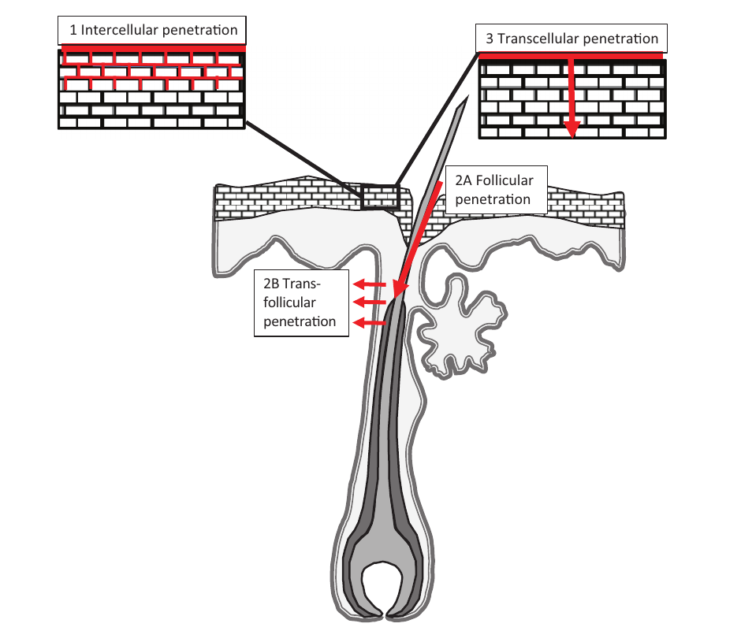

*Hình 6.2. Sơ đồ các con đường thấm khác nhau. (1) Con đường thấm gian bào dọc theo các lớp lipid quanh tế bào sừng. (2) Các con đường thấm vào nang tóc, được chia thành (A) con đường nang tóc và (B) con đường xuyên nang tóc. (3) Con đường thấm xuyên bào, dường như có tầm quan trọng nhỏ đối với hầu hết các chất bôi tại chỗ.*

Các nghiên cứu của Otberg và cs. (2004) cho thấy không thể bỏ qua đóng góp của nang tóc, đặc biệt ở một số vị trí trên cơ thể. Họ tính toán rằng ở một số vùng cơ thể, kho dự trữ của lớp sừng và kho dự trữ của nang tóc thậm chí còn tương quan với nhau, chẳng hạn vùng trán và bắp chân, nơi lần lượt có nhiều nang tóc nhỏ hoặc ít nang tóc nhưng lớn.

Về nguyên tắc, quá trình thấm vào nang tóc phải được phân biệt thành hai giai đoạn. Ở giai đoạn một, chất chỉ thấm vào nang tóc, tại đó chất được lưu trữ hoặc, sang giai đoạn hai, có thể thấm theo con đường xuyên nang tóc vào biểu bì hoặc trung bì bao quanh nang tóc. Việc xảy ra thấm vào nang tóc hay thấm xuyên nang tóc rõ ràng phụ thuộc vào các tính chất lý hóa của chất được bôi (Patzelt và Lademann, 2013).

---

### 6.6.1 Phương pháp khảo sát sự thấm vào nang tóc

Đã có nhiều phương pháp được thiết lập để khảo sát con đường thấm gian bào, chẳng hạn bóc tách bằng băng dính, tế bào khuếch tán, vi thẩm tách trung bì và kính hiển vi Raman (Holmgaard và cs., 2014). Tuy nhiên, khảo sát con đường thấm vào nang tóc phức tạp hơn vì đòi hỏi độ phân giải không gian và một hệ mô hình định lượng không có nang tóc nhưng có cùng các tính chất cấu trúc, sinh hóa và hàng rào như da bình thường (Meidan và cs., 2005). Ngoài ra, hệ này phải phân biệt được cả hai giai đoạn thấm vào nang tóc. Trong những năm gần đây, một số phương pháp khảo sát sự thấm vào nang tóc đã được giới thiệu và nhìn chung đáp ứng các tiêu chí này.

Bóc tách vi sai là một phương pháp có giá trị để khảo sát sự thấm vào nang tóc, nhưng không xem xét quá trình thấm xuyên nang tóc (Teichmann và cs., 2005). Bóc tách vi sai là phương pháp kết hợp giữa bóc tách bằng băng dính và sinh thiết bề mặt da bằng cyanoacrylate. Sau khi bôi tại chỗ và để chất thấm vào, lớp sừng được loại bỏ bằng bóc tách băng dính. Khi đó, chất chỉ còn nằm trong nang tóc và phần chứa trong nang có thể được lấy ra bằng sinh thiết bề mặt da bằng cyanoacrylate. Phương pháp này cho phép định lượng lượng chất đã thấm vào lớp sừng và nang tóc. Có thể áp dụng phương pháp này cho mô hình da *in vivo* và *ex vivo*.

Tuy nhiên, cần lưu ý rằng kho dự trữ nang tóc giảm đáng kể, tới 90%, trong da người đã cắt bỏ do da co lại sau khi lấy mẫu (Patzelt và cs., 2008). Ở da tai lợn, các nang tóc bám chặt hơn trong da và không thể được lấy ra hoàn toàn bằng sinh thiết bề mặt da cyanoacrylate; điều này cũng phải được tính đến khi định lượng.

Bóc tách vi sai cho thấy nang tóc là kho dự trữ dài hạn của các chất bôi tại chỗ. Một nghiên cứu trước đây chứng minh nanocarrier được lưu trữ trong nang tóc trong 10 ngày, trong khi phần nanocarrier nằm trên bề mặt da đã bị loại bỏ hoàn toàn khỏi lớp sừng sau 1 ngày (Lademann và cs., 2006).

Kỹ thuật bít nang tóc chọn lọc cũng trở thành một công cụ có giá trị để khảo sát quá trình thấm xuyên nang tóc (Teichmann và cs., 2006). Việc bít chọn lọc từng lỗ nang trong một vùng thử nghiệm cho phép xác định mức đóng góp của nang tóc vào tổng quá trình thấm của các chất bôi tại chỗ. Có thể thực hiện các phương pháp này *in vivo* (Otberg và cs., 2008) và *ex vivo* kết hợp với thí nghiệm tế bào khuếch tán (Trauer và cs., 2010) và vi thẩm tách trung bì. Nghiên cứu *in vivo* cho thấy caffeine bôi tại chỗ trở nên khả dụng sinh học sau 5 phút khi nang tóc mở, nhưng chỉ sau 20 phút khi nang tóc bị bít (Otberg và cs., 2008).

Ngoài ra, có thể dùng kính hiển vi quét laser đồng tiêu để xác định độ sâu thấm vào nang tóc của các chất bôi tại chỗ trong phạm vi micromet, với điều kiện các chất này được đánh dấu bằng chất phát huỳnh quang (Patzelt và cs., 2011).

---

### 6.6.2 Cơ chế thấm vào nang tóc

Hiệu quả thấm vào nang tóc và thấm xuyên nang tóc phụ thuộc mạnh vào các tính chất lý hóa của chất thấm.

Trong khi các phân tử nhỏ như caffeine có xu hướng mạnh thấm xuyên nang tóc vào mô sống (Otberg và cs., 2008), các chất dạng hạt chủ yếu tích tụ trong nang tóc (Lademann và cs., 2007). Chỉ gần đây, cơ chế của quá trình thấm vào nang tóc mới được làm sáng tỏ một phần. Dữ liệu *ex vivo* và *in silico* đều cho thấy nanocarrier được vận chuyển nhờ chuyển động của tóc bên trong nang tóc, tương tự cơ chế bánh cóc (Radtke và cs., 2017). Độ sâu thấm vào nang tóc được chứng minh là hiệu quả nhất khi kích thước nanocarrier khoảng 600 nm (Patzelt và cs., 2011). Nanocarrier nhỏ hơn hoặc lớn hơn thấm kém hiệu quả đáng kể.

Chuyển động hướng tâm của tóc dường như hiệu quả hơn chuyển động dọc trục, mặc dù khi bôi bằng cách massage, sự kết hợp của cả hai hướng chuyển động là thực tế hơn (Radtke và cs., 2017). Nếu tóc không chuyển động, độ sâu thấm vào nang tóc không đáng kể (Lademann và cs., 2007). Ngoài ra, dữ liệu mới nhất cho thấy tần số chuyển động của tóc cũng có ý nghĩa; các tần số chậm hơn dường như cho hiệu quả cao hơn.

Hiểu biết về cơ chế thấm vào nang tóc rất quan trọng để tối ưu hóa nanocarrier hoặc các chất khác cho con đường vận chuyển đặc thù này.

---

### 6.6.3 Nanocarrier làm chất vận chuyển để đưa hoạt chất vào da

Nanocarrier là một nhóm không đồng nhất gồm các chất dạng hạt, được kỳ vọng sẽ cải thiện đáng kể việc đưa thuốc vào cơ thể trong nhiều lĩnh vực y học, dược lý và mỹ phẩm. Mặc dù đã thành công trong một số lĩnh vực như hướng đích khối u, việc đưa thuốc qua da bằng nanocarrier vẫn là một thách thức vì nanocarrier không thể tự mình vượt qua hàng rào da rất mạnh do kích thước của chúng. Thay vào đó, nanocarrier bị giữ lại trong nang tóc và thoạt nhìn không thể góp phần cải thiện khả dụng sinh học của các chất bôi tại chỗ (Patzelt và Lademann, 2013).

Tuy nhiên, các ưu điểm của nanocarrier rất thuyết phục. Chúng có thể vận chuyển nồng độ thuốc cao hơn đáng kể, cải thiện độ tan của các chất kỵ nước và độ ổn định vật lý, hóa học của thuốc. Ngoài ra, chúng có thể giải phóng thuốc theo cách có kiểm soát (Goyal và cs., 2016). Để tận dụng các đặc tính tích cực của nanocarrier nhằm cải thiện việc đưa thuốc, cần phát triển các chiến lược mới để sử dụng nanocarrier hiệu quả.

Một chiến lược rất hứa hẹn là sử dụng nanocarrier chuyên biệt làm chất vận chuyển thuốc vào nang tóc. Khi đã nằm trong nang tóc, nanocarrier được thiết kế để giải phóng thuốc khi có tín hiệu kích hoạt ngoại sinh hoặc nội sinh. Thuốc được giải phóng sau đó có thể phát huy tác dụng trong nang tóc, chẳng hạn trong điều trị mụn, hoặc tự thấm xuyên nang tóc. Khi đó, khả dụng sinh học của thuốc bôi tại chỗ có thể tăng đáng kể (Patzelt và cs., 2017). Hình 6.3 trình bày sơ đồ phương pháp đưa thuốc giải phóng theo kích hoạt có hỗ trợ nanocarrier này. Hiện đang nghiên cứu nhiều cách để thực hiện giải phóng thuốc có kích hoạt từ nanocarrier trong nang tóc.

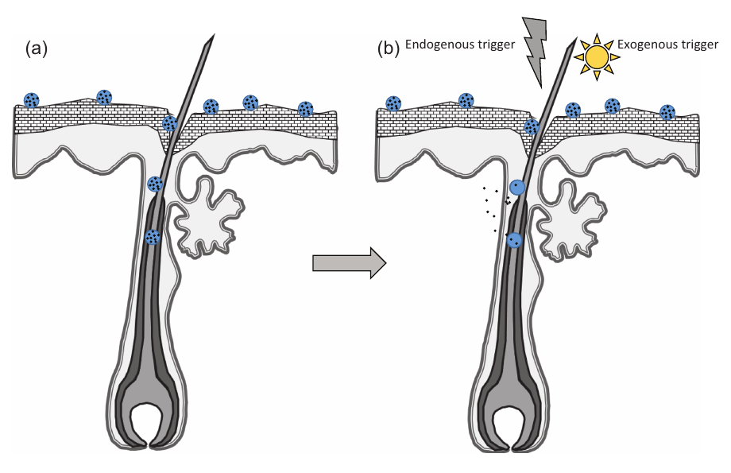

*Hình 6.3. Sơ đồ phương pháp giải phóng có kích hoạt để đưa thuốc bôi tại chỗ. (a) Nanocarrier được dùng để vận chuyển thuốc vào nang tóc. (b) Khi có tín hiệu kích hoạt nội sinh hoặc ngoại sinh, thuốc được giải phóng khỏi nanocarrier trong nang tóc, có thể tự di chuyển vào mô bao quanh nang tóc và trở nên khả dụng sinh học.*

Về nguyên tắc, cần phân biệt hai loại tín hiệu kích hoạt. Một mặt, có thể sử dụng các tín hiệu kích hoạt ngoại sinh như enzyme (Mak và cs., 2011), nguồn sáng bên ngoài (Lademann và cs., 2016) hoặc siêu âm (Mak và cs., 2011). Ý tưởng là nanocarrier đưa thuốc vào nang tóc, còn thuốc chỉ được giải phóng sau khi chiếu xạ hoặc bổ sung enzyme. Ưu điểm là người sử dụng có thể xác định chính xác thời điểm thuốc phát huy tác dụng. Nhược điểm là luôn cần một thành phần thứ hai để thực hiện giải phóng, điều này có thể gây trở ngại khi áp dụng cho một số chỉ định lâm sàng.

Mặt khác, có thể sử dụng các tín hiệu kích hoạt nội sinh; ưu điểm rõ ràng là không cần thành phần thứ hai. Tín hiệu kích hoạt nội sinh có thể là thay đổi pH. Cách tiếp cận này rất hứa hẹn vì về mặt sinh lý, trong nang tóc tồn tại một gradient pH (Dimde và cs., 2017), có thể được dùng để giữ nanocarrier ổn định trên bề mặt da và kích hoạt giải phóng ở pH cao hơn tại phần xa của nang tóc. Thay đổi nhiệt độ cũng có thể là tín hiệu kích hoạt. Các nghiên cứu trước đây với nanogel nhạy nhiệt cho thấy nhiệt độ cao hơn làm tăng sự thấm vào nang tóc của một chất màu mô hình được giải phóng (Jung và cs., 2018). Trong thực hành lâm sàng, điều này có thể khó áp dụng vì dao động nhiệt độ trong quá trình bảo quản và vận chuyển thuốc có thể dẫn đến giải phóng thuốc sớm.

Một cách tiếp cận mới là sử dụng nanocarrier nhạy oxy hóa–khử, có khả năng giải phóng thuốc tại các vùng da có nồng độ gốc tự do cao hơn, chẳng hạn trong bệnh da viêm. Cách này cho phép điều trị chọn lọc chỉ các vùng da viêm, trong khi vùng da khỏe mạnh không bị ảnh hưởng bởi thuốc và tác dụng phụ.

Tóm lại, những chiến lược mới này rất hứa hẹn, nhưng cần tiếp tục nghiên cứu trước khi các hệ nanocarrier thông minh này được thương mại hóa cho sản phẩm mỹ phẩm, chăm sóc cá nhân hoặc dược phẩm.
